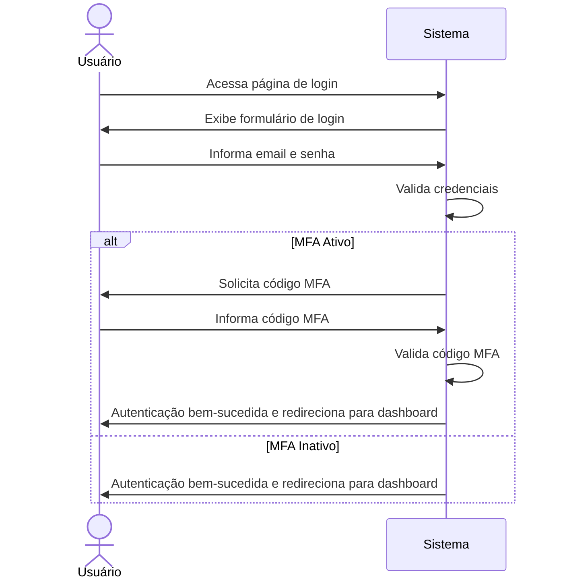

# RF002 🔑 Login com email/senha e autenticação multifator

## 📝 Descrição

Esta funcionalidade permite que o usuário faça login no sistema utilizando seu email e senha cadastrados. Além disso,
oferece a opção de configurar e utilizar autenticação multifator (MFA) para uma camada adicional de segurança.

## 👥 Atores

- 👤 Usuário Cadastrado

## ⚠️ Pré-condições

- O usuário deve possuir uma conta cadastrada no sistema.
- Para autenticação multifator, o usuário deve ter configurado previamente um método de MFA.

## 🔌 Endpoints

- `POST /api/auth/login`
- `POST /api/auth/mfa/setup`
- `POST /api/auth/mfa/verify`

## 📋 Dados de Login

| Campo      | Tipo     | Obrigatório | Descrição                                          | Restrições             |
|------------|----------|-------------|----------------------------------------------------|------------------------|
| `email`    | `string` | ✅ Sim       | E-mail do usuário                                  | Formato válido         |
| `password` | `string` | ✅ Sim       | Senha do usuário                                   | Mínimo de 8 caracteres |
| `mfa_code` | `string` | ⬜ Não       | Código de autenticação multifator (se MFA ativado) | 6 dígitos numéricos    |

## 🔄 Fluxo Principal



1. O usuário acessa a página de login do sistema.
2. O sistema exibe um formulário solicitando email e senha.
3. O usuário insere seu email e senha e envia o formulário.
4. O sistema valida as credenciais fornecidas.
5. Se a autenticação multifator estiver ativada para o usuário, o sistema solicita o código MFA.
6. O usuário insere o código MFA.
7. O sistema valida o código MFA.
8. Após a validação bem-sucedida (seja apenas com senha ou com MFA), o sistema autentica o usuário e o redireciona para
   a página principal (dashboard).

## 🔀 Fluxos Alternativos

### ⚠️ FA01 - Configuração de Autenticação Multifator

1. No fluxo principal, após o login bem-sucedido, o usuário pode ser direcionado para uma página de configuração de MFA,
   caso ainda não tenha ativado.
2. O sistema exibe as opções de MFA (ex: aplicativo autenticador, SMS).
3. O usuário seleciona e configura seu método preferido, seguindo as instruções do sistema.
4. O sistema confirma a ativação do MFA para a conta do usuário.

## 🚫 Fluxos de Exceção

### ⚠️ FE01 - Credenciais Inválidas

1. No passo 4 do fluxo principal, se as credenciais (email/senha) forem inválidas, o sistema exibe uma mensagem de erro
   indicando que o email ou a senha estão incorretos.
2. O sistema mantém o usuário na página de login para que ele possa tentar novamente.

### ⚠️ FE02 - Código MFA Inválido ou Expirado

1. No passo 7 do fluxo principal, se o código MFA informado for inválido ou tiver expirado, o sistema exibe uma mensagem
   de erro.
2. O sistema solicita que o usuário insira um novo código MFA ou utilize uma opção de recuperação.

### ⚠️ FE03 - Conta Bloqueada após Múltiplas Tentativas Falhas

1. Se houver um número excessivo de tentativas de login falhas (seja por senha ou MFA), o sistema pode bloquear
   temporariamente a conta do usuário por segurança.
2. O sistema exibe uma mensagem informando que a conta foi bloqueada e as instruções para desbloqueio (ex: esperar um
   tempo, entrar em contato com o suporte).

## 🧪 Exemplos de Uso

### Requisição HTTP - Login com Email e Senha

```http
POST /api/auth/login HTTP/1.1
Host: api.metakyasshu.com
Content-Type: application/json

{
  "email": "usuario@example.com",
  "password": "MinhaSenhaSegura123"
}
```

### Requisição HTTP - Login com MFA

```http
POST /api/auth/login HTTP/1.1
Host: api.metakyasshu.com
Content-Type: application/json

{
  "email": "usuario@example.com",
  "password": "MinhaSenhaSegura123",
  "mfa_code": "123456"
}
```

### Requisição HTTP - Configuração de MFA (Exemplo simplificado)

```http
POST /api/auth/mfa/setup HTTP/1.1
Host: api.metakyasshu.com
Content-Type: application/json
Authorization: Bearer [TOKEN_DE_AUTENTICACAO]

{
  "method": "authenticator_app"
}
```

---

> ---------------------------------------------------------------------------
> #### 💰 METAKYASSHU 💰
> ***Transformando finanças em conquistas compartilhadas***
> --------------------------------------------------------------------------- 