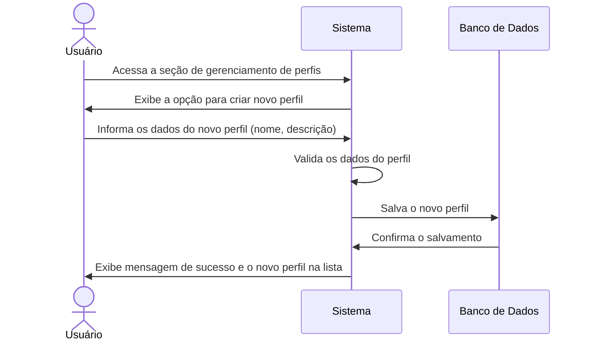

# RF003.1 👥 Criação de perfis de usuário

## 📝 Descrição

Esta funcionalidade permite que o usuário crie múltiplos perfis dentro do sistema para organizar suas finanças pessoais
e profissionais de forma separada.

## 👥 Atores

- 👤 Usuário Autenticado

## ⚠️ Pré-condições

- O usuário deve estar logado no sistema.

## 🔌 Endpoints

- `POST /api/profile`

## 📋 Dados do Perfil

| Campo         | Tipo     | Obrigatório | Descrição                    | Restrições               |
|---------------|----------|-------------|------------------------------|--------------------------|
| `name`        | `string` | ✅ Sim       | Nome do novo perfil          | Mínimo de 3 caracteres   |
| `description` | `string` | ⬜ Não       | Descrição opcional do perfil | Máximo de 255 caracteres |

## 🔄 Fluxo Principal



1. O usuário autenticado acessa a seção de gerenciamento de perfis.
2. O sistema exibe a opção para criar um novo perfil.
3. O usuário preenche o nome e opcionalmente uma descrição para o novo perfil e envia o formulário.
4. O sistema valida os dados informados, garantindo que o nome do perfil seja único para o usuário.
5. O sistema cria e salva o novo perfil associado ao usuário no banco de dados.
6. O sistema exibe uma mensagem de confirmação de criação e atualiza a lista de perfis do usuário.

## 🔀 Fluxos Alternativos

### ⚠️ FA01 - Perfil com nome já existente

1. No passo 4 do fluxo principal, se o nome do perfil informado já existir para o usuário, o sistema exibe uma mensagem
   de erro indicando a duplicidade.
2. O sistema retorna ao passo 3 do fluxo principal para que o usuário informe um novo nome.

## 🚫 Fluxos de Exceção

### ⚠️ FE01 - Dados inválidos

1. No passo 4 do fluxo principal, se os dados informados forem inválidos (ex: nome muito curto, caracteres especiais não
   permitidos), o sistema exibe uma mensagem de erro específica para o campo inválido.
2. O sistema retorna ao passo 3 do fluxo principal para que o ator corrija os dados informados.

## 🧪 Exemplos de Uso

### Requisição HTTP - Criação de Perfil

```http
POST /api/profile HTTP/1.1
Host: api.metakyasshu.com
Content-Type: application/json
Authorization: Bearer [TOKEN_DE_AUTENTICACAO]

{
  "name": "Perfil Pessoal",
  "description": "Meu perfil financeiro para gastos do dia a dia."
}
```

---

> ---------------------------------------------------------------------------
> #### 💰 METAKYASSHU 💰
> ***Transformando finanças em conquistas compartilhadas***
> --------------------------------------------------------------------------- 