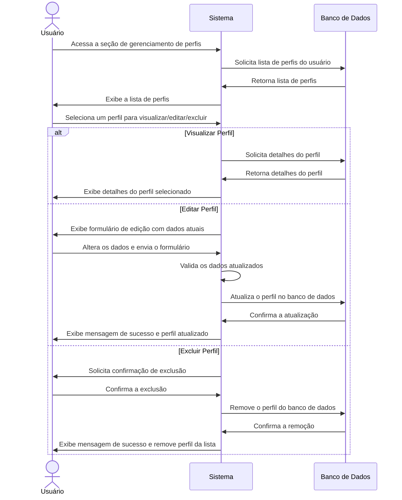

# RF003.2 👥 Gestão de perfis de usuário

## 📝 Descrição

Esta funcionalidade permite que o usuário gerencie (visualize, edite e exclua) seus múltiplos perfis financeiros criados
no sistema.

## 👥 Atores

- 👤 Usuário Autenticado

## ⚠️ Pré-condições

- O usuário deve estar logado no sistema.
- O usuário deve ter pelo menos um perfil criado.

## 🔌 Endpoints

- `GET /api/profile`
- `GET /api/profile/{profileId}`
- `PUT /api/profile/{profileId}`
- `DELETE /api/profile/{profileId}`

## 📋 Dados do Perfil

| Campo         | Tipo     | Obrigatório | Descrição                      | Restrições               |
|---------------|----------|-------------|--------------------------------|--------------------------|
| `profileId`   | `string` | ✅ Sim       | ID único do perfil             | UUID válido              |
| `name`        | `string` | ✅ Sim       | Nome atualizado do perfil      | Mínimo de 3 caracteres   |
| `description` | `string` | ⬜ Não       | Descrição atualizada do perfil | Máximo de 255 caracteres |

## 🔄 Fluxo Principal



1. O usuário autenticado acessa a seção de gerenciamento de perfis.
2. O sistema exibe uma lista de todos os perfis associados ao usuário.
3. O usuário seleciona uma opção: visualizar detalhes, editar ou excluir um perfil existente.
4. **Para Visualização:** O sistema exibe os detalhes completos do perfil selecionado.
5. **Para Edição:**
   a. O sistema apresenta um formulário pré-preenchido com os dados atuais do perfil.
   b. O usuário modifica os campos desejados (ex: nome, descrição) e submete as alterações.
   c. O sistema valida os novos dados e atualiza o perfil no banco de dados.
   d. O sistema exibe uma mensagem de sucesso e a lista de perfis atualizada.
6. **Para Exclusão:**
   a. O sistema solicita uma confirmação do usuário para a exclusão do perfil.
   b. Após a confirmação, o sistema remove o perfil do banco de dados.
   c. O sistema exibe uma mensagem de sucesso e a lista de perfis atualizada (sem o perfil excluído).

## 🔀 Fluxos Alternativos

### ⚠️ FA01 - Tentativa de exclusão do último perfil

1. No passo 6b do fluxo principal, se o usuário tentar excluir o último perfil restante, o sistema exibe uma mensagem de
   erro informando que não é possível excluir o único perfil existente.

## 🚫 Fluxos de Exceção

### ⚠️ FE01 - Perfil não encontrado

1. Em qualquer operação (visualizar, editar, excluir), se o `profileId` fornecido não corresponder a um perfil existente
   para o usuário, o sistema exibe uma mensagem de erro indicando que o perfil não foi encontrado.

### ⚠️ FE02 - Dados de edição inválidos

1. No passo 5c do fluxo principal, se os dados de edição forem inválidos (ex: nome do perfil já existente para o
   usuário, nome muito curto), o sistema exibe uma mensagem de erro específica para o campo inválido.
2. O sistema mantém o usuário no formulário de edição para que ele possa corrigir os dados.

## 🧪 Exemplos de Uso

### Requisição HTTP - Listar Perfis

```http
GET /api/profile HTTP/1.1
Host: api.metakyasshu.com
Authorization: Bearer [TOKEN_DE_AUTENTICACAO]
```

### Requisição HTTP - Obter Detalhes de um Perfil

```http
GET /api/profile/a1b2c3d4e5f6-1234-5678-90ab-cdef12345678 HTTP/1.1
Host: api.metakyasshu.com
Authorization: Bearer [TOKEN_DE_AUTENTICACAO]
```

### Requisição HTTP - Atualizar um Perfil

```http
PUT /api/profile/a1b2c3d4e5f6-1234-5678-90ab-cdef12345678 HTTP/1.1
Host: api.metakyasshu.com
Content-Type: application/json
Authorization: Bearer [TOKEN_DE_AUTENTICACAO]

{
  "name": "Perfil Profissional Atualizado",
  "description": "Meus gastos e receitas relacionados ao trabalho."
}
```

### Requisição HTTP - Excluir um Perfil

```http
DELETE /api/profile/a1b2c3d4e5f6-1234-5678-90ab-cdef12345678 HTTP/1.1
Host: api.metakyasshu.com
Authorization: Bearer [TOKEN_DE_AUTENTICACAO]
```

---

> ---------------------------------------------------------------------------
> #### 💰 METAKYASSHU 💰
> ***Transformando finanças em conquistas compartilhadas***
> --------------------------------------------------------------------------- 