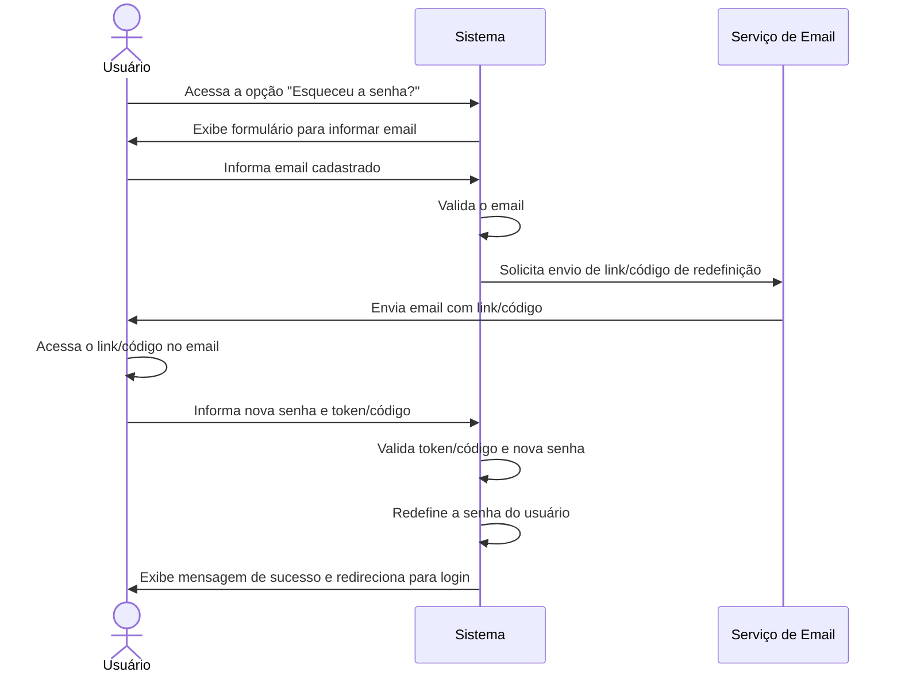

# RF004 🔄 Recuperação de senha

## 📝 Descrição

Esta funcionalidade permite que o usuário recupere sua senha em caso de esquecimento, utilizando o email cadastrado para
receber um link ou código de redefinição.

## 👥 Atores

- 👤 Usuário Cadastrado

## ⚠️ Pré-condições

- O usuário deve ter um email válido cadastrado no sistema.

## 🔌 Endpoints

- `POST /api/auth/forgot-password`
- `POST /api/auth/reset-password`

## 📋 Dados para Recuperação de Senha

| Campo          | Tipo     | Obrigatório        | Descrição                     | Restrições             |
|----------------|----------|--------------------|-------------------------------|------------------------|
| `email`        | `string` | ✅ Sim              | E-mail do usuário             | Formato válido         |
| `token`        | `string` | ✅ Sim (para reset) | Token de redefinição de senha | Gerado pelo sistema    |
| `new_password` | `string` | ✅ Sim (para reset) | Nova senha desejada           | Mínimo de 8 caracteres |

## 🔄 Fluxo Principal



1. O usuário acessa a opção "Esqueceu a senha?" na página de login.
2. O sistema solicita o email cadastrado do usuário.
3. O usuário informa seu email e envia a solicitação.
4. O sistema verifica se o email está cadastrado e, em caso positivo, gera um token ou código de redefinição de senha.
5. O sistema envia um email para o endereço fornecido, contendo o link de redefinição ou o código.
6. O usuário acessa o link ou insere o código no sistema.
7. O sistema solicita que o usuário defina uma nova senha e, em alguns casos, o token/código recebido.
8. O sistema valida o token/código e a nova senha (segundo as regras de segurança de senha).
9. Se a validação for bem-sucedida, o sistema redefine a senha do usuário.
10. O sistema exibe uma mensagem de sucesso e redireciona o usuário para a página de login para que ele possa acessar
    sua conta com a nova senha.

## 🔀 Fluxos Alternativos

### ⚠️ FA01 - Link/Código Expirado

1. No passo 8 do fluxo principal, se o link ou código de redefinição de senha estiver expirado, o sistema exibe uma
   mensagem de erro.
2. O sistema oferece ao usuário a opção de iniciar novamente o processo de recuperação de senha.

## 🚫 Fluxos de Exceção

### ⚠️ FE01 - Email não cadastrado

1. No passo 4 do fluxo principal, se o email informado não estiver cadastrado no sistema, o sistema exibe uma mensagem
   de erro indicando que o email não foi encontrado.
2. O sistema mantém o usuário na tela de solicitação de email.

### ⚠️ FE02 - Erro no envio do email

1. No passo 5 do fluxo principal, se houver um erro no envio do email de redefinição, o sistema exibe uma mensagem de
   erro e informa ao usuário para tentar novamente mais tarde ou entrar em contato com o suporte.

### ⚠️ FE03 - Nova senha inválida

1. No passo 8 do fluxo principal, se a nova senha informada não atender aos requisitos de segurança (ex: muito curta,
   não contém caracteres especiais), o sistema exibe uma mensagem de erro detalhada.
2. O sistema mantém o usuário na tela de redefinição de senha para que ele possa informar uma nova senha válida.

## 🧪 Exemplos de Uso

### Requisição HTTP - Solicitar Redefinição de Senha

```http
POST /api/auth/forgot-password HTTP/1.1
Host: api.metakyasshu.com
Content-Type: application/json

{
  "email": "usuario@example.com"
}
```

### Requisição HTTP - Redefinir Senha

```http
POST /api/auth/reset-password HTTP/1.1
Host: api.metakyasshu.com
Content-Type: application/json

{
  "token": "UM_TOKEN_GERADO_PELO_SISTEMA",
  "new_password": "NovaSenhaMuitoSegura456"
}
```

---

> ---------------------------------------------------------------------------
> #### 💰 METAKYASSHU 💰
> ***Transformando finanças em conquistas compartilhadas***
> --------------------------------------------------------------------------- 