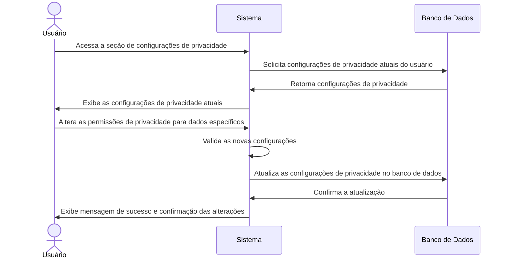

# RF005 🔒 Configurações de privacidade granulares para dados pessoais

## 📝 Descrição

Esta funcionalidade permite que o usuário configure permissões de privacidade granulares para seus dados pessoais,
controlando quais informações são visíveis e para quem (ex: membros do grupo, outros usuários).

## 👥 Atores

- 👤 Usuário Autenticado

## ⚠️ Pré-condições

- O usuário deve estar logado no sistema.
- O usuário deve possuir dados pessoais no sistema para configurar a privacidade.

## 🔌 Endpoints

- `GET /api/user/privacy-settings`
- `PUT /api/user/privacy-settings`

## 📋 Dados de Configuração de Privacidade

| Campo         | Tipo            | Obrigatório | Descrição                                                       | Valores Possíveis                         |
|---------------|-----------------|-------------|-----------------------------------------------------------------|-------------------------------------------|
| `data_type`   | `string`        | ✅ Sim       | Tipo de dado pessoal (ex: email, nome, transações)              | `email`, `phone`, `transactions`, `goals` |
| `visibility`  | `string`        | ✅ Sim       | Nível de visibilidade do dado                                   | `private`, `group`, `public`              |
| `shared_with` | `array<string>` | ⬜ Não       | Lista de IDs de usuários/grupos com quem o dado é compartilhado | IDs de usuários ou grupos                 |

## 🔄 Fluxo Principal



1. O usuário autenticado acessa a seção de configurações de privacidade em seu perfil.
2. O sistema exibe as configurações de privacidade atuais para diferentes tipos de dados pessoais (ex: email, telefone,
   transações, metas).
3. O usuário seleciona um tipo de dado e modifica seu nível de visibilidade (ex: `privado`, `apenas para o grupo`,
   `público`).
4. Se a visibilidade for definida como `group` ou `public`, o usuário pode especificar com quais grupos ou usuários os
   dados serão compartilhados.
5. O usuário salva as alterações.
6. O sistema valida as novas configurações de privacidade para garantir consistência.
7. O sistema atualiza as permissões de privacidade no banco de dados.
8. O sistema exibe uma mensagem de confirmação de que as configurações foram salvas com sucesso.

## 🔀 Fluxos Alternativos

### ⚠️ FA01 - Configuração de privacidade de dados sensíveis

1. No passo 3 do fluxo principal, se o usuário tentar tornar um dado altamente sensível (ex: CPF) visível publicamente,
   o sistema pode exibir um aviso de segurança e solicitar uma confirmação adicional.

## 🚫 Fluxos de Exceção

### ⚠️ FE01 - Dados de configuração inválidos

1. No passo 6 do fluxo principal, se as configurações de privacidade enviadas forem inválidas (ex: tipo de dado
   inexistente, nível de visibilidade inválido), o sistema exibe uma mensagem de erro indicando o problema.
2. O sistema mantém o usuário na tela de configurações para que ele possa corrigir as informações.

### ⚠️ FE02 - Erro ao atualizar configurações

1. No passo 7 do fluxo principal, se ocorrer um erro durante a atualização das configurações no banco de dados, o
   sistema exibe uma mensagem de erro genérica e sugere que o usuário tente novamente mais tarde.

## 🧪 Exemplos de Uso

### Requisição HTTP - Obter Configurações de Privacidade

```http
GET /api/user/privacy-settings HTTP/1.1
Host: api.metakyasshu.com
Authorization: Bearer [TOKEN_DE_AUTENTICACAO]
```

### Requisição HTTP - Atualizar Configurações de Privacidade

```http
PUT /api/user/privacy-settings HTTP/1.1
Host: api.metakyasshu.com
Content-Type: application/json
Authorization: Bearer [TOKEN_DE_AUTENTICACAO]

{
  "data_type": "transactions",
  "visibility": "group",
  "shared_with": ["group_id_1", "user_id_2"]
}
```

---

> ---------------------------------------------------------------------------
> #### 💰 METAKYASSHU 💰
> ***Transformando finanças em conquistas compartilhadas***
> --------------------------------------------------------------------------- 