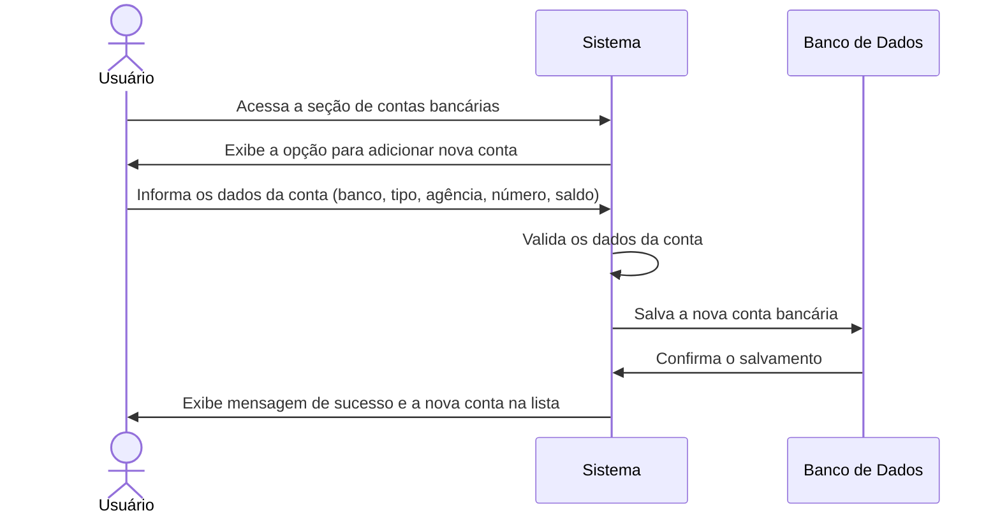

# RF006.1 💳 Cadastro de contas bancárias

## 📝 Descrição

Esta funcionalidade permite que o usuário cadastre suas contas bancárias de diferentes instituições financeiras no
sistema para um controle financeiro centralizado.

## 👥 Atores

- 👤 Usuário Autenticado

## ⚠️ Pré-condições

- O usuário deve estar logado no sistema.

## 🔌 Endpoints

- `POST /api/account`

## 📋 Dados da Conta Bancária

| Campo            | Tipo     | Obrigatório | Descrição                          | Restrições             |
|------------------|----------|-------------|------------------------------------|------------------------|
| `bank_name`      | `string` | ✅ Sim       | Nome do banco                      | Mínimo de 2 caracteres |
| `account_type`   | `string` | ✅ Sim       | Tipo de conta (corrente, poupança) | `checking`, `savings`  |
| `agency`         | `string` | ✅ Sim       | Número da agência                  | Formato numérico       |
| `account_number` | `string` | ✅ Sim       | Número da conta                    | Formato numérico       |
| `balance`        | `number` | ✅ Sim       | Saldo inicial da conta             | Valor não negativo     |

## 🔄 Fluxo Principal



1. O usuário autenticado acessa a seção de gerenciamento de contas bancárias.
2. O sistema exibe a opção para adicionar uma nova conta.
3. O usuário preenche os dados solicitados para a conta bancária (nome do banco, tipo de conta, agência, número da conta
   e saldo inicial).
4. O sistema valida os dados informados para garantir que estão corretos e completos.
5. O sistema salva as informações da nova conta bancária associada ao perfil do usuário no banco de dados.
6. O sistema exibe uma mensagem de confirmação de sucesso e a nova conta é adicionada à lista de contas do usuário.

## 🔀 Fluxos Alternativos

### ⚠️ FA01 - Conta Bancária já cadastrada

1. No passo 4 do fluxo principal, se os dados da conta informados já corresponderem a uma conta previamente cadastrada
   pelo usuário, o sistema exibe uma mensagem de erro indicando que a conta já existe.
2. O sistema retorna ao passo 3 do fluxo principal para que o usuário revise os dados ou cancele a operação.

## 🚫 Fluxos de Exceção

### ⚠️ FE01 - Dados inválidos

1. No passo 4 do fluxo principal, se os dados informados forem inválidos (ex: número de agência ou conta com formato
   incorreto, saldo negativo), o sistema exibe uma mensagem de erro específica para o campo inválido.
2. O sistema retorna ao passo 3 do fluxo principal para que o ator corrija os dados informados.

### ⚠️ FE02 - Erro no sistema ao salvar a conta

1. No passo 5 do fluxo principal, se ocorrer um erro interno no sistema ao tentar salvar a conta bancária, o sistema
   exibe uma mensagem de erro genérica e sugere que o usuário tente novamente mais tarde.

## 🧪 Exemplos de Uso

### Requisição HTTP - Cadastrar Conta Bancária

```http
POST /api/account HTTP/1.1
Host: api.metakyasshu.com
Content-Type: application/json
Authorization: Bearer [TOKEN_DE_AUTENTICACAO]

{
  "bank_name": "Banco Digital Exemplo",
  "account_type": "checking",
  "agency": "0001",
  "account_number": "123456-7",
  "balance": 1500.50
}
```

---

> ---------------------------------------------------------------------------
> #### 💰 METAKYASSHU 💰
> ***Transformando finanças em conquistas compartilhadas***
> --------------------------------------------------------------------------- 