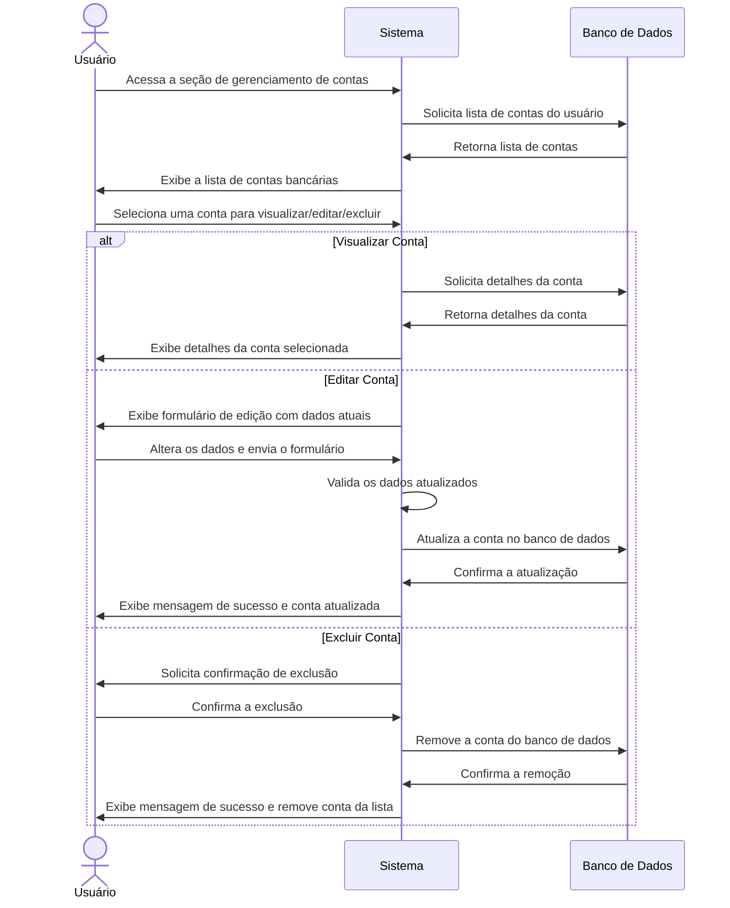

# RF006.2 💳 Gestão de contas bancárias

## 📝 Descrição

Esta funcionalidade permite que o usuário gerencie (visualize, edite e exclua) suas contas bancárias cadastradas no
sistema para um controle financeiro completo.

## 👥 Atores

- 👤 Usuário Autenticado

## ⚠️ Pré-condições

- O usuário deve estar logado no sistema.
- O usuário deve ter pelo menos uma conta bancária cadastrada.

## 🔌 Endpoints

- `GET /api/account`
- `GET /api/account/{accountId}`
- `PUT /api/account/{accountId}`
- `DELETE /api/account/{accountId}`

## 📋 Dados da Conta Bancária

| Campo            | Tipo     | Obrigatório | Descrição                          | Restrições             |
|------------------|----------|-------------|------------------------------------|------------------------|
| `accountId`      | `string` | ✅ Sim       | ID único da conta bancária         | UUID válido            |
| `bank_name`      | `string` | ⬜ Não       | Nome do banco (para edição)        | Mínimo de 2 caracteres |
| `account_type`   | `string` | ⬜ Não       | Tipo de conta (para edição)        | `checking`, `savings`  |
| `agency`         | `string` | ⬜ Não       | Número da agência (para edição)    | Formato numérico       |
| `account_number` | `string` | ⬜ Não       | Número da conta (para edição)      | Formato numérico       |
| `balance`        | `number` | ⬜ Não       | Saldo atual da conta (para edição) | Valor não negativo     |

## 🔄 Fluxo Principal



1. O usuário autenticado acessa a seção de gerenciamento de contas bancárias.
2. O sistema exibe uma lista de todas as contas bancárias associadas ao usuário.
3. O usuário seleciona uma opção: visualizar detalhes, editar ou excluir uma conta existente.
4. **Para Visualização:** O sistema exibe os detalhes completos da conta selecionada.
5. **Para Edição:**
   a. O sistema apresenta um formulário pré-preenchido com os dados atuais da conta.
   b. O usuário modifica os campos desejados (ex: nome do banco, tipo, saldo) e submete as alterações.
   c. O sistema valida os novos dados e atualiza a conta no banco de dados.
   d. O sistema exibe uma mensagem de sucesso e a lista de contas atualizada.
6. **Para Exclusão:**
   a. O sistema solicita uma confirmação do usuário para a exclusão da conta.
   b. Após a confirmação, o sistema remove a conta do banco de dados.
   c. O sistema exibe uma mensagem de sucesso e a lista de contas atualizada (sem a conta excluída).

## 🔀 Fluxos Alternativos

### ⚠️ FA01 - Tentativa de exclusão da última conta bancária

1. No passo 6b do fluxo principal, se o usuário tentar excluir a última conta bancária restante, o sistema exibe uma
   mensagem de erro informando que não é possível excluir a única conta existente.

## 🚫 Fluxos de Exceção

### ⚠️ FE01 - Conta não encontrada

1. Em qualquer operação (visualizar, editar, excluir), se o `accountId` fornecido não corresponder a uma conta existente
   para o usuário, o sistema exibe uma mensagem de erro indicando que a conta não foi encontrada.

### ⚠️ FE02 - Dados de edição inválidos

1. No passo 5c do fluxo principal, se os dados de edição forem inválidos (ex: nome do banco muito curto, tipo de conta
   inválido), o sistema exibe uma mensagem de erro específica para o campo inválido.
2. O sistema mantém o usuário no formulário de edição para que ele possa corrigir os dados.

### ⚠️ FE03 - Erro ao atualizar/excluir conta

1. No passo 5c ou 6b do fluxo principal, se ocorrer um erro interno no sistema ao tentar atualizar ou excluir a conta
   bancária, o sistema exibe uma mensagem de erro genérica e sugere que o usuário tente novamente mais tarde.

## 🧪 Exemplos de Uso

### Requisição HTTP - Listar Contas Bancárias

```http
GET /api/account HTTP/1.1
Host: api.metakyasshu.com
Authorization: Bearer [TOKEN_DE_AUTENTICACAO]
```

### Requisição HTTP - Obter Detalhes de uma Conta Bancária

```http
GET /api/account/a1b2c3d4e5f6-1234-5678-90ab-cdef12345678 HTTP/1.1
Host: api.metakyasshu.com
Authorization: Bearer [TOKEN_DE_AUTENTICACAO]
```

### Requisição HTTP - Atualizar uma Conta Bancária

```http
PUT /api/account/a1b2c3d4e5f6-1234-5678-90ab-cdef12345678 HTTP/1.1
Host: api.metakyasshu.com
Content-Type: application/json
Authorization: Bearer [TOKEN_DE_AUTENTICACAO]

{
  "bank_name": "Novo Banco S.A.",
  "balance": 2500.75
}
```

### Requisição HTTP - Excluir uma Conta Bancária

```http
DELETE /api/account/a1b2c3d4e5f6-1234-5678-90ab-cdef12345678 HTTP/1.1
Host: api.metakyasshu.com
Authorization: Bearer [TOKEN_DE_AUTENTICACAO]
```

---

> ---------------------------------------------------------------------------
> #### 💰 METAKYASSHU 💰
> ***Transformando finanças em conquistas compartilhadas***
> --------------------------------------------------------------------------- 