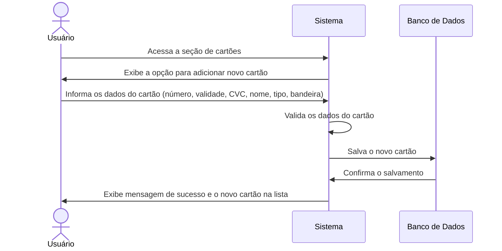

# RF006.3 💳 Cadastro de cartões de crédito/débito

## 📝 Descrição

Esta funcionalidade permite que o usuário cadastre seus cartões de crédito e débito no sistema, para que possa
associá-los a transações e gerenciar seus gastos de forma centralizada.

## 👥 Atores

- 👤 Usuário Autenticado

## ⚠️ Pré-condições

- O usuário deve estar logado no sistema.

## 🔌 Endpoints

- `POST /api/card`

## 📋 Dados do Cartão

| Campo             | Tipo     | Obrigatório | Descrição                                   | Restrições                      |
|-------------------|----------|-------------|---------------------------------------------|---------------------------------|
| `card_number`     | `string` | ✅ Sim       | Número completo do cartão                   | Formato numérico, 13-19 dígitos |
| `expiry_date`     | `string` | ✅ Sim       | Data de validade (MM/AA)                    | Formato MM/AA válido, futuro    |
| `cvc`             | `string` | ✅ Sim       | Código de segurança do cartão               | 3 ou 4 dígitos numéricos        |
| `cardholder_name` | `string` | ✅ Sim       | Nome do titular do cartão                   | Mínimo de 3 caracteres          |
| `card_type`       | `string` | ✅ Sim       | Tipo de cartão                              | `credit`, `debit`               |
| `flag`            | `string` | ⬜ Não       | Bandeira do cartão (Visa, Mastercard, etc.) | Texto livre                     |

## 🔄 Fluxo Principal



1. O usuário autenticado acessa a seção de gerenciamento de cartões.
2. O sistema exibe a opção para adicionar um novo cartão.
3. O usuário preenche os dados solicitados para o cartão (número, data de validade, CVC, nome do titular, tipo de cartão
   e, opcionalmente, a bandeira).
4. O sistema valida os dados informados, verificando o formato e a validade do cartão.
5. O sistema salva as informações do novo cartão associado ao perfil do usuário no banco de dados.
6. O sistema exibe uma mensagem de confirmação de sucesso e o novo cartão é adicionado à lista de cartões do usuário.

## 🔀 Fluxos Alternativos

### ⚠️ FA01 - Cartão já cadastrado

1. No passo 4 do fluxo principal, se o número do cartão informado já corresponder a um cartão previamente cadastrado
   pelo usuário, o sistema exibe uma mensagem de erro indicando que o cartão já existe.
2. O sistema retorna ao passo 3 do fluxo principal para que o usuário revise os dados ou cancele a operação.

## 🚫 Fluxos de Exceção

### ⚠️ FE01 - Dados inválidos

1. No passo 4 do fluxo principal, se os dados informados forem inválidos (ex: número de cartão com formato incorreto,
   data de validade expirada, CVC inválido), o sistema exibe uma mensagem de erro específica para o campo inválido.
2. O sistema retorna ao passo 3 do fluxo principal para que o ator corrija os dados informados.

### ⚠️ FE02 - Erro no sistema ao salvar o cartão

1. No passo 5 do fluxo principal, se ocorrer um erro interno no sistema ao tentar salvar o cartão, o sistema exibe uma
   mensagem de erro genérica e sugere que o usuário tente novamente mais tarde.

## 🧪 Exemplos de Uso

### Requisição HTTP - Cadastrar Cartão

```http
POST /api/card HTTP/1.1
Host: api.metakyasshu.com
Content-Type: application/json
Authorization: Bearer [TOKEN_DE_AUTENTICACAO]

{
  "card_number": "4000123456789010",
  "expiry_date": "12/25",
  "cvc": "123",
  "cardholder_name": "JOAO DA SILVA",
  "card_type": "credit",
  "flag": "Visa"
}
```

---

> ---------------------------------------------------------------------------
> #### 💰 METAKYASSHU 💰
> ***Transformando finanças em conquistas compartilhadas***
> --------------------------------------------------------------------------- 