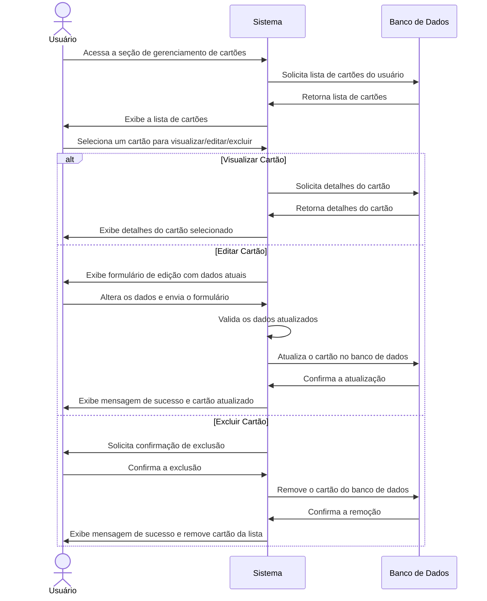

# RF006.4 💳 Gestão de cartões de crédito/débito

## 📝 Descrição

Esta funcionalidade permite que o usuário gerencie (visualize, edite e exclua) seus cartões de crédito e débito
cadastrados no sistema.

## 👥 Atores

- 👤 Usuário Autenticado

## ⚠️ Pré-condições

- O usuário deve estar logado no sistema.
- O usuário deve ter pelo menos um cartão cadastrado.

## 🔌 Endpoints

- `GET /api/card`
- `GET /api/card/{cardId}`
- `PUT /api/card/{cardId}`
- `DELETE /api/card/{cardId}`

## 📋 Dados do Cartão

| Campo             | Tipo     | Obrigatório | Descrição                               | Restrições                   |
|-------------------|----------|-------------|-----------------------------------------|------------------------------|
| `cardId`          | `string` | ✅ Sim       | ID único do cartão                      | UUID válido                  |
| `cardholder_name` | `string` | ⬜ Não       | Nome do titular do cartão (para edição) | Mínimo de 3 caracteres       |
| `expiry_date`     | `string` | ⬜ Não       | Data de validade (MM/AA) (para edição)  | Formato MM/AA válido, futuro |
| `card_type`       | `string` | ⬜ Não       | Tipo de cartão (para edição)            | `credit`, `debit`            |
| `flag`            | `string` | ⬜ Não       | Bandeira do cartão (para edição)        | Texto livre                  |

## 🔄 Fluxo Principal



1. O usuário autenticado acessa a seção de gerenciamento de cartões.
2. O sistema exibe uma lista de todos os cartões associados ao usuário.
3. O usuário seleciona uma opção: visualizar detalhes, editar ou excluir um cartão existente.
4. **Para Visualização:** O sistema exibe os detalhes completos do cartão selecionado (exceto informações sensíveis como
   número completo e CVC).
5. **Para Edição:**
   a. O sistema apresenta um formulário pré-preenchido com os dados atuais do cartão (nome do titular, data de validade,
   tipo, bandeira).
   b. O usuário modifica os campos desejados e submete as alterações.
   c. O sistema valida os novos dados e atualiza o cartão no banco de dados.
   d. O sistema exibe uma mensagem de sucesso e a lista de cartões atualizada.
6. **Para Exclusão:**
   a. O sistema solicita uma confirmação do usuário para a exclusão do cartão.
   b. Após a confirmação, o sistema remove o cartão do banco de dados.
   c. O sistema exibe uma mensagem de sucesso e a lista de cartões atualizada (sem o cartão excluído).

## 🔀 Fluxos Alternativos

### ⚠️ FA01 - Tentativa de exclusão do último cartão

1. No passo 6b do fluxo principal, se o usuário tentar excluir o último cartão restante, o sistema exibe uma mensagem de
   erro informando que não é possível excluir o único cartão existente.

## 🚫 Fluxos de Exceção

### ⚠️ FE01 - Cartão não encontrado

1. Em qualquer operação (visualizar, editar, excluir), se o `cardId` fornecido não corresponder a um cartão existente
   para o usuário, o sistema exibe uma mensagem de erro indicando que o cartão não foi encontrado.

### ⚠️ FE02 - Dados de edição inválidos

1. No passo 5c do fluxo principal, se os dados de edição forem inválidos (ex: data de validade expirada, nome muito
   curto), o sistema exibe uma mensagem de erro específica para o campo inválido.
2. O sistema mantém o usuário no formulário de edição para que ele possa corrigir os dados.

### ⚠️ FE03 - Erro ao atualizar/excluir cartão

1. No passo 5c ou 6b do fluxo principal, se ocorrer um erro interno no sistema ao tentar atualizar ou excluir o cartão,
   o sistema exibe uma mensagem de erro genérica e sugere que o usuário tente novamente mais tarde.

## 🧪 Exemplos de Uso

### Requisição HTTP - Listar Cartões

```http
GET /api/card HTTP/1.1
Host: api.metakyasshu.com
Authorization: Bearer [TOKEN_DE_AUTENTICACAO]
```

### Requisição HTTP - Obter Detalhes de um Cartão

```http
GET /api/card/a1b2c3d4e5f6-1234-5678-90ab-cdef12345678 HTTP/1.1
Host: api.metakyasshu.com
Authorization: Bearer [TOKEN_DE_AUTENTICACAO]
```

### Requisição HTTP - Atualizar um Cartão

```http
PUT /api/card/a1b2c3d4e5f6-1234-5678-90ab-cdef12345678 HTTP/1.1
Host: api.metakyasshu.com
Content-Type: application/json
Authorization: Bearer [TOKEN_DE_AUTENTICACAO]

{
  "cardholder_name": "NOVO NOME DO TITULAR",
  "expiry_date": "12/28"
}
```

### Requisição HTTP - Excluir um Cartão

```http
DELETE /api/card/a1b2c3d4e5f6-1234-5678-90ab-cdef12345678 HTTP/1.1
Host: api.metakyasshu.com
Authorization: Bearer [TOKEN_DE_AUTENTICACAO]
```

---

> ---------------------------------------------------------------------------
> #### 💰 METAKYASSHU 💰
> ***Transformando finanças em conquistas compartilhadas***
> --------------------------------------------------------------------------- 