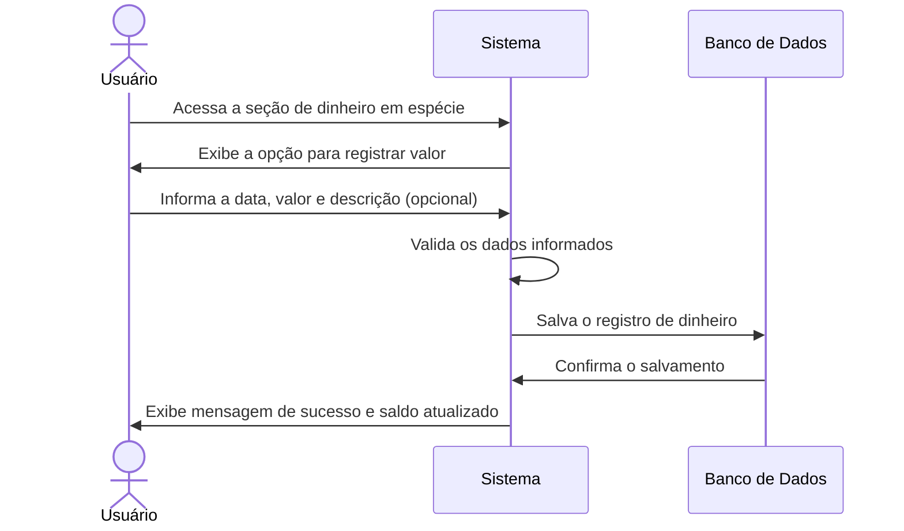

# RF006.5 💳 Registro de dinheiro em espécie

## 📝 Descrição

Esta funcionalidade permite que o usuário registre seus valores em dinheiro em espécie, mantendo um controle preciso de
seu saldo físico.

## 👥 Atores

- 👤 Usuário Autenticado

## ⚠️ Pré-condições

- O usuário deve estar logado no sistema.

## 🔌 Endpoints

- `POST /api/cash`
- `PUT /api/cash/{cashEntryId}`
- `GET /api/cash`

## 📋 Dados de Registro de Dinheiro em Espécie

| Campo         | Tipo     | Obrigatório | Descrição                    | Restrições               |
|---------------|----------|-------------|------------------------------|--------------------------|
| `date`        | `string` | ✅ Sim       | Data do registro             | Formato YYYY-MM-DD       |
| `amount`      | `number` | ✅ Sim       | Valor do dinheiro em espécie | Valor positivo           |
| `description` | `string` | ⬜ Não       | Descrição do registro        | Máximo de 255 caracteres |

## 🔄 Fluxo Principal



1. O usuário autenticado acessa a seção de gerenciamento de dinheiro em espécie.
2. O sistema exibe a opção para registrar uma entrada ou saída de dinheiro.
3. O usuário preenche os campos com a data, o valor e uma descrição opcional para o registro.
4. O sistema valida os dados informados, garantindo que o valor seja positivo e a data válida.
5. O sistema salva o registro de dinheiro em espécie associado ao perfil do usuário no banco de dados.
6. O sistema atualiza o saldo total de dinheiro em espécie do usuário e exibe uma mensagem de confirmação de sucesso.

## 🔀 Fluxos Alternativos

### ⚠️ FA01 - Edição de Registro Existente

1. O usuário seleciona um registro de dinheiro em espécie existente para edição.
2. O sistema exibe um formulário pré-preenchido com os dados do registro.
3. O usuário modifica os campos desejados (data, valor, descrição) e submete as alterações.
4. O sistema valida os novos dados e atualiza o registro no banco de dados.
5. O sistema exibe mensagem de sucesso e saldo atualizado.

## 🚫 Fluxos de Exceção

### ⚠️ FE01 - Dados inválidos

1. No passo 4 do fluxo principal, se os dados informados forem inválidos (ex: valor negativo, data futura), o sistema
   exibe uma mensagem de erro específica para o campo inválido.
2. O sistema retorna ao passo 3 do fluxo principal para que o ator corrija os dados informados.

### ⚠️ FE02 - Erro ao salvar o registro

1. No passo 5 do fluxo principal, se ocorrer um erro interno no sistema ao tentar salvar o registro, o sistema exibe uma
   mensagem de erro genérica e sugere que o usuário tente novamente mais tarde.

## 🧪 Exemplos de Uso

### Requisição HTTP - Registrar Dinheiro em Espécie (Entrada)

```http
POST /api/cash HTTP/1.1
Host: api.metakyasshu.com
Content-Type: application/json
Authorization: Bearer [TOKEN_DE_AUTENTICACAO]

{
  "date": "2023-10-27",
  "amount": 100.00,
  "description": "Dinheiro recebido em reembolso"
}
```

### Requisição HTTP - Registrar Dinheiro em Espécie (Saída)

```http
POST /api/cash HTTP/1.1
Host: api.metakyasshu.com
Content-Type: application/json
Authorization: Bearer [TOKEN_DE_AUTENTICACAO]

{
  "date": "2023-10-27",
  "amount": -50.00,
  "description": "Pagamento de almoço em dinheiro"
}
```

---

> ---------------------------------------------------------------------------
> #### 💰 METAKYASSHU 💰
> ***Transformando finanças em conquistas compartilhadas***
> --------------------------------------------------------------------------- 