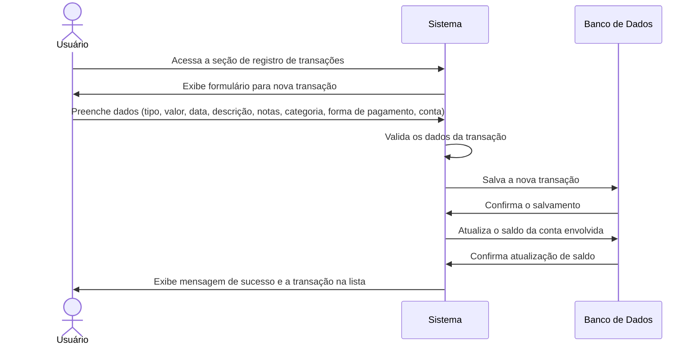

# RF007 📝 Registro detalhado de receitas e despesas

## 📝 Descrição

Esta funcionalidade permite o registro detalhado de receitas e despesas, incluindo data, valor, descrição, notas,
categoria e forma de pagamento, para um controle financeiro completo e granular.

## 👥 Atores

- 👤 Usuário Autenticado

## ⚠️ Pré-condições

- O usuário deve estar logado no sistema.
- O usuário deve ter pelo menos uma conta bancária ou dinheiro em espécie cadastrados para vincular a transação.
- O usuário deve ter categorias de despesas/receitas configuradas (ou usar as padrão).

## 🔌 Endpoints

- `POST /api/transactions`
- `GET /api/transactions/{transactionId}`
- `PUT /api/transactions/{transactionId}`
- `DELETE /api/transactions/{transactionId}`

## 📋 Dados da Transação (Receita/Despesa)

| Campo               | Tipo     | Obrigatório | Descrição                                   | Restrições                                |
|---------------------|----------|-------------|---------------------------------------------|-------------------------------------------|
| `type`              | `string` | ✅ Sim       | Tipo de transação                           | `revenue`, `expense`                      |
| `amount`            | `number` | ✅ Sim       | Valor da transação                          | Valor positivo, com duas casas decimais   |
| `date`              | `string` | ✅ Sim       | Data da transação                           | Formato YYYY-MM-DD, não futura            |
| `description`       | `string` | ✅ Sim       | Descrição breve da transação                | Mínimo de 3 caracteres                    |
| `notes`             | `string` | ⬜ Não       | Notas adicionais sobre a transação          | Máximo de 500 caracteres                  |
| `category_id`       | `string` | ✅ Sim       | ID da categoria da transação                | UUID válido, categoria existente          |
| `payment_method_id` | `string` | ✅ Sim       | ID da forma de pagamento utilizada          | UUID válido, forma de pagamento existente |
| `account_id`        | `string` | ✅ Sim       | ID da conta/carteira envolvida na transação | UUID válido, conta/carteira existente     |

## 🔄 Fluxo Principal



1. O usuário autenticado acessa a seção de registro de transações (receitas/despesas).
2. O sistema exibe um formulário para que o usuário insira os detalhes da nova transação.
3. O usuário preenche os campos obrigatórios e opcionais, incluindo: tipo (receita/despesa), valor, data, descrição,
   notas (opcional), categoria, forma de pagamento utilizada e a conta bancária/carteira de onde a transação partiu ou
   para onde foi destinada.
4. O sistema valida os dados informados para garantir a consistência e a validade (ex: valores positivos, data não
   futura, categorias e formas de pagamento existentes).
5. O sistema salva a nova transação no banco de dados, associando-a ao usuário e à conta/perfil especificados.
6. O sistema atualiza o saldo da conta bancária ou dinheiro em espécie envolvida na transação (aumentando para receitas,
   diminuindo para despesas).
7. O sistema exibe uma mensagem de confirmação de sucesso e a nova transação é adicionada à lista de transações do
   usuário.

## 🔀 Fluxos Alternativos

### ⚠️ FA01 - Edição de Transação Existente

1. O usuário seleciona uma transação existente na lista para edição.
2. O sistema exibe um formulário pré-preenchido com os dados atuais da transação.
3. O usuário modifica os campos desejados (ex: valor, categoria, descrição) e submete as alterações.
4. O sistema valida os novos dados, atualiza a transação no banco de dados e recalcula o impacto no saldo da conta, se
   necessário.
5. O sistema exibe mensagem de sucesso e a transação atualizada na lista.

### ⚠️ FA02 - Exclusão de Transação Existente

1. O usuário seleciona uma transação existente na lista para exclusão.
2. O sistema solicita uma confirmação do usuário para a exclusão.
3. Após a confirmação, o sistema remove a transação do banco de dados e reverte o impacto no saldo da conta envolvida.
4. O sistema exibe mensagem de sucesso e remove a transação da lista.

## 🚫 Fluxos de Exceção

### ⚠️ FE01 - Dados inválidos

1. No passo 4 do fluxo principal (ou passos de edição), se os dados informados forem inválidos (ex: valor negativo, data
   futura, `category_id` ou `payment_method_id` inexistentes), o sistema exibe uma mensagem de erro específica para o
   campo inválido.
2. O sistema retorna ao formulário para que o usuário corrija os dados informados.

### ⚠️ FE02 - Saldo Insuficiente (para despesas)

1. No passo 6 do fluxo principal, se o tipo de transação for `expense` e o valor for maior que o saldo disponível na
   conta selecionada, o sistema exibe uma mensagem de erro indicando saldo insuficiente.
2. O sistema não registra a transação e retorna ao formulário para que o usuário ajuste o valor ou selecione outra
   conta.

### ⚠️ FE03 - Transação não encontrada (para edição/exclusão)

1. No fluxo alternativo de edição ou exclusão, se o `transactionId` fornecido não corresponder a uma transação existente
   para o usuário, o sistema exibe uma mensagem de erro indicando que a transação não foi encontrada.

## 🧪 Exemplos de Uso

### Requisição HTTP - Registrar Receita

```http
POST /api/transactions HTTP/1.1
Host: api.metakyasshu.com
Content-Type: application/json
Authorization: Bearer [TOKEN_DE_AUTENTICACAO]

{
  "type": "revenue",
  "amount": 1500.00,
  "date": "2023-10-26",
  "description": "Salário mensal",
  "notes": "Referente ao mês de Outubro",
  "category_id": "uuid-da-categoria-salario",
  "payment_method_id": "uuid-da-forma-pagamento-deposito",
  "account_id": "uuid-da-conta-corrente"
}
```

### Requisição HTTP - Registrar Despesa

```http
POST /api/transactions HTTP/1.1
Host: api.metakyasshu.com
Content-Type: application/json
Authorization: Bearer [TOKEN_DE_AUTENTICACAO]

{
  "type": "expense",
  "amount": 85.50,
  "date": "2023-10-25",
  "description": "Compras no supermercado",
  "notes": "Compras da semana",
  "category_id": "uuid-da-categoria-alimentacao",
  "payment_method_id": "uuid-da-forma-pagamento-cartao",
  "account_id": "uuid-da-conta-corrente"
}
```

### Requisição HTTP - Obter Detalhes de Transação

```http
GET /api/transactions/a1b2c3d4e5f6-1234-5678-90ab-cdef12345678 HTTP/1.1
Host: api.metakyasshu.com
Authorization: Bearer [TOKEN_DE_AUTENTICACAO]
```

### Requisição HTTP - Atualizar Transação

```http
PUT /api/transactions/a1b2c3d4e5f6-1234-5678-90ab-cdef12345678 HTTP/1.1
Host: api.metakyasshu.com
Content-Type: application/json
Authorization: Bearer [TOKEN_DE_AUTENTICACAO]

{
  "amount": 90.00,
  "description": "Compras no supermercado (ajuste)"
}
```

### Requisição HTTP - Excluir Transação

```http
DELETE /api/transactions/a1b2c3d4e5f6-1234-5678-90ab-cdef12345678 HTTP/1.1
Host: api.metakyasshu.com
Authorization: Bearer [TOKEN_DE_AUTENTICACAO]
```

---

> ---------------------------------------------------------------------------
> #### 💰 METAKYASSHU 💰
> ***Transformando finanças em conquistas compartilhadas***
> --------------------------------------------------------------------------- 