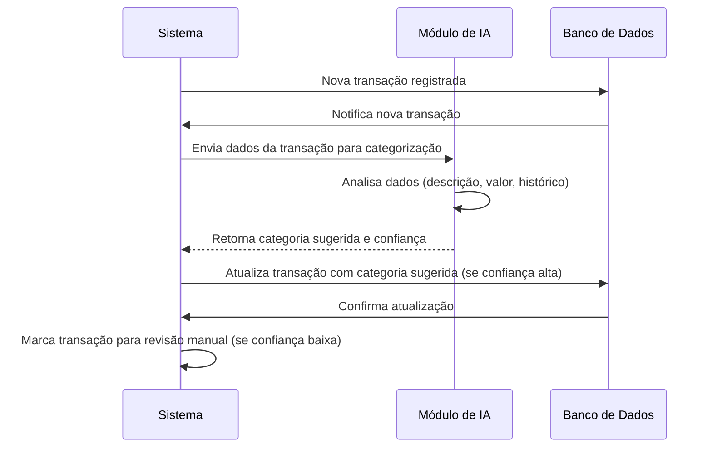

# RF008.1 🏷️ Categorização automática de transações

## 📝 Descrição

Esta funcionalidade permite a categorização automática de transações utilizando algoritmos de inteligência artificial,
baseando-se em padrões de gastos, histórico do usuário e descrição da transação.

## 👥 Atores

- 👤 Sistema (AI)
- 👤 Usuário Autenticado (para revisão)

## ⚠️ Pré-condições

- O usuário deve ter transações registradas no sistema.
- O sistema de inteligência artificial para categorização deve estar ativo e configurado.

## 🔌 Endpoints

- `POST /api/transactions/{transactionId}/categorize/auto`
- `GET /api/categories/suggest` (para sugestões)

## 📋 Dados para Categorização Automática

| Campo                   | Tipo     | Obrigatório | Descrição                                    | Restrições                       |
|-------------------------|----------|-------------|----------------------------------------------|----------------------------------|
| `transaction_id`        | `string` | ✅ Sim       | ID da transação a ser categorizada           | UUID válido, transação existente |
| `suggested_category_id` | `string` | ⬜ Não       | ID da categoria sugerida pela AI (retorno)   | UUID válido, categoria existente |
| `confidence_score`      | `number` | ⬜ Não       | Pontuação de confiança da sugestão (retorno) | 0.0 a 1.0                        |

## 🔄 Fluxo Principal



1. Uma nova transação é registrada no sistema (manualmente pelo usuário ou importada).
2. O sistema envia os detalhes da transação (descrição, valor, data, etc.) para o módulo de inteligência artificial.
3. O módulo de IA analisa os dados da transação, comparando-os com padrões de gastos do usuário e um banco de dados de
   categorias pré-definidas.
4. O módulo de IA sugere uma categoria para a transação e atribui uma pontuação de confiança a essa sugestão.
5. Se a pontuação de confiança for alta (acima de um limite configurável), o sistema automaticamente atribui a categoria
   sugerida à transação e a marca como categorizada.
6. Se a pontuação de confiança for baixa, o sistema mantém a transação sem categoria e a marca para revisão manual pelo
   usuário, podendo também sugerir a categoria para que o usuário confirme.

## 🔀 Fluxos Alternativos

### ⚠️ FA01 - Rejeição da Categoria Automática

1. O usuário revisa uma transação categorizada automaticamente e discorda da categoria atribuída.
2. O usuário opta por editar a categoria da transação manualmente, conforme RF008.2.
3. O sistema pode usar essa correção para refinar o modelo de IA para futuras categorizações.

## 🚫 Fluxos de Exceção

### ⚠️ FE01 - Falha na Comunicação com Módulo de IA

1. No passo 2 do fluxo principal, se houver uma falha na comunicação com o módulo de inteligência artificial, o sistema
   não consegue categorizar automaticamente a transação.
2. O sistema marca a transação como "pendente de categorização" e pode notificar o usuário para categorizá-la
   manualmente.

### ⚠️ FE02 - Nenhuma Categoria Sugerida

1. No passo 4 do fluxo principal, se o módulo de IA não conseguir sugerir uma categoria com confiança mínima, a
   transação permanece sem categoria e é marcada para revisão manual pelo usuário.

## 🧪 Exemplos de Uso

### Requisição Interna (Sistema para AI) - Solicitar Categorização

```json
{
  "transaction_id": "uuid-da-transacao-exemplo",
  "description": "Almoço no restaurante",
  "amount": 45.00
}
```

### Resposta da AI (para Sistema) - Categoria Sugerida

```json
{
  "transaction_id": "uuid-da-transacao-exemplo",
  "suggested_category_id": "uuid-da-categoria-alimentacao",
  "confidence_score": 0.92
}
```

---

> ---------------------------------------------------------------------------
> #### 💰 METAKYASSHU 💰
> ***Transformando finanças em conquistas compartilhadas***
> --------------------------------------------------------------------------- 