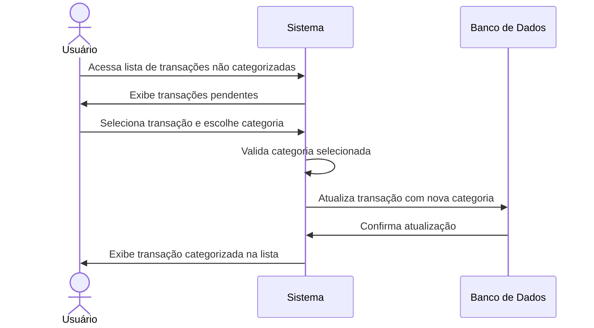
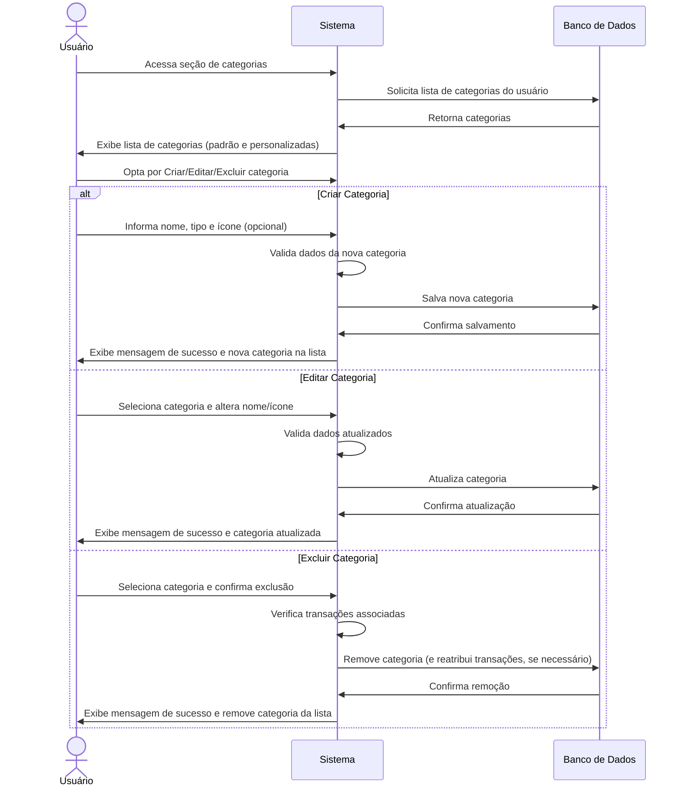

# RF008.2 🏷️ Categorização manual e personalização de categorias

## 📝 Descrição

Esta funcionalidade permite ao usuário categorizar manualmente suas transações e também criar, editar e gerenciar suas
próprias categorias personalizadas para um controle financeiro mais preciso e adaptado às suas necessidades.

## 👥 Atores

- 👤 Usuário Autenticado

## ⚠️ Pré-condições

- O usuário deve estar logado no sistema.
- Para categorização manual, o usuário deve ter transações registradas.

## 🔌 Endpoints

- `PUT /api/transactions/{transactionId}/category` (para categorização manual)
- `POST /api/categories` (para criar categoria)
- `GET /api/categories` (para listar categorias)
- `PUT /api/categories/{categoryId}` (para editar categoria)
- `DELETE /api/categories/{categoryId}` (para excluir categoria)

## 📋 Dados para Categorização e Categorias

| Campo            | Tipo     | Obrigatório | Descrição                           | Restrições                                    |
|------------------|----------|-------------|-------------------------------------|-----------------------------------------------|
| `transaction_id` | `string` | ✅ Sim       | ID da transação a ser categorizada  | UUID válido, transação existente              |
| `category_id`    | `string` | ✅ Sim       | ID da categoria para atribuir       | UUID válido, categoria existente              |
| `name`           | `string` | ✅ Sim       | Nome da nova categoria              | Mínimo de 3 caracteres, único para o usuário  |
| `type`           | `string` | ✅ Sim       | Tipo da categoria (receita/despesa) | `revenue`, `expense`                          |
| `icon`           | `string` | ⬜ Não       | Ícone da categoria                  | Nome de ícone válido (ex: `fa-shopping-cart`) |

## 🔄 Fluxo Principal - Categorização Manual



1. O usuário autenticado acessa a lista de suas transações.
2. O sistema exibe as transações, destacando as que ainda não foram categorizadas ou que foram marcadas para revisão
   manual.
3. O usuário seleciona uma transação e escolhe uma categoria existente (padrão ou personalizada) na lista.
4. O sistema valida a categoria selecionada e atualiza a transação com essa nova categoria no banco de dados.
5. O sistema exibe uma mensagem de sucesso e a transação aparece como categorizada na lista.

## 🔄 Fluxo Principal - Gestão de Categorias Personalizadas



1. O usuário autenticado acessa a seção de gerenciamento de categorias.
2. O sistema exibe uma lista de todas as categorias disponíveis (padrão e as criadas pelo usuário).
3. O usuário seleciona uma opção:
   a. **Criar Nova Categoria:** Preenche o nome, tipo (receita/despesa) e, opcionalmente, um ícone para a nova
   categoria. O sistema valida os dados (nome único, tipo válido) e salva a nova categoria no banco de dados,
   associando-a ao usuário.
   b. **Editar Categoria Existente:** Seleciona uma categoria da lista, modifica seu nome ou ícone. O sistema valida as
   alterações e atualiza a categoria no banco de dados.
   c. **Excluir Categoria Existente:** Seleciona uma categoria e confirma a exclusão. O sistema verifica se há
   transações associadas a essa categoria e pode solicitar uma reatribuição dessas transações antes da exclusão. A
   categoria é removida do banco de dados.
4. O sistema exibe uma mensagem de sucesso após cada operação e atualiza a lista de categorias.

## 🚫 Fluxos de Exceção

### ⚠️ FE01 - Categoria não encontrada

1. Ao tentar categorizar uma transação com uma `category_id` inválida ou ao tentar editar/excluir uma categoria
   inexistente, o sistema exibe uma mensagem de erro indicando que a categoria não foi encontrada.

### ⚠️ FE02 - Dados de categoria inválidos (para criação/edição)

1. Se o nome da categoria for muito curto, já existir para o usuário, ou o tipo for inválido, o sistema exibe uma
   mensagem de erro específica.
2. O sistema mantém o usuário no formulário para que ele corrija os dados.

### ⚠️ FE03 - Tentativa de exclusão de categoria com transações associadas

1. Se o usuário tentar excluir uma categoria que ainda possui transações vinculadas, o sistema alerta o usuário e
   solicita que ele reatribua essas transações para outra categoria antes de prosseguir com a exclusão.

## 🧪 Exemplos de Uso

### Requisição HTTP - Categorizar Transação Manualmente

```http
PUT /api/transactions/a1b2c3d4e5f6-1234-5678-90ab-cdef12345678/category HTTP/1.1
Host: api.metakyasshu.com
Content-Type: application/json
Authorization: Bearer [TOKEN_DE_AUTENTICACAO]

{
  "category_id": "uuid-da-nova-categoria"
}
```

### Requisição HTTP - Criar Nova Categoria

```http
POST /api/categories HTTP/1.1
Host: api.metakyasshu.com
Content-Type: application/json
Authorization: Bearer [TOKEN_DE_AUTENTICACAO]

{
  "name": "Transporte Público",
  "type": "expense",
  "icon": "fa-bus"
}
```

### Requisição HTTP - Listar Categorias

```http
GET /api/categories HTTP/1.1
Host: api.metakyasshu.com
Authorization: Bearer [TOKEN_DE_AUTENTICACAO]
```

### Requisição HTTP - Editar Categoria

```http
PUT /api/categories/uuid-da-categoria-existente HTTP/1.1
Host: api.metakyasshu.com
Content-Type: application/json
Authorization: Bearer [TOKEN_DE_AUTENTICACAO]

{
  "name": "Transporte Urbano",
  "icon": "fa-train"
}
```

### Requisição HTTP - Excluir Categoria

```http
DELETE /api/categories/uuid-da-categoria-a-excluir HTTP/1.1
Host: api.metakyasshu.com
Authorization: Bearer [TOKEN_DE_AUTENTICACAO]
```

---

> ---------------------------------------------------------------------------
> #### 💰 METAKYASSHU 💰
> ***Transformando finanças em conquistas compartilhadas***
> --------------------------------------------------------------------------- 