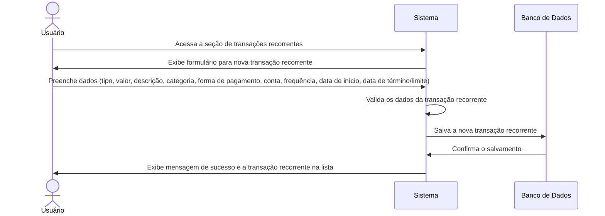
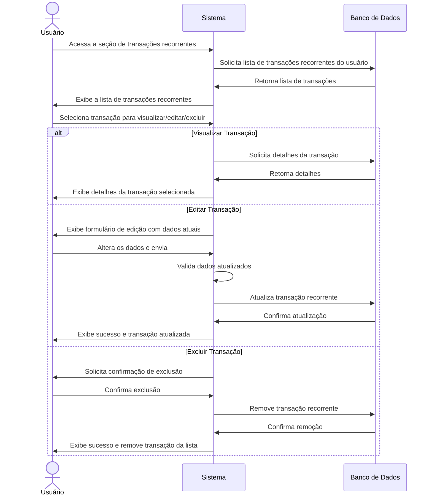

# RF009.1 🔄 Criação e gestão de transações recorrentes

## 📝 Descrição

Esta funcionalidade permite a criação e gestão de transações que se repetem periodicamente (ex: aluguel, salário,
assinaturas), facilitando o planejamento e controle financeiro do usuário.

## 👥 Atores

- 👤 Usuário Autenticado

## ⚠️ Pré-condições

- O usuário deve estar logado no sistema.
- O usuário deve ter categorias e formas de pagamento configuradas.

## 🔌 Endpoints

- `POST /api/recurring-transactions`
- `GET /api/recurring-transactions`
- `GET /api/recurring-transactions/{recurringTransactionId}`
- `PUT /api/recurring-transactions/{recurringTransactionId}`
- `DELETE /api/recurring-transactions/{recurringTransactionId}`

## 📋 Dados da Transação Recorrente

| Campo               | Tipo     | Obrigatório | Descrição                                   | Restrições                                |
|---------------------|----------|-------------|---------------------------------------------|-------------------------------------------|
| `type`              | `string` | ✅ Sim       | Tipo de transação (receita/despesa)         | `revenue`, `expense`                      |
| `amount`            | `number` | ✅ Sim       | Valor da transação recorrente               | Valor positivo, com duas casas decimais   |
| `description`       | `string` | ✅ Sim       | Descrição da transação                      | Mínimo de 3 caracteres                    |
| `category_id`       | `string` | ✅ Sim       | ID da categoria da transação                | UUID válido, categoria existente          |
| `payment_method_id` | `string` | ✅ Sim       | ID da forma de pagamento utilizada          | UUID válido, forma de pagamento existente |
| `account_id`        | `string` | ✅ Sim       | ID da conta/carteira envolvida na transação | UUID válido, conta/carteira existente     |
| `frequency`         | `string` | ✅ Sim       | Frequência da recorrência                   | `daily`, `weekly`, `monthly`, `yearly`    |
| `start_date`        | `string` | ✅ Sim       | Data de início da recorrência               | Formato YYYY-MM-DD, não futura            |
| `end_date`          | `string` | ⬜ Não       | Data de término da recorrência              | Formato YYYY-MM-DD, após `start_date`     |
| `occurrences_limit` | `number` | ⬜ Não       | Limite de ocorrências da transação          | Número inteiro positivo                   |

## 🔄 Fluxo Principal - Criação de Transação Recorrente



1. O usuário autenticado acessa a seção de gerenciamento de transações recorrentes.
2. O sistema exibe um formulário para a criação de uma nova transação recorrente.
3. O usuário preenche os dados, incluindo: tipo (receita/despesa), valor, descrição, categoria, forma de pagamento,
   conta envolvida, frequência da recorrência (diária, semanal, mensal, anual), data de início e, opcionalmente, uma
   data de término ou um limite de ocorrências.
4. O sistema valida os dados informados, garantindo a consistência e a validade (ex: datas válidas, frequência
   reconhecida).
5. O sistema salva as informações da nova transação recorrente no banco de dados.
6. O sistema exibe uma mensagem de confirmação de sucesso e a nova transação recorrente é adicionada à lista do usuário,
   com as próximas ocorrências programadas.

## 🔄 Fluxo Principal - Gestão de Transações Recorrentes



1. O usuário autenticado acessa a seção de gerenciamento de transações recorrentes.
2. O sistema exibe uma lista de todas as transações recorrentes cadastradas pelo usuário.
3. O usuário seleciona uma opção: visualizar detalhes, editar ou excluir uma transação recorrente existente.
4. **Para Visualização:** O sistema exibe os detalhes completos da transação recorrente, incluindo as próximas
   ocorrências.
5. **Para Edição:**
   a. O sistema apresenta um formulário pré-preenchido com os dados atuais da transação recorrente.
   b. O usuário modifica os campos desejados (ex: valor, descrição, frequência, data de término) e submete as
   alterações.
   c. O sistema valida os novos dados e atualiza a transação recorrente no banco de dados, ajustando as futuras
   ocorrências se necessário.
   d. O sistema exibe uma mensagem de sucesso e a lista de transações recorrentes atualizada.
6. **Para Exclusão:**
   a. O sistema solicita uma confirmação do usuário para a exclusão da transação recorrente.
   b. Após a confirmação, o sistema remove a transação recorrente e todas as suas futuras ocorrências do banco de dados.
   c. O sistema exibe uma mensagem de sucesso e a transação é removida da lista.

## 🚫 Fluxos de Exceção

### ⚠️ FE01 - Dados inválidos

1. Durante a criação ou edição, se os dados informados forem inválidos (ex: valor negativo, data de término anterior à
   data de início, `category_id` inexistente), o sistema exibe uma mensagem de erro específica para o campo inválido.
2. O sistema retorna ao formulário para que o usuário corrija os dados.

### ⚠️ FE02 - Transação Recorrente não encontrada

1. Ao tentar visualizar, editar ou excluir uma transação recorrente com um `recurringTransactionId` inválido, o sistema
   exibe uma mensagem de erro indicando que a transação não foi encontrada.

### ⚠️ FE03 - Erro ao salvar/atualizar/excluir

1. Se ocorrer um erro interno no sistema durante as operações de salvar, atualizar ou excluir a transação recorrente, o
   sistema exibe uma mensagem de erro genérica e sugere que o usuário tente novamente mais tarde.

## 🧪 Exemplos de Uso

### Requisição HTTP - Criar Transação Recorrente (Mensal)

```http
POST /api/recurring-transactions HTTP/1.1
Host: api.metakyasshu.com
Content-Type: application/json
Authorization: Bearer [TOKEN_DE_AUTENTICACAO]

{
  "type": "expense",
  "amount": 1200.00,
  "description": "Aluguel",
  "category_id": "uuid-da-categoria-moradia",
  "payment_method_id": "uuid-da-forma-pagamento-boleto",
  "account_id": "uuid-da-conta-corrente",
  "frequency": "monthly",
  "start_date": "2023-11-01"
}
```

### Requisição HTTP - Listar Transações Recorrentes

```http
GET /api/recurring-transactions HTTP/1.1
Host: api.metakyasshu.com
Authorization: Bearer [TOKEN_DE_AUTENTICACAO]
```

### Requisição HTTP - Atualizar Transação Recorrente

```http
PUT /api/recurring-transactions/a1b2c3d4e5f6-1234-5678-90ab-cdef12345678 HTTP/1.1
Host: api.metakyasshu.com
Content-Type: application/json
Authorization: Bearer [TOKEN_DE_AUTENTICACAO]

{
  "amount": 1250.00,
  "description": "Aluguel (reajustado)"
}
```

### Requisição HTTP - Excluir Transação Recorrente

```http
DELETE /api/recurring-transactions/a1b2c3d4e5f6-1234-5678-90ab-cdef12345678 HTTP/1.1
Host: api.metakyasshu.com
Authorization: Bearer [TOKEN_DE_AUTENTICACAO]
```

---

> ---------------------------------------------------------------------------
> #### 💰 METAKYASSHU 💰
> ***Transformando finanças em conquistas compartilhadas***
> ---------------------------------------------------------------------------