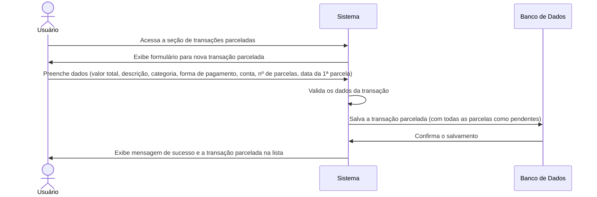
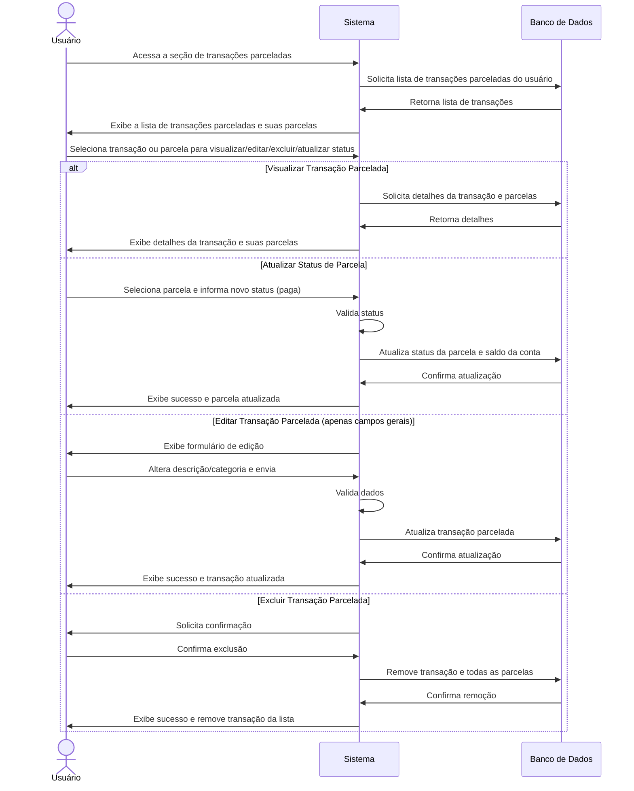

# RF009.2 🔄 Criação e gestão de transações parceladas

## 📝 Descrição

Esta funcionalidade permite a criação e gestão de transações divididas em múltiplas parcelas, com controle individual do
status de cada parcela, ideal para compras parceladas no cartão de crédito ou outros pagamentos divididos.

## 👥 Atores

- 👤 Usuário Autenticado

## ⚠️ Pré-condições

- O usuário deve estar logado no sistema.
- O usuário deve ter categorias e formas de pagamento configuradas.

## 🔌 Endpoints

- `POST /api/installment-transactions`
- `GET /api/installment-transactions`
- `GET /api/installment-transactions/{installmentTransactionId}`
- `PUT /api/installment-transactions/{installmentTransactionId}`
- `DELETE /api/installment-transactions/{installmentTransactionId}`
- `PUT /api/installment-transactions/installments/{installmentId}/status` (para atualizar status de parcela)

## 📋 Dados da Transação Parcelada

| Campo                    | Tipo     | Obrigatório | Descrição                                   | Restrições                                |
|--------------------------|----------|-------------|---------------------------------------------|-------------------------------------------|
| `type`                   | `string` | ✅ Sim       | Tipo de transação (despesa)                 | `expense`                                 |
| `total_amount`           | `number` | ✅ Sim       | Valor total da transação                    | Valor positivo, com duas casas decimais   |
| `description`            | `string` | ✅ Sim       | Descrição da transação                      | Mínimo de 3 caracteres                    |
| `category_id`            | `string` | ✅ Sim       | ID da categoria da transação                | UUID válido, categoria existente          |
| `payment_method_id`      | `string` | ✅ Sim       | ID da forma de pagamento utilizada          | UUID válido, forma de pagamento existente |
| `account_id`             | `string` | ✅ Sim       | ID da conta/carteira envolvida na transação | UUID válido, conta/carteira existente     |
| `number_of_installments` | `number` | ✅ Sim       | Número total de parcelas                    | Inteiro positivo, mínimo 2                |
| `first_installment_date` | `string` | ✅ Sim       | Data da primeira parcela                    | Formato YYYY-MM-DD, não futura            |

## 📋 Dados da Parcela Individual

| Campo           | Tipo     | Obrigatório | Descrição                      | Restrições                   |
|-----------------|----------|-------------|--------------------------------|------------------------------|
| `installmentId` | `string` | ✅ Sim       | ID único da parcela            | UUID válido                  |
| `status`        | `string` | ✅ Sim       | Status de pagamento da parcela | `paid`, `pending`, `overdue` |

## 🔄 Fluxo Principal - Criação de Transação Parcelada



1. O usuário autenticado acessa a seção de gerenciamento de transações parceladas.
2. O sistema exibe um formulário para a criação de uma nova transação parcelada.
3. O usuário preenche os dados, incluindo: valor total, descrição, categoria, forma de pagamento, conta envolvida,
   número de parcelas e a data da primeira parcela.
4. O sistema valida os dados informados, calculando o valor de cada parcela e gerando as parcelas individuais com
   status "pendente".
5. O sistema salva a transação parcelada e todas as suas parcelas no banco de dados.
6. O sistema exibe uma mensagem de confirmação de sucesso e a nova transação parcelada é adicionada à lista do usuário,
   com o detalhamento das parcelas.

## 🔄 Fluxo Principal - Gestão de Transações Parceladas



1. O usuário autenticado acessa a seção de gerenciamento de transações parceladas.
2. O sistema exibe uma lista de todas as transações parceladas cadastradas, com o status de cada parcela.
3. O usuário seleciona uma opção:
   a. **Visualizar Detalhes:** O sistema exibe os detalhes completos da transação parcelada e de todas as suas
   parcelas (valor, data de vencimento, status).
   b. **Atualizar Status da Parcela:** O usuário seleciona uma parcela e marca-a como paga, pendente ou vencida. O
   sistema atualiza o status no banco de dados e, se paga, registra a saída de valor da conta envolvida.
   c. **Editar Transação Parcelada:** O usuário pode editar informações gerais da transação parcelada (ex: descrição,
   categoria), mas não o número de parcelas ou valor total após a criação. O sistema valida e atualiza os dados.
   d. **Excluir Transação Parcelada:** O sistema solicita uma confirmação e, após a confirmação, remove a transação
   parcelada e todas as suas parcelas do banco de dados, revertendo quaisquer impactos em saldos de contas se
   necessário.
4. O sistema exibe uma mensagem de sucesso após cada operação e atualiza a lista.

## 🚫 Fluxos de Exceção

### ⚠️ FE01 - Dados inválidos

1. Durante a criação ou edição, se os dados informados forem inválidos (ex: número de parcelas menor que 2, valor total
   negativo, `category_id` inexistente), o sistema exibe uma mensagem de erro específica.
2. O sistema retorna ao formulário para que o usuário corrija os dados.

### ⚠️ FE02 - Transação/Parcela não encontrada

1. Ao tentar visualizar, editar, excluir ou atualizar o status de uma transação ou parcela com um ID inválido, o sistema
   exibe uma mensagem de erro indicando que o item não foi encontrado.

### ⚠️ FE03 - Erro ao salvar/atualizar/excluir

1. Se ocorrer um erro interno no sistema durante as operações, o sistema exibe uma mensagem de erro genérica e sugere
   que o usuário tente novamente mais tarde.

## 🧪 Exemplos de Uso

### Requisição HTTP - Criar Transação Parcelada

```http
POST /api/installment-transactions HTTP/1.1
Host: api.metakyasshu.com
Content-Type: application/json
Authorization: Bearer [TOKEN_DE_AUTENTICACAO]

{
  "type": "expense",
  "total_amount": 600.00,
  "description": "Compra de eletrônicos",
  "category_id": "uuid-da-categoria-eletronicos",
  "payment_method_id": "uuid-da-forma-pagamento-cartao-credito",
  "account_id": "uuid-da-conta-cartao-credito",
  "number_of_installments": 10,
  "first_installment_date": "2023-11-05"
}
```

### Requisição HTTP - Listar Transações Parceladas

```http
GET /api/installment-transactions HTTP/1.1
Host: api.metakyasshu.com
Authorization: Bearer [TOKEN_DE_AUTENTICACAO]
```

### Requisição HTTP - Atualizar Status de Parcela

```http
PUT /api/installment-transactions/installments/a1b2c3d4e5f6-1234-5678-90ab-cdef12345678/status HTTP/1.1
Host: api.metakyasshu.com
Content-Type: application/json
Authorization: Bearer [TOKEN_DE_AUTENTICACAO]

{
  "status": "paid"
}
```

### Requisição HTTP - Excluir Transação Parcelada

```http
DELETE /api/installment-transactions/a1b2c3d4e5f6-1234-5678-90ab-cdef12345678 HTTP/1.1
Host: api.metakyasshu.com
Authorization: Bearer [TOKEN_DE_AUTENTICACAO]
```

---

> ---------------------------------------------------------------------------
> #### 💰 METAKYASSHU 💰
> ***Transformando finanças em conquistas compartilhadas***
> --------------------------------------------------------------------------- 