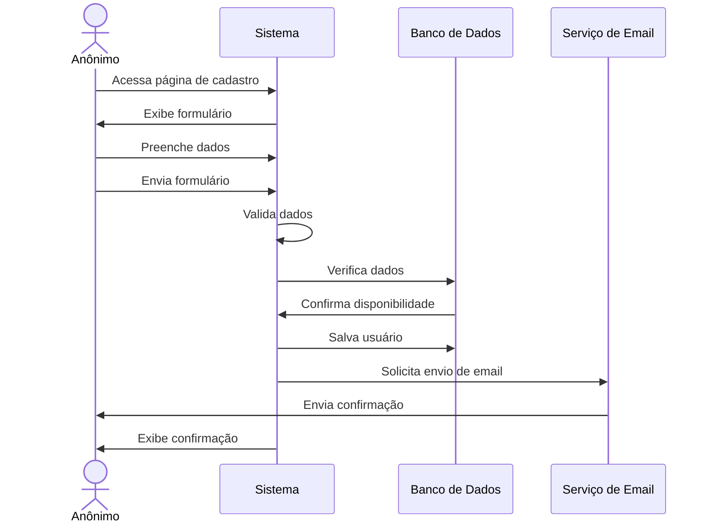

# 👤 RF01 - Cadastrar Usuário 

{ width=150 }

## 📝 Descrição

Esta funcionalidade permite que usuários se cadastrem no sistema.

## 👥 Atores

- 👤 Anônimo

## ⚠️ Pré-condições

- Não há pré-condições específicas para este requisito.

## 🔌 Endpoints

- `POST /api/user`

## 📋 Dados do Usuário

| Campo      | Tipo     | Obrigatório | Descrição         | Restrições             |
|------------|----------|-------------|-------------------|------------------------|
| `name`     | `string` | ✅ Sim      | Nome do usuário   | Mínimo de 3 caracteres |
| `email`    | `string` | ✅ Sim      | E-mail do usuário | Formato válido         |
| `cpf`      | `string` | ✅ Sim      | CPF do usuário    | Formato válido         |
| `password` | `string` | ✅ Sim      | Senha do usuário  | Mínimo de 8 caracteres |

## 🔄 Fluxo Principal



1. Inicialmente, o ator acessa a página de cadastro de usuário.
2. O sistema exibe um formulário de cadastro com os campos a serem preenchidos.
3. O ator preenche os campos obrigatórios do formulário.
4. O ator envia o formulário de cadastro.
5. O sistema valida os dados informados.
6. O sistema cria uma conta de usuário com os dados fornecidos.
7. O sistema exibe uma mensagem de confirmação de cadastro.
8. O ator recebe um e-mail de confirmação de cadastro.

## 🔀 Fluxos Alternativos

### ⚠️ FA01 - E-mail e CPF já cadastrados e não confirmados

1. Inicialmente, o ator acessa a página de cadastro de usuário.
2. O sistema exibe um formulário de cadastro com os campos a serem preenchidos.
3. O ator preenche os campos obrigatórios do formulário.
4. O ator envia o formulário de cadastro.
5. O sistema valida os dados informados.
6. O sistema reenvia o e-mail de confirmação de cadastro.
7. O ator recebe um novo e-mail de confirmação de cadastro.

## 🚫 Fluxos de Exceção

### ⚠️ FE01 - Dados inválidos
1. No passo 5 do fluxo principal, se os dados informados forem inválidos, o sistema exibe uma mensagem de erro.
2. O sistema retorna ao passo 2 do fluxo principal para que o ator corrija os dados informados.

### ⚠️ FE02 - E-mail já cadastrado
1. No passo 6 do fluxo alternativo, se o e-mail informado já estiver cadastrado, o sistema exibe uma mensagem de erro.
2. O sistema retorna ao passo 2 do fluxo alternativo para que o ator informe um novo e-mail.

### ⚠️ FE03 - CPF já cadastrado
1. No passo 6 do fluxo principal, se o CPF informado já estiver cadastrado, o sistema exibe uma mensagem de erro.
2. O sistema retorna ao passo 2 do fluxo principal para que o ator informe um novo CPF.

### ⚠️ FE04 - Erro no envio do e-mail
1. No passo 8 do fluxo principal ou alternativo, se houver um erro no envio do e-mail de confirmação, o sistema exibe uma mensagem de erro.
2. O sistema informa ao ator que houve um problema no envio do e-mail e solicita que ele tente novamente.

## 🧪 Exemplos de Uso

### Requisição HTTP
```http
POST /api/user HTTP/1.1
Host: api.metakyasshu.com
Content-Type: application/json

{
  "name": "João Silva",
  "email": "joao@email.com",
  "cpf": "123.456.789-00",
  "password": "Senha@123"
}
```


> ---------------------------------------------------------------------------
> #### 💰 Sistema de Gestão Financeira 💰
> ***Controlando suas finanças de forma simples e eficiente***
> ---------------------------------------------------------------------------