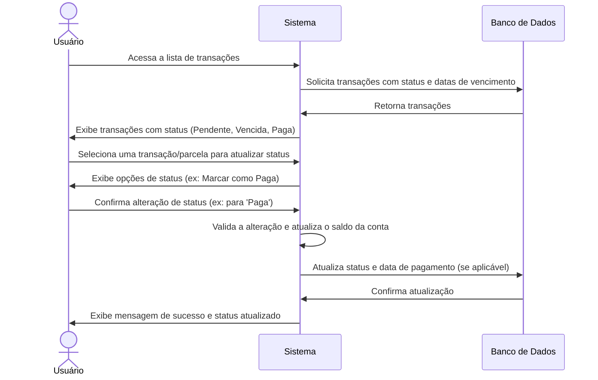

# RF010 ⏰ Registro e acompanhamento do status de pagamento de transações

## 📝 Descrição

Esta funcionalidade permite o registro e acompanhamento do status de pagamento de transações (receitas e despesas)
avulsas, recorrentes e parceladas, incluindo datas de vencimento e datas de pagamento, oferecendo uma visão clara do
fluxo de caixa e obrigações financeiras.

## 👥 Atores

- 👤 Usuário Autenticado
- ⚙️ Sistema (para atualizações automáticas de status e alertas)

## ⚠️ Pré-condições

- O usuário deve estar logado no sistema.
- Deve haver transações (avulsas, recorrentes ou parceladas) registradas no sistema.

## 🔌 Endpoints

- `PUT /api/transactions/{transactionId}/status` (para transações avulsas ou ocorrências de recorrentes/parceladas)
- `GET /api/transactions/summary-by-status` (obter resumo de status)
- `GET /api/transactions?status={status}` (filtrar transações por status)

## 📋 Dados de Status de Pagamento

| Campo            | Tipo     | Obrigatório                            | Descrição                                   | Restrições                                      |
|------------------|----------|----------------------------------------|---------------------------------------------|-------------------------------------------------|
| `transaction_id` | `string` | ✅ Sim                                  | ID da transação ou parcela a ser atualizada | UUID válido, transação/parcela existente        |
| `status`         | `string` | ✅ Sim                                  | Status de pagamento                         | `paid`, `pending`, `overdue`, `due_soon`        |
| `due_date`       | `string` | ✅ Sim (para transações com vencimento) | Data de vencimento da transação/parcela     | Formato YYYY-MM-DD                              |
| `payment_date`   | `string` | ⬜ Não                                  | Data em que a transação foi paga            | Formato YYYY-MM-DD, não futura, após `due_date` |

## 🔄 Fluxo Principal - Acompanhamento e Atualização Manual



1. O usuário autenticado acessa a seção de transações, que pode incluir receitas e despesas avulsas, recorrentes e
   parcelas.
2. O sistema exibe uma lista de transações com seu status de pagamento atual (ex: Paga, Pendente, A Pagar, Vencida) e
   suas respectivas datas de vencimento.
3. O sistema atualiza automaticamente o status de transações para `overdue` quando a data de vencimento é ultrapassada e
   não está `paid`.
4. O usuário pode selecionar uma transação (ou uma parcela de uma transação parcelada) e optar por atualizar manualmente
   seu status (ex: marcar como `paid`).
5. Ao marcar uma despesa como `paid`, o sistema valida e registra a saída do valor da conta associada e a data de
   pagamento.
6. Ao marcar uma receita como `paid`, o sistema valida e registra a entrada do valor na conta associada e a data de
   pagamento.
7. O sistema exibe uma mensagem de confirmação de sucesso e o status da transação é atualizado na lista.

## 🔀 Fluxos Alternativos

### ⚠️ FA01 - Alertas de Vencimento

1. O sistema verifica periodicamente as transações com `due_date` próxima ou que já estão vencidas e `status` diferente
   de `paid`.
2. O sistema envia notificações (ex: email, push) ao usuário alertando sobre transações `due_soon` (a vencer) ou
   `overdue` (vencidas).

### ⚠️ FA02 - Filtragem por Status

1. O usuário pode aplicar filtros na lista de transações para visualizar apenas aquelas com um status específico (ex:
   ver todas as transações `pending` ou `overdue`).

## 🚫 Fluxos de Exceção

### ⚠️ FE01 - Transação/Parcela não encontrada

1. Ao tentar atualizar o status de uma transação ou parcela com um ID inválido ou inexistente, o sistema exibe uma
   mensagem de erro indicando que o item não foi encontrado.

### ⚠️ FE02 - Saldo Insuficiente (ao marcar despesa como 'Paga')

1. No passo 5 do fluxo principal, se o usuário tentar marcar uma despesa como `paid` e o saldo disponível na conta
   associada for insuficiente, o sistema exibe uma mensagem de erro indicando a falta de saldo.
2. O sistema não permite a alteração de status e sugere que o usuário ajuste o saldo ou a conta.

### ⚠️ FE03 - Status Inválido

1. Se o usuário tentar atribuir um status inválido (que não seja `paid`, `pending`, `overdue`, `due_soon`), o sistema
   exibe uma mensagem de erro.

## 🧪 Exemplos de Uso

### Requisição HTTP - Marcar Transação como Paga

```http
PUT /api/transactions/a1b2c3d4e5f6-1234-5678-90ab-cdef12345678/status HTTP/1.1
Host: api.metakyasshu.com
Content-Type: application/json
Authorization: Bearer [TOKEN_DE_AUTENTICACAO]

{
  "status": "paid",
  "payment_date": "2023-10-27"
}
```

### Requisição HTTP - Marcar Parcela como Paga

```http
PUT /api/installment-transactions/installments/a1b2c3d4e5f6-1234-5678-90ab-cdef12345678/status HTTP/1.1
Host: api.metakyasshu.com
Content-Type: application/json
Authorization: Bearer [TOKEN_DE_AUTENTICACAO]

{
  "status": "paid",
  "payment_date": "2023-10-27"
}
```

### Requisição HTTP - Obter Resumo de Transações por Status

```http
GET /api/transactions/summary-by-status HTTP/1.1
Host: api.metakyasshu.com
Authorization: Bearer [TOKEN_DE_AUTENTICACAO]
```

---

> ---------------------------------------------------------------------------
> #### 💰 METAKYASSHU 💰
> ***Transformando finanças em conquistas compartilhadas***
> --------------------------------------------------------------------------- 