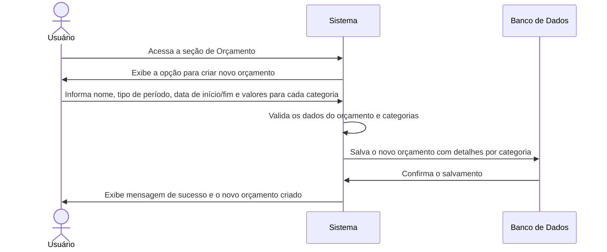
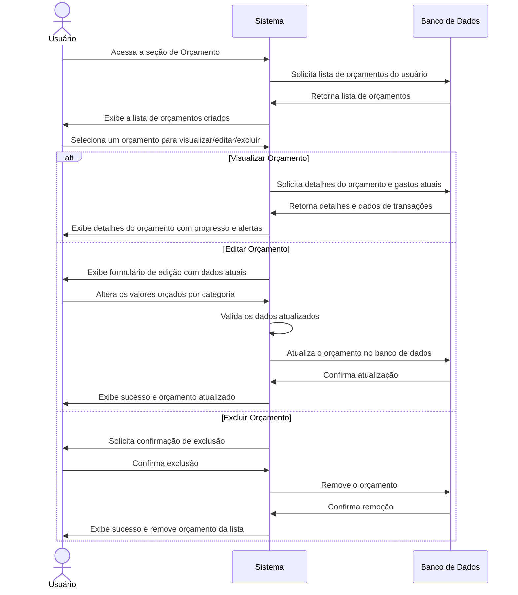

# RF011 📊 Orçamento mensal/anual personalizável

## 📝 Descrição

Esta funcionalidade permite a criação de orçamentos mensais ou anuais personalizáveis por categoria e subcategoria,
auxiliando o usuário a planejar e controlar seus gastos e receitas para atingir metas financeiras.

## 👥 Atores

- 👤 Usuário Autenticado

## ⚠️ Pré-condições

- O usuário deve estar logado no sistema.
- O usuário deve ter categorias e subcategorias configuradas (ou usar as padrão).

## 🔌 Endpoints

- `POST /api/budgets`
- `GET /api/budgets`
- `GET /api/budgets/{budgetId}`
- `PUT /api/budgets/{budgetId}`
- `DELETE /api/budgets/{budgetId}`

## 📋 Dados do Orçamento

| Campo              | Tipo            | Obrigatório | Descrição                                  | Restrições                                              |
|--------------------|-----------------|-------------|--------------------------------------------|---------------------------------------------------------|
| `name`             | `string`        | ✅ Sim       | Nome do orçamento (ex: "Orçamento Mensal") | Mínimo de 3 caracteres, único para o usuário no período |
| `period_type`      | `string`        | ✅ Sim       | Tipo de período do orçamento               | `monthly`, `yearly`                                     |
| `start_date`       | `string`        | ✅ Sim       | Data de início do período do orçamento     | Formato YYYY-MM-DD                                      |
| `end_date`         | `string`        | ✅ Sim       | Data de término do período do orçamento    | Formato YYYY-MM-DD, após `start_date`                   |
| `category_budgets` | `array<object>` | ✅ Sim       | Detalhamento do orçamento por categoria    | Array de objetos de orçamento por categoria             |
| `category_id`      | `string`        | ✅ Sim       | ID da categoria                            | UUID válido, categoria existente                        |
| ` budgeted_amount` | `number`        | ✅ Sim       | Valor orçado para a categoria              | Valor positivo, com duas casas decimais                 |

## 🔄 Fluxo Principal - Criação de Orçamento



1. O usuário autenticado acessa a seção de Orçamento no sistema.
2. O sistema exibe a opção para criar um novo orçamento (mensal ou anual).
3. O usuário preenche os detalhes gerais do orçamento (nome, tipo de período, data de início e fim) e, para cada
   categoria de despesa ou receita, define um valor orçado.
4. O sistema valida os dados, garantindo que os valores sejam positivos, as datas válidas e que o nome do orçamento não
   seja duplicado para o mesmo período.
5. O sistema salva o novo orçamento e seus detalhes por categoria no banco de dados.
6. O sistema exibe uma mensagem de confirmação de sucesso e o novo orçamento é adicionado à lista de orçamentos do
   usuário.

## 🔄 Fluxo Principal - Gestão de Orçamentos



1. O usuário autenticado acessa a seção de gerenciamento de orçamentos.
2. O sistema exibe uma lista de todos os orçamentos criados pelo usuário.
3. O usuário pode:
   a. **Visualizar:** Selecionar um orçamento para ver seus detalhes, incluindo o progresso em cada categoria (quanto já
   foi gasto/recebido em comparação ao orçado) e alertas de estouro de orçamento.
   b. **Editar:** Selecionar um orçamento para modificar os valores orçados para cada categoria. O sistema valida as
   alterações e atualiza o orçamento no banco de dados.
   c. **Excluir:** Selecionar um orçamento e confirmar a exclusão. O sistema remove o orçamento e seus detalhes do banco
   de dados.
4. O sistema exibe uma mensagem de sucesso após cada operação e atualiza a lista de orçamentos.

## 🔀 Fluxos Alternativos

### ⚠️ FA01 - Alertas de Estouro/Quase Estouro

1. O sistema monitora continuamente as transações do usuário em relação aos orçamentos definidos.
2. Se o gasto em uma categoria se aproximar ou exceder o valor orçado, o sistema envia alertas (ex: notificações, email)
   ao usuário.

## 🚫 Fluxos de Exceção

### ⚠️ FE01 - Dados inválidos

1. Durante a criação ou edição, se os dados informados forem inválidos (ex: `budgeted_amount` negativo, `start_date`
   após `end_date`, `category_id` inexistente), o sistema exibe uma mensagem de erro específica.
2. O sistema retorna ao formulário para que o usuário corrija os dados.

### ⚠️ FE02 - Orçamento não encontrado

1. Ao tentar visualizar, editar ou excluir um orçamento com um `budgetId` inválido, o sistema exibe uma mensagem de erro
   indicando que o orçamento não foi encontrado.

### ⚠️ FE03 - Erro ao salvar/atualizar/excluir

1. Se ocorrer um erro interno no sistema durante as operações, o sistema exibe uma mensagem de erro genérica e sugere
   que o usuário tente novamente mais tarde.

## 🧪 Exemplos de Uso

### Requisição HTTP - Criar Orçamento Mensal

```http
POST /api/budgets HTTP/1.1
Host: api.metakyasshu.com
Content-Type: application/json
Authorization: Bearer [TOKEN_DE_AUTENTICACAO]

{
  "name": "Orçamento de Novembro 2023",
  "period_type": "monthly",
  "start_date": "2023-11-01",
  "end_date": "2023-11-30",
  "category_budgets": [
    {
      "category_id": "uuid-da-categoria-alimentacao",
      "budgeted_amount": 500.00
    },
    {
      "category_id": "uuid-da-categoria-transporte",
      "budgeted_amount": 150.00
    }
  ]
}
```

### Requisição HTTP - Listar Orçamentos

```http
GET /api/budgets HTTP/1.1
Host: api.metakyasshu.com
Authorization: Bearer [TOKEN_DE_AUTENTICACAO]
```

### Requisição HTTP - Atualizar Orçamento

```http
PUT /api/budgets/a1b2c3d4e5f6-1234-5678-90ab-cdef12345678 HTTP/1.1
Host: api.metakyasshu.com
Content-Type: application/json
Authorization: Bearer [TOKEN_DE_AUTENTICACAO]

{
  "name": "Orçamento de Novembro 2023 (Revisado)",
  "category_budgets": [
    {
      "category_id": "uuid-da-categoria-alimentacao",
      "budgeted_amount": 550.00
    },
    {
      "category_id": "uuid-da-categoria-transporte",
      "budgeted_amount": 150.00
    }
  ]
}
```

### Requisição HTTP - Excluir Orçamento

```http
DELETE /api/budgets/a1b2c3d4e5f6-1234-5678-90ab-cdef12345678 HTTP/1.1
Host: api.metakyasshu.com
Authorization: Bearer [TOKEN_DE_AUTENTICACAO]
```

---

> ---------------------------------------------------------------------------
> #### 💰 METAKYASSHU 💰
> ***Transformando finanças em conquistas compartilhadas***
> --------------------------------------------------------------------------- 