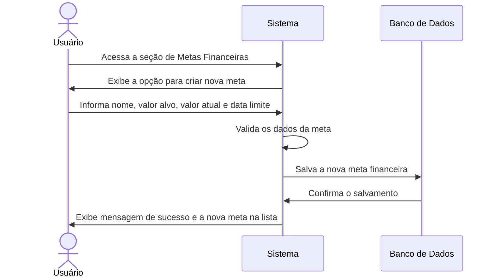

# RF012.1 🎯 Criação de metas financeiras

## 📝 Descrição

Esta funcionalidade permite a criação de metas financeiras personalizáveis por valor (ex: poupar X para um objetivo) e
por data (ex: atingir um valor até data Y), auxiliando o usuário a planejar e alcançar seus objetivos financeiros.

## 👥 Atores

- 👤 Usuário Autenticado

## ⚠️ Pré-condições

- O usuário deve estar logado no sistema.

## 🔌 Endpoints

- `POST /api/goals`

## 📋 Dados da Meta Financeira

| Campo            | Tipo     | Obrigatório | Descrição                              | Restrições                                           |
|------------------|----------|-------------|----------------------------------------|------------------------------------------------------|
| `name`           | `string` | ✅ Sim       | Nome da meta (ex: "Viagem dos Sonhos") | Mínimo de 3 caracteres, único para o usuário         |
| `target_amount`  | `number` | ✅ Sim       | Valor total que se deseja alcançar     | Valor positivo, com duas casas decimais              |
| `current_amount` | `number` | ✅ Sim       | Valor atual acumulado para a meta      | Valor não negativo, menor ou igual a `target_amount` |
| `due_date`       | `string` | ✅ Sim       | Data limite para atingir a meta        | Formato YYYY-MM-DD, futura                           |
| `description`    | `string` | ⬜ Não       | Descrição detalhada da meta            | Máximo de 500 caracteres                             |

## 🔄 Fluxo Principal



1. O usuário autenticado acessa a seção de gerenciamento de metas financeiras.
2. O sistema exibe a opção para criar uma nova meta.
3. O usuário preenche os dados solicitados: nome da meta, valor total que deseja alcançar (`target_amount`), o valor que
   já possui (`current_amount`) e a data limite para atingir a meta (`due_date`). Opcionalmente, pode adicionar uma
   descrição.
4. O sistema valida os dados informados, garantindo que o valor alvo seja positivo, a data limite seja futura e o valor
   atual não exceda o valor alvo.
5. O sistema salva as informações da nova meta financeira associada ao usuário no banco de dados.
6. O sistema exibe uma mensagem de confirmação de sucesso e a nova meta é adicionada à lista de metas do usuário.

## 🔀 Fluxos Alternativos

### ⚠️ FA01 - Cálculo de Contribuição Mensal Sugerida

1. Após criar a meta, o sistema pode sugerir um valor de contribuição mensal necessário para atingir a meta até a
   `due_date`, com base no `target_amount`, `current_amount` e o tempo restante.

## 🚫 Fluxos de Exceção

### ⚠️ FE01 - Dados inválidos

1. No passo 4 do fluxo principal, se os dados informados forem inválidos (ex: `target_amount` negativo, `due_date`
   passada, `current_amount` maior que `target_amount`), o sistema exibe uma mensagem de erro específica para o campo
   inválido.
2. O sistema retorna ao formulário para que o usuário corrija os dados informados.

### ⚠️ FE02 - Nome da meta já existente

1. No passo 4 do fluxo principal, se o nome da meta informado já existir para o usuário, o sistema exibe uma mensagem de
   erro indicando a duplicidade.
2. O sistema retorna ao passo 3 do fluxo principal para que o usuário informe um novo nome.

### ⚠️ FE03 - Erro no sistema ao salvar a meta

1. No passo 5 do fluxo principal, se ocorrer um erro interno no sistema ao tentar salvar a meta, o sistema exibe uma
   mensagem de erro genérica e sugere que o usuário tente novamente mais tarde.

## 🧪 Exemplos de Uso

### Requisição HTTP - Criar Meta Financeira

```http
POST /api/goals HTTP/1.1
Host: api.metakyasshu.com
Content-Type: application/json
Authorization: Bearer [TOKEN_DE_AUTENTICACAO]

{
  "name": "Entrada Apartamento",
  "target_amount": 50000.00,
  "current_amount": 5000.00,
  "due_date": "2025-12-31",
  "description": "Economizar para a entrada do apartamento novo."
}
```

---

> ---------------------------------------------------------------------------
> #### 💰 METAKYASSHU 💰
> ***Transformando finanças em conquistas compartilhadas***
> --------------------------------------------------------------------------- 