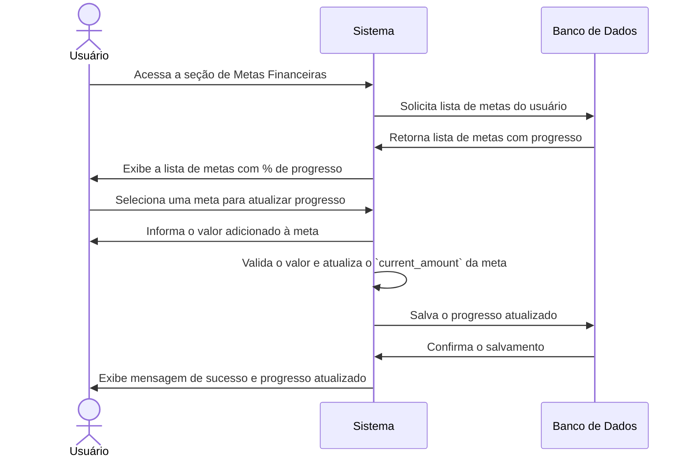

# RF012.2 🎯 Acompanhamento de metas financeiras

## 📝 Descrição

Esta funcionalidade permite o acompanhamento do progresso e a conclusão de metas financeiras, oferecendo ao usuário uma
visão clara de seu avanço em relação aos objetivos estabelecidos.

## 👥 Atores

- 👤 Usuário Autenticado

## ⚠️ Pré-condições

- O usuário deve estar logado no sistema.
- O usuário deve ter pelo menos uma meta financeira criada.

## 🔌 Endpoints

- `GET /api/goals`
- `GET /api/goals/{goalId}`
- `PUT /api/goals/{goalId}/progress` (para atualizar progresso)
- `PUT /api/goals/{goalId}/complete` (para marcar como concluída)
- `DELETE /api/goals/{goalId}`

## 📋 Dados de Acompanhamento de Meta Financeira

| Campo          | Tipo     | Obrigatório            | Descrição                             | Restrições                              |
|----------------|----------|------------------------|---------------------------------------|-----------------------------------------|
| `goalId`       | `string` | ✅ Sim                  | ID único da meta financeira           | UUID válido, meta existente             |
| `amount_added` | `number` | ✅ Sim (para progresso) | Valor adicionado à meta               | Valor positivo                          |
| `status`       | `string` | ⬜ Não                  | Status da meta (automático ou manual) | `in_progress`, `completed`, `cancelled` |

## 🔄 Fluxo Principal - Acompanhamento e Atualização de Progresso



1. O usuário autenticado acessa a seção de gerenciamento de metas financeiras.
2. O sistema exibe uma lista de todas as metas criadas pelo usuário, mostrando o nome da meta, o valor total a ser
   alcançado, o valor atual acumulado e a porcentagem de progresso.
3. O usuário pode:
   a. **Visualizar Detalhes:** Selecionar uma meta para ver informações mais detalhadas e um histórico de contribuições.
   b. **Atualizar Progresso:** Informar um valor que foi adicionado à meta. O sistema valida o valor (deve ser positivo
   e não exceder o `target_amount`) e o adiciona ao `current_amount` da meta no banco de dados. O sistema recalcula a
   porcentagem de progresso.
   c. **Marcar como Concluída:** Se o `current_amount` atingir ou exceder o `target_amount`, o sistema pode
   automaticamente marcar a meta como `completed`. O usuário também pode marcá-la manualmente.
   d. **Cancelar Meta:** O usuário pode optar por cancelar uma meta, que é então marcada como `cancelled` e não aparece
   mais como ativa.
4. O sistema exibe uma mensagem de sucesso após cada operação e atualiza a lista de metas.

## 🔀 Fluxos Alternativos

### ⚠️ FA01 - Notificações de Progresso

1. O sistema envia notificações ao usuário quando há um progresso significativo na meta (ex: atingir 25%, 50%, 75% ou
   100%).
2. O sistema também pode enviar lembretes periódicos sobre metas próximas da `due_date` ou com progresso lento.

## 🚫 Fluxos de Exceção

### ⚠️ FE01 - Meta não encontrada

1. Ao tentar atualizar o progresso ou o status de uma meta com um `goalId` inválido ou inexistente, o sistema exibe uma
   mensagem de erro indicando que a meta não foi encontrada.

### ⚠️ FE02 - Valor adicionado inválido

1. Ao tentar adicionar um valor negativo ou um valor que faria o `current_amount` exceder o `target_amount` (a menos que
   a meta seja marcada como concluída), o sistema exibe uma mensagem de erro.
2. O sistema retorna à tela de atualização de progresso para que o usuário corrija o valor.

### ⚠️ FE03 - Erro ao atualizar meta

1. Se ocorrer um erro interno no sistema durante as operações de atualização ou conclusão da meta, o sistema exibe uma
   mensagem de erro genérica e sugere que o usuário tente novamente mais tarde.

## 🧪 Exemplos de Uso

### Requisição HTTP - Listar Metas Financeiras

```http
GET /api/goals HTTP/1.1
Host: api.metakyasshu.com
Authorization: Bearer [TOKEN_DE_AUTENTICACAO]
```

### Requisição HTTP - Atualizar Progresso da Meta

```http
PUT /api/goals/a1b2c3d4e5f6-1234-5678-90ab-cdef12345678/progress HTTP/1.1
Host: api.metakyasshu.com
Content-Type: application/json
Authorization: Bearer [TOKEN_DE_AUTENTICACAO]

{
  "amount_added": 500.00
}
```

### Requisição HTTP - Marcar Meta como Concluída

```http
PUT /api/goals/a1b2c3d4e5f6-1234-5678-90ab-cdef12345678/complete HTTP/1.1
Host: api.metakyasshu.com
Authorization: Bearer [TOKEN_DE_AUTENTICACAO]
```

### Requisição HTTP - Excluir Meta

```http
DELETE /api/goals/a1b2c3d4e5f6-1234-5678-90ab-cdef12345678 HTTP/1.1
Host: api.metakyasshu.com
Authorization: Bearer [TOKEN_DE_AUTENTICACAO]
```

---

> ---------------------------------------------------------------------------
> #### 💰 METAKYASSHU 💰
> ***Transformando finanças em conquistas compartilhadas***
> --------------------------------------------------------------------------- 