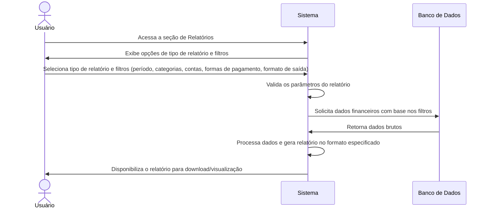

# RF013.1 📈 Geração de relatórios financeiros

## 📝 Descrição

Esta funcionalidade permite a geração de relatórios financeiros personalizáveis, como extratos, balanços e
demonstrativos de fluxo de caixa, com filtros por período, categoria, conta e forma de pagamento, para auxiliar na
análise e tomada de decisões financeiras.

## 👥 Atores

- 👤 Usuário Autenticado

## ⚠️ Pré-condições

- O usuário deve estar logado no sistema.
- O usuário deve ter transações financeiras registradas.

## 🔌 Endpoints

- `POST /api/reports/generate`
- `GET /api/reports/available-types`

## 📋 Dados para Geração de Relatório

| Campo                | Tipo            | Obrigatório | Descrição                                          | Restrições                                       |
|----------------------|-----------------|-------------|----------------------------------------------------|--------------------------------------------------|
| `report_type`        | `string`        | ✅ Sim       | Tipo de relatório a ser gerado                     | `statement`, `balance`, `cash_flow`              |
| `start_date`         | `string`        | ✅ Sim       | Data de início do período do relatório             | Formato YYYY-MM-DD                               |
| `end_date`           | `string`        | ✅ Sim       | Data de término do período do relatório            | Formato YYYY-MM-DD, após ou igual a `start_date` |
| `category_ids`       | `array<string>` | ⬜ Não       | IDs das categorias a incluir no relatório          | Array de UUIDs válidos                           |
| `account_ids`        | `array<string>` | ⬜ Não       | IDs das contas a incluir no relatório              | Array de UUIDs válidos                           |
| `payment_method_ids` | `array<string>` | ⬜ Não       | IDs das formas de pagamento a incluir no relatório | Array de UUIDs válidos                           |
| `output_format`      | `string`        | ⬜ Não       | Formato de saída do relatório                      | `pdf`, `csv` (padrão: `pdf`)                     |

## 🔄 Fluxo Principal



1. O usuário autenticado acessa a seção de Relatórios no sistema.
2. O sistema exibe as opções de tipos de relatórios disponíveis (ex: Extrato, Balanço, Fluxo de Caixa) e os filtros que
   podem ser aplicados (período, categorias, contas bancárias, formas de pagamento, formato de saída).
3. O usuário seleciona o tipo de relatório desejado e configura os filtros de acordo com suas necessidades. Escolhe
   também o formato de saída (PDF ou CSV).
4. O sistema valida os parâmetros de entrada, garantindo que as datas são válidas e que os IDs de
   categorias/contas/formas de pagamento existem e pertencem ao usuário.
5. O sistema consulta o banco de dados para recuperar as transações e dados financeiros relevantes com base nos filtros
   aplicados.
6. O sistema processa os dados, realiza os cálculos necessários (ex: saldos, totais por categoria) e gera o relatório no
   formato escolhido.
7. O sistema disponibiliza o relatório gerado para download ou visualização direta na interface.

## 🔀 Fluxos Alternativos

### ⚠️ FA01 - Relatórios Agendados

1. O usuário pode agendar a geração de relatórios periódicos (ex: extrato mensal) que são enviados automaticamente por
   e-mail ou disponibilizados em uma área específica do sistema.

### ⚠️ FA02 - Relatórios Comparativos

1. O sistema pode oferecer a opção de gerar relatórios comparativos entre diferentes períodos ou entre categorias, para
   análise de tendências.

## 🚫 Fluxos de Exceção

### ⚠️ FE01 - Período sem dados

1. Se o período selecionado para o relatório não contiver nenhuma transação ou dado financeiro, o sistema informa ao
   usuário que não há dados para o período e não gera o relatório.

### ⚠️ FE02 - Parâmetros de filtro inválidos

1. Se os parâmetros de filtro (ex: `category_ids`, `account_ids`) contiverem IDs inexistentes ou inválidos para o
   usuário, o sistema exibe uma mensagem de erro indicando o problema.
2. O sistema retorna à tela de filtros para que o usuário corrija os dados.

### ⚠️ FE03 - Erro na geração do relatório

1. Se ocorrer um erro interno no sistema durante o processamento ou a geração do arquivo do relatório, o sistema exibe
   uma mensagem de erro genérica e sugere que o usuário tente novamente mais tarde.

## 🧪 Exemplos de Uso

### Requisição HTTP - Gerar Extrato Mensal em PDF

```http
POST /api/reports/generate HTTP/1.1
Host: api.metakyasshu.com
Content-Type: application/json
Authorization: Bearer [TOKEN_DE_AUTENTICACAO]

{
  "report_type": "statement",
  "start_date": "2023-10-01",
  "end_date": "2023-10-31",
  "output_format": "pdf"
}
```

### Requisição HTTP - Gerar Balanço por Categorias em CSV

```http
POST /api/reports/generate HTTP/1.1
Host: api.metakyasshu.com
Content-Type: application/json
Authorization: Bearer [TOKEN_DE_AUTENTICACAO]

{
  "report_type": "balance",
  "start_date": "2023-01-01",
  "end_date": "2023-12-31",
  "category_ids": ["uuid-da-categoria-alimentacao", "uuid-da-categoria-transporte"],
  "output_format": "csv"
}
```

---

> ---------------------------------------------------------------------------
> #### 💰 METAKYASSHU 💰
> ***Transformando finanças em conquistas compartilhadas***
> --------------------------------------------------------------------------- 