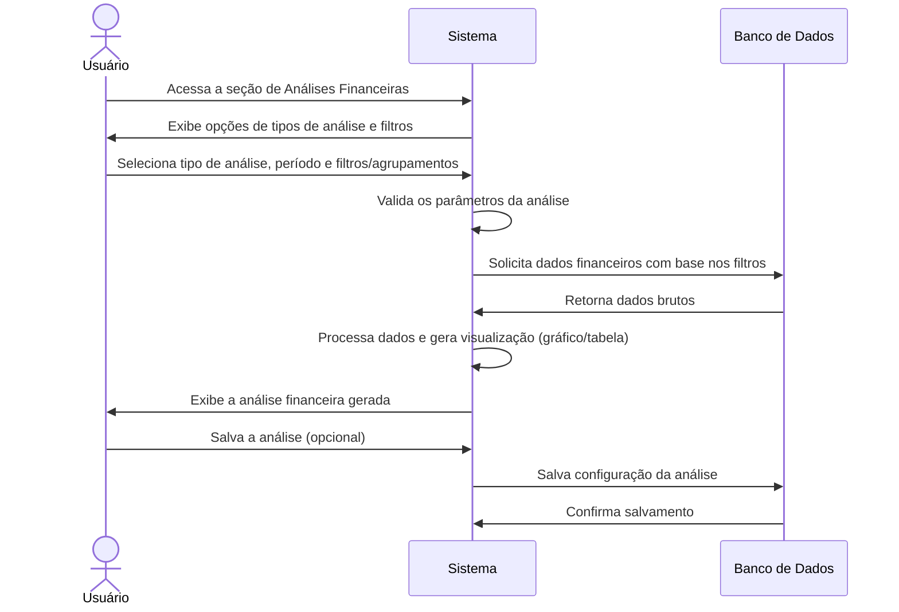

# RF013.2 📈 Análises financeiras personalizáveis

## 📝 Descrição

Esta funcionalidade permite a criação de análises financeiras personalizáveis (gráficos, tabelas, dashboards) para
identificar padrões de gastos, tendências de receitas e despesas, e oportunidades de economia, oferecendo ao usuário uma
compreensão aprofundada de sua saúde financeira.

## 👥 Atores

- 👤 Usuário Autenticado

## ⚠️ Pré-condições

- O usuário deve estar logado no sistema.
- O usuário deve ter um histórico de transações financeiras no sistema.

## 🔌 Endpoints

- `POST /api/analytics/custom` (para criar análise personalizada)
- `GET /api/analytics/predefined` (para obter tipos de análise predefinidos)
- `GET /api/analytics/{analysisId}` (para visualizar análise salva)

## 📋 Dados para Análise Financeira

| Campo           | Tipo     | Obrigatório | Descrição                                     | Restrições                                                 |
|-----------------|----------|-------------|-----------------------------------------------|------------------------------------------------------------|
| `name`          | `string` | ✅ Sim       | Nome da análise personalizada                 | Mínimo de 3 caracteres, único para o usuário               |
| `analysis_type` | `string` | ✅ Sim       | Tipo de visualização                          | `bar_chart`, `line_chart`, `pie_chart`, `table`, `summary` |
| `start_date`    | `string` | ✅ Sim       | Data de início do período da análise          | Formato YYYY-MM-DD                                         |
| `end_date`      | `string` | ✅ Sim       | Data de término do período da análise         | Formato YYYY-MM-DD, após ou igual a `start_date`           |
| `group_by`      | `string` | ⬜ Não       | Agrupamento dos dados                         | `category`, `month`, `year`, `payment_method`              |
| `filter_by`     | `object` | ⬜ Não       | Filtros adicionais (categorias, contas, etc.) | Objeto com chaves `category_ids`, `account_ids`, `type`    |

## 🔄 Fluxo Principal - Criação e Visualização de Análise



1. O usuário autenticado acessa a seção de Análises Financeiras no sistema.
2. O sistema exibe opções de análises predefinidas (ex: Despesas por Categoria, Receitas por Mês) e a possibilidade de
   criar uma análise personalizada.
3. O usuário seleciona um tipo de visualização (ex: gráfico de barras, linha, pizza, tabela, resumo), define um período
   e aplica filtros (ex: por categoria, conta, tipo de transação) ou agrupamentos (ex: por mês, ano).
4. O sistema valida os parâmetros de entrada, garantindo que as datas são válidas e que os IDs de filtros existem e
   pertencem ao usuário.
5. O sistema consulta o banco de dados para recuperar as transações e dados financeiros relevantes com base nos filtros
   e agrupamentos selecionados.
6. O sistema processa os dados, realiza os cálculos necessários e gera a visualização (gráficos, tabelas) na interface.
7. O usuário pode interagir com a análise (ex: passar o mouse para ver detalhes, ajustar zoom) e, opcionalmente, salvar
   a configuração dessa análise personalizada para acesso futuro.

## 🔀 Fluxos Alternativos

### ⚠️ FA01 - Análises Salvas e Favoritas

1. O usuário pode acessar uma lista de suas análises personalizadas salvas e marcá-las como favoritas para acesso
   rápido.
2. O sistema exibe um dashboard personalizável onde as análises favoritas podem ser fixadas.

### ⚠️ FA02 - Exportação de Dados da Análise

1. O usuário pode exportar os dados brutos ou a imagem da análise gerada em formatos como CSV, PDF ou PNG.

## 🚫 Fluxos de Exceção

### ⚠️ FE01 - Período sem dados

1. Se o período selecionado para a análise não contiver nenhuma transação ou dado financeiro, o sistema informa ao
   usuário que não há dados para o período e não gera a análise.

### ⚠️ FE02 - Parâmetros de análise inválidos

1. Se os parâmetros de análise (ex: `analysis_type` desconhecido, `filter_by` com IDs inválidos) forem incorretos, o
   sistema exibe uma mensagem de erro indicando o problema.
2. O sistema retorna à tela de configuração da análise para que o usuário corrija os dados.

### ⚠️ FE03 - Erro na geração da análise

1. Se ocorrer um erro interno no sistema durante o processamento ou a geração da visualização da análise, o sistema
   exibe uma mensagem de erro genérica e sugere que o usuário tente novamente mais tarde.

## 🧪 Exemplos de Uso

### Requisição HTTP - Criar Análise de Despesas por Categoria (Gráfico de Pizza)

```http
POST /api/analytics/custom HTTP/1.1
Host: api.metakyasshu.com
Content-Type: application/json
Authorization: Bearer [TOKEN_DE_AUTENTICACAO]

{
  "name": "Despesas por Categoria - Últimos 3 meses",
  "analysis_type": "pie_chart",
  "start_date": "2023-08-01",
  "end_date": "2023-10-31",
  "group_by": "category",
  "filter_by": {
    "type": "expense"
  }
}
```

### Requisição HTTP - Visualizar Análise Salva

```http
GET /api/analytics/a1b2c3d4e5f6-1234-5678-90ab-cdef12345678 HTTP/1.1
Host: api.metakyasshu.com
Authorization: Bearer [TOKEN_DE_AUTENTICACAO]
```

---

> ---------------------------------------------------------------------------
> #### 💰 METAKYASSHU 💰
> ***Transformando finanças em conquistas compartilhadas***
> --------------------------------------------------------------------------- 