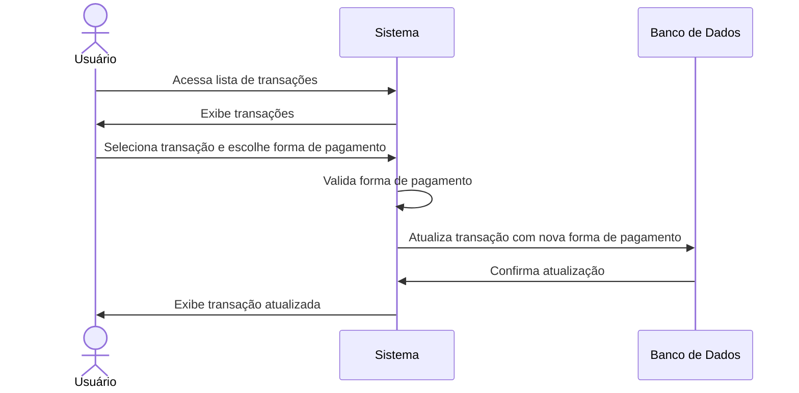
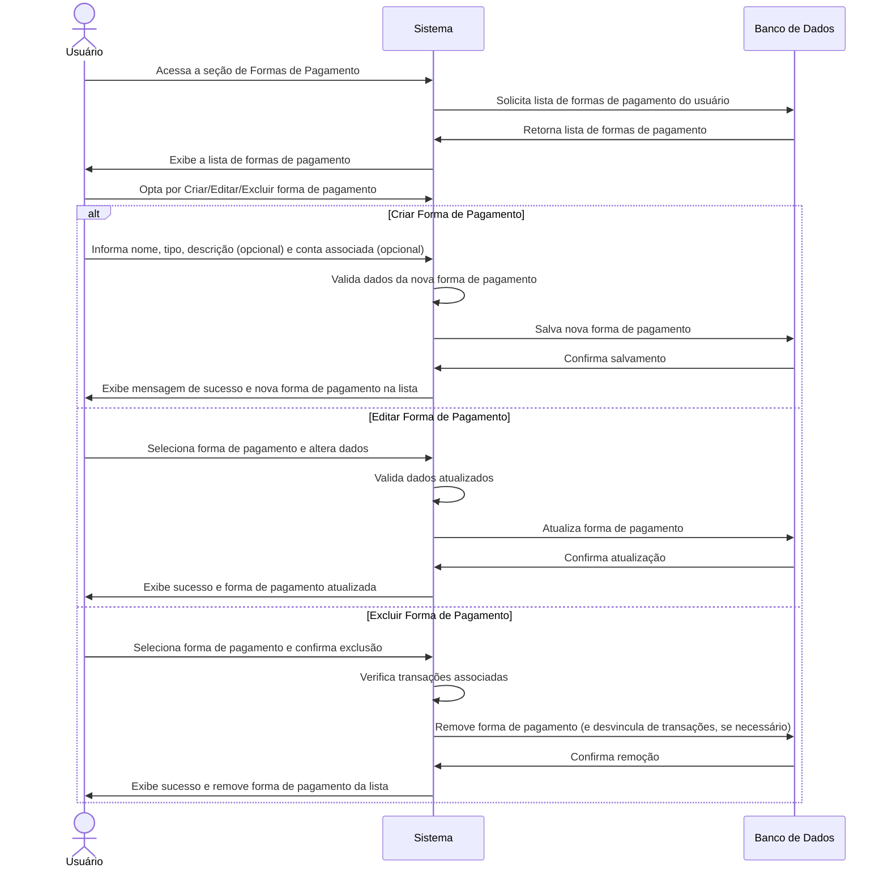

# RF014 💵 Classificação da forma de pagamento

## 📝 Descrição

Esta funcionalidade permite a classificação detalhada da forma de pagamento utilizada em transações (ex: Pix, Boleto,
Cartão de Crédito, Débito, Cheque, Carnê, Dinheiro, Transferência bancária), bem como a gestão dessas formas de
pagamento para um registro financeiro mais preciso.

## 👥 Atores

- 👤 Usuário Autenticado

## ⚠️ Pré-condições

- O usuário deve estar logado no sistema.
- O usuário deve ter transações registradas para classificá-las.
- O usuário deve ter contas bancárias ou cartões cadastrados se a forma de pagamento for vinculada a eles.

## 🔌 Endpoints

- `POST /api/payment-methods` (Criar forma de pagamento)
- `GET /api/payment-methods` (Listar formas de pagamento)
- `GET /api/payment-methods/{paymentMethodId}` (Obter detalhes de forma de pagamento)
- `PUT /api/payment-methods/{paymentMethodId}` (Atualizar forma de pagamento)
- `DELETE /api/payment-methods/{paymentMethodId}` (Excluir forma de pagamento)
- `PUT /api/transactions/{transactionId}/payment-method` (Classificar forma de pagamento em transação existente)

## 📋 Dados para Classificação e Formas de Pagamento

| Campo               | Tipo     | Obrigatório                | Descrição                                                                    | Restrições                                                                     |
|---------------------|----------|----------------------------|------------------------------------------------------------------------------|--------------------------------------------------------------------------------|
| `name`              | `string` | ✅ Sim                      | Nome da forma de pagamento (ex: "Cartão de Crédito Visa", "Dinheiro", "Pix") | Mínimo de 2 caracteres, único para o usuário                                   |
| `type`              | `string` | ✅ Sim                      | Tipo genérico da forma de pagamento                                          | `credit_card`, `debit_card`, `cash`, `bank_transfer`, `pix`, `boleto`, `other` |
| `description`       | `string` | ⬜ Não                      | Descrição adicional da forma de pagamento                                    | Máximo de 255 caracteres                                                       |
| `account_id`        | `string` | ⬜ Não                      | ID da conta bancária/cartão associada (se aplicável)                         | UUID válido, conta/cartão existente                                            |
| `transaction_id`    | `string` | ✅ Sim (para classificação) | ID da transação a ser classificada                                           | UUID válido, transação existente                                               |
| `payment_method_id` | `string` | ✅ Sim (para classificação) | ID da forma de pagamento a atribuir                                          | UUID válido, forma de pagamento existente                                      |

## 🔄 Fluxo Principal - Classificação de Forma de Pagamento em Transação



1. O usuário autenticado acessa a lista de suas transações.
2. O sistema exibe as transações.
3. O usuário seleciona uma transação e escolhe uma forma de pagamento existente (cadastrada previamente) na lista.
4. O sistema valida a forma de pagamento selecionada e associa-a à transação no banco de dados.
5. O sistema exibe uma mensagem de sucesso e a transação é atualizada com a forma de pagamento.

## 🔄 Fluxo Principal - Gestão de Formas de Pagamento



1. O usuário autenticado acessa a seção de gerenciamento de formas de pagamento.
2. O sistema exibe uma lista de todas as formas de pagamento disponíveis (padrão e as criadas pelo usuário).
3. O usuário pode:
   a. **Criar Nova Forma de Pagamento:** Preenche o nome, tipo genérico (ex: "credit_card", "cash") e, opcionalmente,
   uma descrição e uma conta bancária/cartão associada. O sistema valida os dados (nome único, tipo válido) e salva a
   nova forma de pagamento no banco de dados.
   b. **Editar Forma de Pagamento Existente:** Seleciona uma forma de pagamento da lista, modifica seu nome, tipo ou
   descrição. O sistema valida as alterações e atualiza a forma de pagamento no banco de dados.
   c. **Excluir Forma de Pagamento Existente:** Seleciona uma forma de pagamento e confirma a exclusão. O sistema
   verifica se há transações vinculadas e pode alertar o usuário ou desvincular automaticamente antes da exclusão. A
   forma de pagamento é removida do banco de dados.
4. O sistema exibe uma mensagem de sucesso após cada operação e atualiza a lista de formas de pagamento.

## 🔀 Fluxos Alternativos

### ⚠️ FA01 - Sugestão de Forma de Pagamento

1. O sistema pode sugerir formas de pagamento com base em transações anteriores ou padrões de uso.

## 🚫 Fluxos de Exceção

### ⚠️ FE01 - Forma de pagamento não encontrada

1. Ao tentar classificar uma transação com uma `payment_method_id` inválida ou ao tentar editar/excluir uma forma de
   pagamento inexistente, o sistema exibe uma mensagem de erro indicando que o item não foi encontrado.

### ⚠️ FE02 - Dados de forma de pagamento inválidos (para criação/edição)

1. Se o nome da forma de pagamento for muito curto, já existir para o usuário, ou o tipo for inválido, o sistema exibe
   uma mensagem de erro específica.
2. O sistema retorna ao formulário para que o usuário corrija os dados.

### ⚠️ FE03 - Tentativa de exclusão de forma de pagamento com transações associadas

1. Se o usuário tentar excluir uma forma de pagamento que ainda possui transações vinculadas, o sistema alerta o usuário
   e solicita uma ação (ex: reatribuir transações ou confirmar exclusão forçada).

## 🧪 Exemplos de Uso

### Requisição HTTP - Criar Forma de Pagamento

```http
POST /api/payment-methods HTTP/1.1
Host: api.metakyasshu.com
Content-Type: application/json
Authorization: Bearer [TOKEN_DE_AUTENTICACAO]

{
  "name": "Cartão de Crédito Principal",
  "type": "credit_card",
  "description": "Meu cartão de crédito Visa da conta principal.",
  "account_id": "uuid-da-conta-cartao"
}
```

### Requisição HTTP - Classificar Transação com Forma de Pagamento

```http
PUT /api/transactions/a1b2c3d4e5f6-1234-5678-90ab-cdef12345678/payment-method HTTP/1.1
Host: api.metakyasshu.com
Content-Type: application/json
Authorization: Bearer [TOKEN_DE_AUTENTICACAO]

{
  "payment_method_id": "uuid-da-forma-pagamento-pix"
}
```

### Requisição HTTP - Listar Formas de Pagamento

```http
GET /api/payment-methods HTTP/1.1
Host: api.metakyasshu.com
Authorization: Bearer [TOKEN_DE_AUTENTICACAO]
```

### Requisição HTTP - Excluir Forma de Pagamento

```http
DELETE /api/payment-methods/uuid-da-forma-pagamento-a-excluir HTTP/1.1
Host: api.metakyasshu.com
Authorization: Bearer [TOKEN_DE_AUTENTICACAO]
```

---

> ---------------------------------------------------------------------------
> #### 💰 METAKYASSHU 💰
> ***Transformando finanças em conquistas compartilhadas***
> --------------------------------------------------------------------------- 