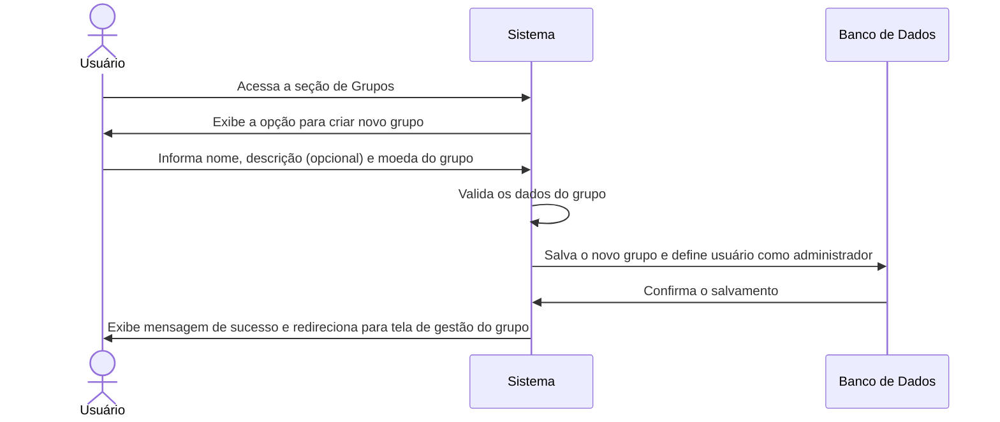

# RF015.1 🏗️ Criação de grupos financeiros colaborativos

## 📝 Descrição

Esta funcionalidade permite que o usuário crie grupos financeiros colaborativos para gerenciar finanças compartilhadas
com amigos, familiares ou colegas, facilitando o controle de orçamentos em conjunto, despesas divididas e metas comuns.

## 👥 Atores

- 👤 Usuário Autenticado (Criador do Grupo)

## ⚠️ Pré-condições

- O usuário deve estar logado no sistema.

## 🔌 Endpoints

- `POST /api/groups`

## 📋 Dados do Grupo Financeiro Colaborativo

| Campo         | Tipo     | Obrigatório | Descrição                                                 | Restrições                                           |
|---------------|----------|-------------|-----------------------------------------------------------|------------------------------------------------------|
| `name`        | `string` | ✅ Sim       | Nome do grupo (ex: "Viagem com Amigos", "Contas da Casa") | Mínimo de 3 caracteres, único para o usuário criador |
| `description` | `string` | ⬜ Não       | Descrição breve do propósito do grupo                     | Máximo de 500 caracteres                             |
| `currency`    | `string` | ✅ Sim       | Moeda padrão para transações do grupo                     | Código de moeda ISO (ex: "BRL", "USD")               |

## 🔄 Fluxo Principal



1. O usuário autenticado acessa a seção de gerenciamento de grupos no sistema.
2. O sistema exibe a opção para criar um novo grupo financeiro colaborativo.
3. O usuário preenche os dados solicitados: nome do grupo, uma descrição opcional sobre o propósito do grupo e a moeda
   padrão para as transações do grupo.
4. O sistema valida os dados informados, garantindo que o nome do grupo seja único para o usuário criador e que a moeda
   seja válida.
5. O sistema salva as informações do novo grupo no banco de dados e automaticamente define o usuário criador como o
   administrador do grupo.
6. O sistema exibe uma mensagem de confirmação de sucesso e redireciona o usuário para a tela de gestão do grupo, onde
   ele poderá convidar outros membros.

## 🔀 Fluxos Alternativos

### ⚠️ FA01 - Sugestão de Membros

1. Após a criação do grupo, o sistema pode sugerir contatos do usuário para convidar ao grupo, com base em interações
   anteriores ou listas de contatos.

## 🚫 Fluxos de Exceção

### ⚠️ FE01 - Dados inválidos

1. No passo 4 do fluxo principal, se os dados informados forem inválidos (ex: nome do grupo muito curto, moeda
   inválida), o sistema exibe uma mensagem de erro específica para o campo inválido.
2. O sistema retorna ao formulário para que o usuário corrija os dados informados.

### ⚠️ FE02 - Nome do grupo já existente

1. No passo 4 do fluxo principal, se o nome do grupo informado já existir para o usuário, o sistema exibe uma mensagem
   de erro indicando a duplicidade.
2. O sistema retorna ao passo 3 do fluxo principal para que o usuário informe um novo nome.

### ⚠️ FE03 - Erro no sistema ao criar o grupo

1. No passo 5 do fluxo principal, se ocorrer um erro interno no sistema ao tentar salvar o grupo, o sistema exibe uma
   mensagem de erro genérica e sugere que o usuário tente novamente mais tarde.

## 🧪 Exemplos de Uso

### Requisição HTTP - Criar Grupo Financeiro

```http
POST /api/groups HTTP/1.1
Host: api.metakyasshu.com
Content-Type: application/json
Authorization: Bearer [TOKEN_DE_AUTENTICACAO]

{
  "name": "Moradia - Ap. 201",
  "description": "Gastos mensais do apartamento e reformas.",
  "currency": "BRL"
}
```

---

> ---------------------------------------------------------------------------
> #### 💰 METAKYASSHU 💰
> ***Transformando finanças em conquistas compartilhadas***
> --------------------------------------------------------------------------- 