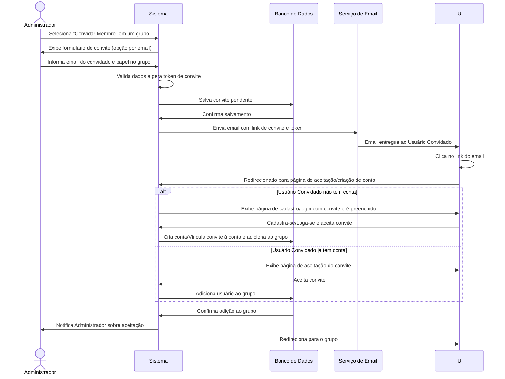
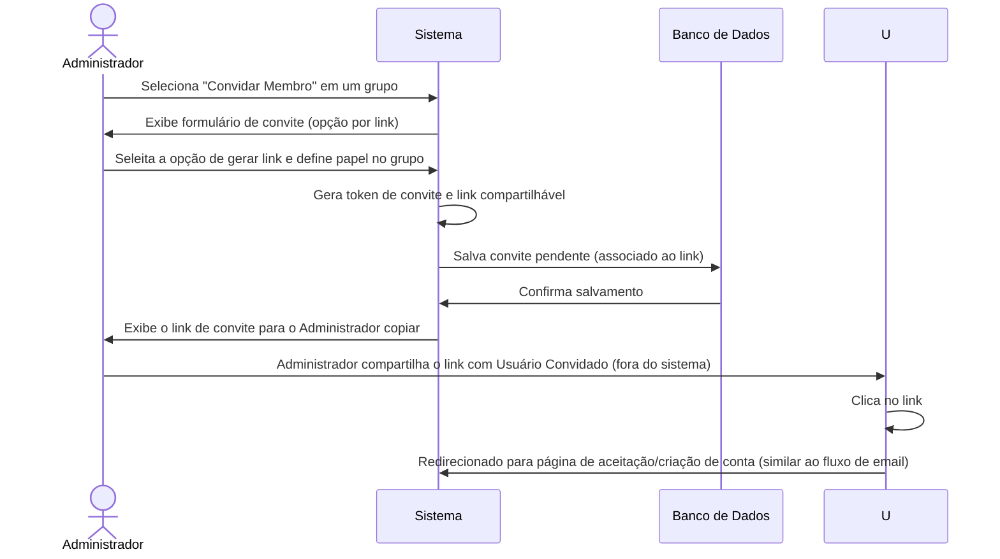

# RF016 📨 Convite de membros para grupos

## 📝 Descrição

Esta funcionalidade permite que o administrador de um grupo financeiro envie convites para novos membros via e-mail ou
link compartilhável. Os convites são unilaterais, o que significa que o convidado precisa aceitar o convite para se
juntar ao grupo.

## 👥 Atores

- 👤 Administrador do Grupo
- 👤 Usuário Convidado
- 📧 Sistema de Notificação/E-mail

## ⚠️ Pré-condições

- O administrador deve estar logado no sistema.
- O grupo financeiro colaborativo deve existir e o usuário deve ser seu administrador.
- O usuário convidado pode ou não ter uma conta existente no sistema.

## 🔌 Endpoints

- `POST /api/groups/{groupId}/invites` (Enviar convite por email ou gerar link)
- `PUT /api/invites/{inviteId}/accept` (Aceitar convite)
- `PUT /api/invites/{inviteId}/reject` (Rejeitar convite)
- `GET /api/invites/me` (Listar convites pendentes para o usuário)

## 📋 Dados para Convite de Membros

| Campo         | Tipo     | Obrigatório                    | Descrição                                       | Restrições                     |
|---------------|----------|--------------------------------|-------------------------------------------------|--------------------------------|
| `groupId`     | `string` | ✅ Sim                          | ID do grupo para o qual o membro será convidado | UUID válido, grupo existente   |
| `invite_type` | `string` | ✅ Sim                          | Tipo de convite                                 | `email`, `link`                |
| `email`       | `string` | ✅ Sim (se `email` invite_type) | E-mail do usuário a ser convidado               | Formato de e-mail válido       |
| `role`        | `string` | ✅ Sim                          | Papel do usuário no grupo                       | `member`, `admin`              |
| `invite_link` | `string` | ⬜ Não (retorno)                | Link de convite gerado                          | URL válida                     |
| `inviteId`    | `string` | ✅ Sim (para aceitar/rejeitar)  | ID do convite específico                        | UUID válido, convite existente |

## 🔄 Fluxo Principal - Envio de Convite por E-mail



1. O administrador do grupo acessa a opção "Convidar Membro" para um grupo específico.
2. O sistema oferece a opção de convidar por e-mail.
3. O administrador informa o e-mail do usuário a ser convidado e o papel que ele terá no grupo (ex: `member` padrão).
4. O sistema valida o e-mail, gera um token de convite único e salva o convite como pendente no banco de dados.
5. O sistema envia um e-mail para o endereço fornecido, contendo um link de convite com o token.
6. O usuário convidado recebe o e-mail e clica no link. Se o usuário já tiver uma conta, ele será direcionado para uma
   página de aceitação. Se não tiver, será direcionado para uma página de cadastro/login onde o convite já estará
   associado.
7. Após aceitar o convite (e, se necessário, criar/logar na conta), o sistema adiciona o usuário ao grupo com o papel
   definido.
8. O sistema notifica o administrador sobre a aceitação do convite e o novo membro passa a ter acesso ao grupo.

## 🔄 Fluxo Principal - Geração de Link de Convite



1. O administrador do grupo acessa a opção "Convidar Membro" para um grupo específico.
2. O sistema oferece a opção de gerar um link de convite compartilhável.
3. O administrador seleciona essa opção e define o papel que os usuários que usarem o link terão no grupo (ex:
   `member`).
4. O sistema gera um token de convite único e um link URL. O convite é salvo como pendente.
5. O sistema exibe o link para o administrador, que pode copiá-lo e compartilhá-lo manualmente com os futuros membros (
   ex: via WhatsApp, Slack).
6. Qualquer usuário que acessar o link será direcionado para a página de aceitação/cadastro, similar ao fluxo de e-mail.
7. Após a aceitação, o usuário é adicionado ao grupo.

## 🔀 Fluxos Alternativos

### ⚠️ FA01 - Reenvio de Convite / Geração de Novo Link

1. O administrador pode reenviar um convite por e-mail ou gerar um novo link caso o anterior tenha expirado ou não tenha
   sido recebido.

### ⚠️ FA02 - Cancelamento de Convite

1. O administrador pode cancelar um convite pendente a qualquer momento, invalidando o token ou link associado.

## 🚫 Fluxos de Exceção

### ⚠️ FE01 - Grupo não encontrado

1. Se o `groupId` fornecido para enviar o convite for inválido, o sistema exibe uma mensagem de erro indicando que o
   grupo não foi encontrado.

### ⚠️ FE02 - E-mail já membro do grupo / convite pendente

1. Se o e-mail informado para convite já pertencer a um membro do grupo ou já tiver um convite pendente para o mesmo
   grupo, o sistema informa ao administrador sobre a duplicidade e não envia um novo convite.

### ⚠️ FE03 - Erro no envio de e-mail

1. Se ocorrer uma falha no serviço de envio de e-mail, o sistema informa ao administrador que o e-mail não pôde ser
   enviado, mas o convite ainda pode ser aceito por link ou reenvio.

### ⚠️ FE04 - Convite Expirado/Inválido (na aceitação)

1. Se o usuário convidado tentar aceitar um convite cujo token ou link já expirou ou é inválido, o sistema exibe uma
   mensagem de erro e pode sugerir que ele solicite um novo convite ao administrador do grupo.

## 🧪 Exemplos de Uso

### Requisição HTTP - Enviar Convite por E-mail

```http
POST /api/groups/a1b2c3d4e5f6-1234-5678-90ab-cdef12345678/invites HTTP/1.1
Host: api.metakyasshu.com
Content-Type: application/json
Authorization: Bearer [TOKEN_DE_AUTENTICACAO]

{
  "invite_type": "email",
  "email": "convidado@example.com",
  "role": "member"
}
```

### Requisição HTTP - Gerar Link de Convite

```http
POST /api/groups/a1b2c3d4e5f6-1234-5678-90ab-cdef12345678/invites HTTP/1.1
Host: api.metakyasshu.com
Content-Type: application/json
Authorization: Bearer [TOKEN_DE_AUTENTICACAO]

{
  "invite_type": "link",
  "role": "member"
}
```

### Requisição HTTP - Aceitar Convite

```http
PUT /api/invites/uuid-do-convite-gerado/accept HTTP/1.1
Host: api.metakyasshu.com
Authorization: Bearer [TOKEN_DE_AUTENTICACAO] (se usuário já logado)
```

---

> ---------------------------------------------------------------------------
> #### 💰 METAKYASSHU 💰
> ***Transformando finanças em conquistas compartilhadas***
> --------------------------------------------------------------------------- 