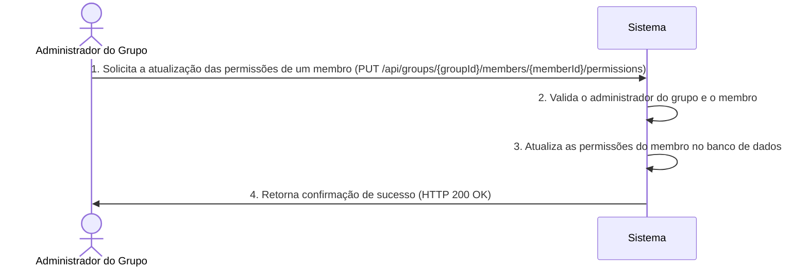

# RF017 👮 Definição granular de permissões por membro em grupo

## 📝 Descrição

Esta funcionalidade permite a definição granular de permissões (visualizar, editar, aprovar) por membro dentro de um
grupo financeiro. O objetivo é fornecer aos administradores de grupos o controle total sobre as ações que cada membro
pode realizar, garantindo a segurança e a integridade dos dados financeiros compartilhados.

## 👥 Atores

- 👤 **Administrador do Grupo**: Usuário com permissão para gerenciar as permissões de outros membros.
- 👥 **Membro do Grupo**: Usuário que possui permissões definidas dentro de um grupo.

## ⚠️ Pré-condições

- O usuário deve estar autenticado no sistema.
- O usuário deve ser um administrador de um grupo financeiro existente.
- O membro do grupo ao qual as permissões serão aplicadas deve existir e pertencer ao mesmo grupo.

## 🔌 Endpoints

- `PUT /api/groups/{groupId}/members/{memberId}/permissions`

## 📋 Dados de Permissão do Membro

| Campo         | Tipo     | Obrigatório | Descrição                                         | Restrições                                                                 |
|---------------|----------|-------------|---------------------------------------------------|----------------------------------------------------------------------------|
| `groupId`     | `string` | ✅ Sim       | ID único do grupo financeiro.                     | Deve ser um ID de grupo válido e existente.                                |
| `memberId`    | `string` | ✅ Sim       | ID único do membro dentro do grupo.               | Deve ser um ID de usuário válido e existente dentro do grupo especificado. |
| `permissions` | `array`  | ✅ Sim       | Lista de permissões a serem concedidas ao membro. | Valores permitidos: `VIEW`, `EDIT`, `APPROVE`.                             |

## 🔄 Fluxo Principal



1. O Administrador do Grupo envia uma requisição PUT para `/api/groups/{groupId}/members/{memberId}/permissions` com as
   novas permissões no corpo da requisição.
2. O sistema valida se o usuário que fez a requisição é um administrador do `groupId` especificado e se o `memberId`
   pertence a este grupo.
3. O sistema atualiza as permissões do `memberId` no banco de dados com base nas permissões fornecidas.
4. O sistema retorna uma resposta HTTP 200 OK com uma mensagem de sucesso.

## 🔀 Fluxos Alternativos

### ⚠️ FA01 - Permissões Parciais

1. O Administrador do Grupo envia uma requisição com apenas algumas permissões a serem atualizadas.
2. O sistema atualiza apenas as permissões fornecidas, mantendo as demais inalteradas (se a lógica de negócio permitir).

## 🚫 Fluxos de Exceção

### ⚠️ FE01 - Administrador Não Autorizado

1. O usuário que tenta modificar as permissões não é um administrador do grupo.
2. O sistema retorna uma resposta HTTP 403 Forbidden.

### ⚠️ FE02 - Membro Não Encontrado ou Não Pertencente ao Grupo

1. O `memberId` especificado não é encontrado ou não pertence ao `groupId`.
2. O sistema retorna uma resposta HTTP 404 Not Found.

### ⚠️ FE03 - Permissões Inválidas

1. O array de `permissions` contém valores inválidos.
2. O sistema retorna uma resposta HTTP 400 Bad Request.

## 🧪 Exemplos de Uso

### Requisição HTTP para Conceder Permissões de Visualização e Edição

```http
PUT /api/groups/grp_123abc/members/mem_456def/permissions HTTP/1.1
Host: api.metakyasshu.com
Content-Type: application/json

{
  "permissions": ["VIEW", "EDIT"]
}
```

### Requisição HTTP para Conceder Permissões de Aprovação

```http
PUT /api/groups/grp_123abc/members/mem_789ghi/permissions HTTP/1.1
Host: api.metakyasshu.com
Content-Type: application/json

{
  "permissions": ["APPROVE"]
}
```

---

> ---------------------------------------------------------------------------
> #### 💰 METAKYASSHU 💰
> ***Transformando finanças em conquistas compartilhadas***
> --------------------------------------------------------------------------- 