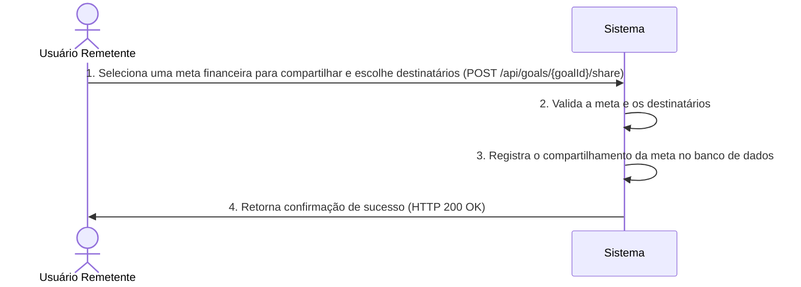

# RF018.2 🔄 Compartilhamento seletivo de metas financeiras

## 📝 Descrição

Esta funcionalidade permite o compartilhamento seletivo de metas financeiras com membros específicos do grupo ou
usuários individuais. O usuário pode escolher com quem compartilhar suas metas financeiras, mantendo a privacidade e
colaborando de forma controlada.

## 👥 Atores

- 👤 **Usuário Remetente**: O usuário que deseja compartilhar uma meta financeira.
- 👥 **Membro do Grupo/Usuário Destinatário**: O membro do grupo ou usuário individual com quem a meta financeira será
  compartilhada.

## ⚠️ Pré-condições

- O usuário remetente deve estar autenticado no sistema.
- A meta financeira a ser compartilhada deve existir e pertencer ao usuário remetente.
- O membro do grupo ou usuário destinatário deve existir.

## 🔌 Endpoints

- `POST /api/goals/{goalId}/share`

## 📋 Dados de Compartilhamento de Meta Financeira

| Campo       | Tipo     | Obrigatório | Descrição                                                              | Restrições                                                      |
|-------------|----------|-------------|------------------------------------------------------------------------|-----------------------------------------------------------------|
| `goalId`    | `string` | ✅ Sim       | ID único da meta financeira a ser compartilhada.                       | Deve ser um ID de meta válido e existente do usuário remetente. |
| `shareWith` | `array`  | ✅ Sim       | Lista de IDs de usuários ou grupos com quem a meta será compartilhada. | Deve conter IDs de usuários ou grupos válidos e existentes.     |

## 🔄 Fluxo Principal



1. O Usuário Remetente envia uma requisição POST para `/api/goals/{goalId}/share` com os IDs dos destinatários no corpo
   da requisição.
2. O sistema valida se o `goalId` pertence ao Usuário Remetente e se os `shareWith` IDs são válidos (usuários ou grupos
   existentes).
3. O sistema registra o relacionamento de compartilhamento para a meta financeira e os destinatários especificados no
   banco de dados.
4. O sistema retorna uma resposta HTTP 200 OK com uma mensagem de sucesso.

## 🔀 Fluxos Alternativos

### ⚠️ FA01 - Compartilhamento com um Grupo

1. O Usuário Remetente inclui o ID de um grupo no array `shareWith`.
2. O sistema compartilha a meta financeira com todos os membros ativos desse grupo.

### ⚠️ FA02 - Compartilhamento com Usuários Individuais

1. O Usuário Remetente inclui IDs de usuários individuais no array `shareWith`.
2. O sistema compartilha a meta financeira com cada um dos usuários especificados.

## 🚫 Fluxos de Exceção

### ⚠️ FE01 - Meta Financeira Não Encontrada ou Não Pertencente ao Usuário

1. O `goalId` especificado não é encontrado ou não pertence ao Usuário Remetente.
2. O sistema retorna uma resposta HTTP 404 Not Found.

### ⚠️ FE02 - Destinatário(s) Inválido(s)

1. Um ou mais IDs em `shareWith` não são de usuários ou grupos válidos e existentes.
2. O sistema retorna uma resposta HTTP 400 Bad Request.

### ⚠️ FE03 - Meta Já Compartilhada

1. O usuário tenta compartilhar uma meta que já está compartilhada com um ou mais dos destinatários especificados.
2. O sistema pode optar por ignorar o compartilhamento duplicado para os destinatários já existentes e retornar um HTTP
   200 OK, ou retornar um HTTP 409 Conflict.

## 🧪 Exemplos de Uso

### Requisição HTTP para Compartilhar Meta Financeira com Usuários e um Grupo

```http
POST /api/goals/goal_abc123/share HTTP/1.1
Host: api.metakyasshu.com
Content-Type: application/json

{
  "shareWith": ["usr_def456", "grp_ghi789", "usr_jkl012"]
}
```

### Requisição HTTP para Compartilhar Meta Financeira Apenas com um Usuário

```http
POST /api/goals/goal_xyz987/share HTTP/1.1
Host: api.metakyasshu.com
Content-Type: application/json

{
  "shareWith": ["usr_mno345"]
}
```

---

> ---------------------------------------------------------------------------
> #### 💰 METAKYASSHU 💰
> ***Transformando finanças em conquistas compartilhadas***
> --------------------------------------------------------------------------- 