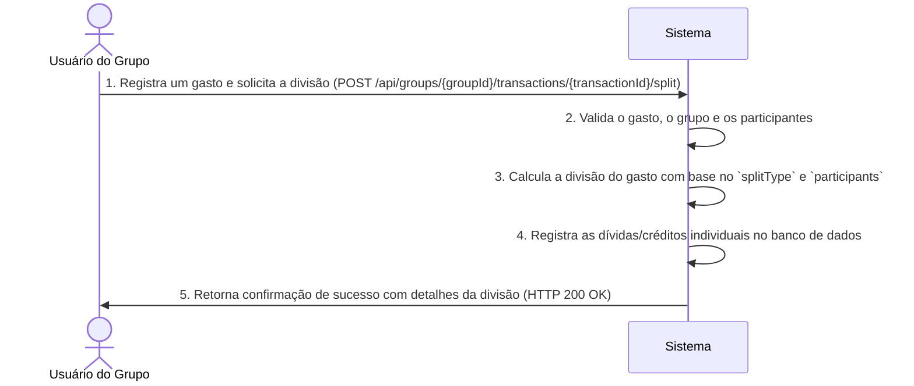

# RF019 💸 Divisão de gastos entre membros do grupo

## 📝 Descrição

Esta funcionalidade permite a divisão de gastos entre membros do grupo, com cálculo automático da parte de cada um e
opções de personalização. O objetivo é simplificar a gestão financeira compartilhada, permitindo que os usuários
registrem um gasto e o dividam de diversas formas entre os participantes, facilitando o acerto de contas.

## 👥 Atores

- 👤 **Usuário do Grupo**: O usuário que registra o gasto e inicia a divisão.
- 👥 **Membros do Grupo**: Os usuários que participarão da divisão do gasto.

## ⚠️ Pré-condições

- O usuário deve estar autenticado no sistema.
- O gasto a ser dividido deve ter sido registrado e pertencer ao grupo.
- O grupo financeiro deve existir e ter membros válidos.

## 🔌 Endpoints

- `POST /api/groups/{groupId}/transactions/{transactionId}/split`

## 📋 Dados de Divisão de Gasto

| Campo                       | Tipo     | Obrigatório | Descrição                                                | Restrições                                                                                 |
|-----------------------------|----------|-------------|----------------------------------------------------------|--------------------------------------------------------------------------------------------|
| `groupId`                   | `string` | ✅ Sim       | ID único do grupo financeiro.                            | Deve ser um ID de grupo válido e existente.                                                |
| `transactionId`             | `string` | ✅ Sim       | ID único da transação a ser dividida.                    | Deve ser um ID de transação válido e existente do grupo especificado.                      |
| `splitType`                 | `string` | ✅ Sim       | Tipo de divisão do gasto.                                | Valores permitidos: `EQUAL`, `PERCENTAGE`, `CUSTOM`.                                       |
| `participants`              | `array`  | ✅ Sim       | Lista de participantes e suas respectivas contribuições. | Array de objetos contendo `userId` e, dependendo do `splitType`, `amount` ou `percentage`. |
| `participants[].userId`     | `string` | ✅ Sim       | ID único do membro do grupo participante da divisão.     | Deve ser um ID de usuário válido e pertencente ao grupo.                                   |
| `participants[].amount`     | `number` | Condicional | Valor exato da participação do membro na divisão.        | Obrigatório se `splitType` for `CUSTOM`. Deve ser um número positivo.                      |
| `participants[].percentage` | `number` | Condicional | Porcentagem da participação do membro na divisão.        | Obrigatório se `splitType` for `PERCENTAGE`. Deve ser um número entre 0 e 100.             |

## 🔄 Fluxo Principal



1. O Usuário do Grupo envia uma requisição POST para `/api/groups/{groupId}/transactions/{transactionId}/split` com os
   detalhes da divisão (tipo e participantes).
2. O sistema valida se a `transactionId` pertence ao `groupId` e se todos os `userId` em `participants` são membros
   válidos do grupo.
3. O sistema calcula a parte de cada participante com base no `splitType` (e.g., divisão igual, por porcentagem, valores
   customizados).
4. O sistema registra as dívidas e créditos individuais resultantes da divisão no banco de dados, vinculando-os aos
   membros do grupo.
5. O sistema retorna uma resposta HTTP 200 OK com uma mensagem de sucesso e os detalhes da divisão efetuada (e.g.,
   quanto cada um deve/recebeu).

## 🔀 Fluxos Alternativos

### ⚠️ FA01 - Divisão por Porcentagem

1. O `splitType` é definido como `PERCENTAGE` e cada participante tem um `percentage` especificado.
2. O sistema calcula a contribuição de cada um com base na porcentagem fornecida sobre o valor total do gasto.

### ⚠️ FA02 - Divisão Customizada

1. O `splitType` é definido como `CUSTOM` e cada participante tem um `amount` especificado.
2. O sistema verifica se a soma dos `amount`s corresponde ao valor total do gasto e registra as contribuições exatas.

## 🚫 Fluxos de Exceção

### ⚠️ FE01 - Gasto Não Encontrado ou Não Pertencente ao Grupo

1. O `transactionId` especificado não é encontrado ou não pertence ao `groupId`.
2. O sistema retorna uma resposta HTTP 404 Not Found.

### ⚠️ FE02 - Tipo de Divisão Inválido

1. O `splitType` fornecido não é `EQUAL`, `PERCENTAGE` ou `CUSTOM`.
2. O sistema retorna uma resposta HTTP 400 Bad Request.

### ⚠️ FE03 - Dados de Participantes Inválidos

1. O array `participants` está vazio, contém IDs de usuários inválidos, ou a soma das porcentagens/valores não
   corresponde ao total do gasto (para `PERCENTAGE` ou `CUSTOM`).
2. O sistema retorna uma resposta HTTP 400 Bad Request.

### ⚠️ FE04 - Membros Não Pertencentes ao Grupo

1. Um ou mais `userId` em `participants` não são membros ativos do `groupId` especificado.
2. O sistema retorna uma resposta HTTP 400 Bad Request.

## 🧪 Exemplos de Uso

### Requisição HTTP para Divisão Igual (entre 3 pessoas para um gasto de 30)

```http
POST /api/groups/grp_abc456/transactions/trn_xyz789/split HTTP/1.1
Host: api.metakyasshu.com
Content-Type: application/json

{
  "splitType": "EQUAL",
  "participants": [
    { "userId": "usr_111" },
    { "userId": "usr_222" },
    { "userId": "usr_333" }
  ]
}
```

### Requisição HTTP para Divisão por Porcentagem (para um gasto de 100)

```http
POST /api/groups/grp_abc456/transactions/trn_xyz789/split HTTP/1.1
Host: api.metakyasshu.com
Content-Type: application/json

{
  "splitType": "PERCENTAGE",
  "participants": [
    { "userId": "usr_111", "percentage": 50 },
    { "userId": "usr_222", "percentage": 30 },
    { "userId": "usr_333", "percentage": 20 }
  ]
}
```

### Requisição HTTP para Divisão Customizada (para um gasto de 100)

```http
POST /api/groups/grp_abc456/transactions/trn_xyz789/split HTTP/1.1
Host: api.metakyasshu.com
Content-Type: application/json

{
  "splitType": "CUSTOM",
  "participants": [
    { "userId": "usr_111", "amount": 40 },
    { "userId": "usr_222", "amount": 30 },
    { "userId": "usr_333", "amount": 30 }
  ]
}
```

---

> ---------------------------------------------------------------------------
> #### 💰 METAKYASSHU 💰
> ***Transformando finanças em conquistas compartilhadas***
> --------------------------------------------------------------------------- 