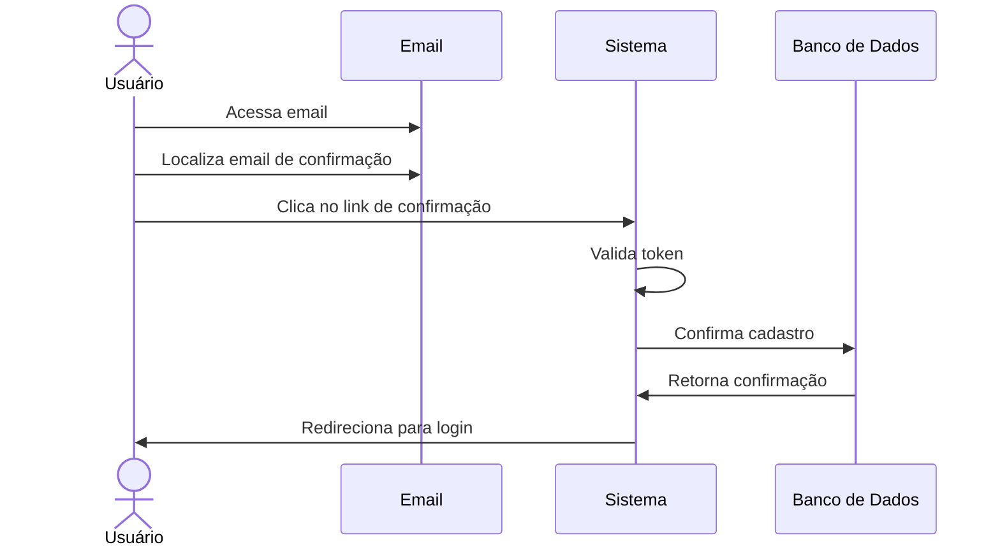

#  📧 RF02 - Validar Usuário 

{ width=150 }

## 📝 Descrição

Esta funcionalidade permite que usuários validem o cadastro no sistema por um link de confirmação enviado por e-mail.

## 👥 Atores

- 👤 Usuário

## ⚠️ Pré-condições

- O usuário deve ter recebido o e-mail de confirmação de cadastro.

## 🔌 Endpoints

- `PATCH /api/user/confirm/:token`

## 📋 Dados do Usuário

| Campo   | Tipo     | Obrigatório | Descrição                        | Restrições |
|---------|----------|-------------|----------------------------------|------------|
| `token` | `string` | ✅ Sim      | Token de confirmação do cadastro |            |

## 🔄 Fluxo Principal



1. Inicialmente, o usuário acessa o e-mail fornecido durante o cadastro.
2. O usuário localiza o e-mail de confirmação de cadastro enviado pelo sistema.
3. O usuário clica no link de confirmação presente no e-mail.
4. O sistema valida o link de confirmação.
5. O sistema confirma o cadastro do usuário.
6. O usuário é redirecionado para a página de login do sistema.

## 🔀 Fluxos Alternativos

- Não se aplica.

## 🚫 Fluxos de Exceção

### ⚠️ FE01 - Link de confirmação inválido
1. No passo 4 do fluxo principal, se o link de confirmação for inválido, o sistema exibe uma mensagem de erro.
2. O sistema solicita que o usuário solicite um novo e-mail de confirmação.

## 🧪 Exemplos de Uso

### Requisição HTTP
```http
PATCH /api/user/confirm/abcdef123456 HTTP/1.1
Host: api.metakyasshu.com
```


> ---------------------------------------------------------------------------
> #### 💰 Sistema de Gestão Financeira 💰
> ***Controlando suas finanças de forma simples e eficiente***
> ---------------------------------------------------------------------------