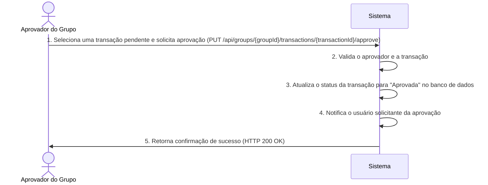
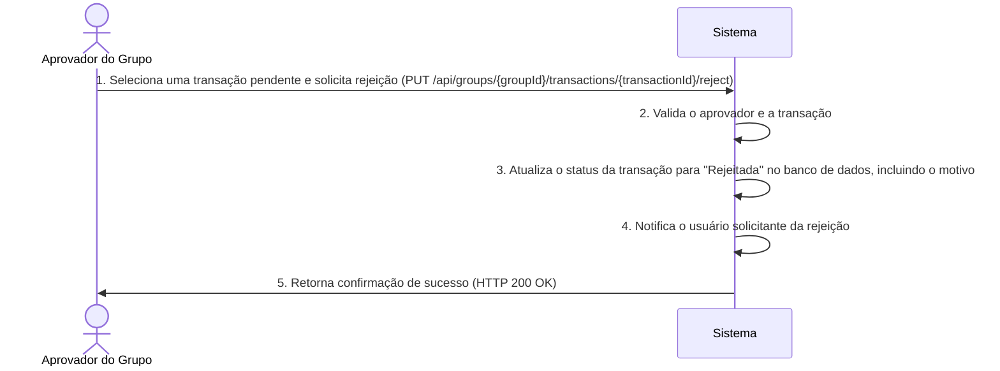

# RF020 ✅ Sistema de aprovações para gastos ou transações em grupo

## 📝 Descrição

Esta funcionalidade implementa um sistema de aprovações para gastos ou transações realizadas em grupo. Isso permite que
os membros do grupo, com permissão de aprovação, revisem e aprovem transações antes que elas sejam finalizadas,
garantindo maior controle e transparência nas finanças compartilhadas.

## 👥 Atores

- 👤 **Usuário Solicitante**: O usuário que inicia a transação ou gasto que requer aprovação.
- 👥 **Aprovador do Grupo**: Um membro do grupo com permissão para aprovar ou rejeitar transações.

## ⚠️ Pré-condições

- O usuário deve estar autenticado no sistema.
- A transação ou gasto deve ter sido criada e estar pendente de aprovação.
- O aprovador deve ser um membro do grupo e ter a permissão de `APPROVE`.

## 🔌 Endpoints

- `PUT /api/groups/{groupId}/transactions/{transactionId}/approve`
- `PUT /api/groups/{groupId}/transactions/{transactionId}/reject`

## 📋 Dados de Aprovação/Rejeição de Transação

| Campo           | Tipo     | Obrigatório | Descrição                                       | Restrições                                               |
|-----------------|----------|-------------|-------------------------------------------------|----------------------------------------------------------|
| `groupId`       | `string` | ✅ Sim       | ID único do grupo financeiro.                   | Deve ser um ID de grupo válido e existente.              |
| `transactionId` | `string` | ✅ Sim       | ID único da transação a ser aprovada/rejeitada. | Deve ser um ID de transação válido e existente no grupo. |
| `reason`        | `string` | ❌ Não       | Motivo da rejeição (opcional).                  | Texto livre, máximo 255 caracteres.                      |

## 🔄 Fluxo Principal - Aprovação de Transação



1. O Aprovador do Grupo envia uma requisição PUT para `/api/groups/{groupId}/transactions/{transactionId}/approve`.
2. O sistema valida se o usuário que fez a requisição tem a permissão de `APPROVE` para o `groupId` e se a
   `transactionId` está pendente de aprovação no grupo.
3. O sistema atualiza o status da transação para "Aprovada" no banco de dados.
4. O sistema pode enviar uma notificação ao usuário que solicitou a transação informando sobre a aprovação.
5. O sistema retorna uma resposta HTTP 200 OK com uma mensagem de sucesso.

## 🔄 Fluxo Principal - Rejeição de Transação



1. O Aprovador do Grupo envia uma requisição PUT para `/api/groups/{groupId}/transactions/{transactionId}/reject`,
   podendo incluir um `reason`.
2. O sistema valida se o usuário que fez a requisição tem a permissão de `APPROVE` para o `groupId` e se a
   `transactionId` está pendente de aprovação no grupo.
3. O sistema atualiza o status da transação para "Rejeitada" no banco de dados e registra o motivo da rejeição, se
   fornecido.
4. O sistema pode enviar uma notificação ao usuário que solicitou a transação informando sobre a rejeição e o motivo.
5. O sistema retorna uma resposta HTTP 200 OK com uma mensagem de sucesso.

## 🔀 Fluxos Alternativos

### ⚠️ FA01 - Múltiplas Aprovações Necessárias

1. Se a configuração do grupo exigir múltiplas aprovações, a transação permanece "Pendente" até que o número necessário
   de aprovadores a aprove.
2. O sistema registra cada aprovação individual e só altera o status final da transação após todas as aprovações
   necessárias.

## 🚫 Fluxos de Exceção

### ⚠️ FE01 - Transação Não Encontrada ou Não Pertencente ao Grupo

1. O `transactionId` especificado não é encontrado ou não pertence ao `groupId`.
2. O sistema retorna uma resposta HTTP 404 Not Found.

### ⚠️ FE02 - Usuário Não Autorizado

1. O usuário que tenta aprovar/rejeitar a transação não tem a permissão de `APPROVE` para o grupo ou não é membro do
   grupo.
2. O sistema retorna uma resposta HTTP 403 Forbidden.

### ⚠️ FE03 - Transação Já Aprovada/Rejeitada

1. O usuário tenta aprovar ou rejeitar uma transação que já foi finalizada (aprovada ou rejeitada).
2. O sistema retorna uma resposta HTTP 409 Conflict.

## 🧪 Exemplos de Uso

### Requisição HTTP para Aprovar Transação

```http
PUT /api/groups/grp_123abc/transactions/trn_xyz456/approve HTTP/1.1
Host: api.metakyasshu.com
Content-Type: application/json

{}
```

### Requisição HTTP para Rejeitar Transação com Motivo

```http
PUT /api/groups/grp_123abc/transactions/trn_xyz456/reject HTTP/1.1
Host: api.metakyasshu.com
Content-Type: application/json

{
  "reason": "Orçamento excedido para este tipo de gasto."
}
```

---

> ---------------------------------------------------------------------------
> #### 💰 METAKYASSHU 💰
> ***Transformando finanças em conquistas compartilhadas***
> --------------------------------------------------------------------------- 