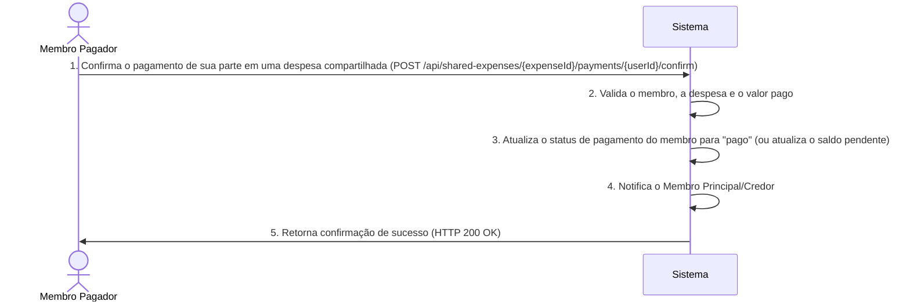

# RF021 🧾 Confirmação individual de pagamento em despesas compartilhadas

## 📝 Descrição

Esta funcionalidade permite a confirmação individual de pagamento da parte de cada membro em despesas compartilhadas,
com a opção de reflexão automática ao membro principal. O objetivo é facilitar o acompanhamento e a liquidação de
dívidas dentro de um grupo, proporcionando transparência sobre quem já pagou sua parte de um gasto comum.

## 👥 Atores

- 👤 **Membro Pagador**: O usuário que pagou sua parte em uma despesa compartilhada.
- 👥 **Membro Principal/Credor**: O usuário que iniciou a despesa ou é o responsável por receber os pagamentos.

## ⚠️ Pré-condições

- O usuário deve estar autenticado no sistema.
- A despesa compartilhada deve existir e o Membro Pagador deve ter uma parte atribuída a ela.
- O status da parte do Membro Pagador na despesa deve ser "pendente".

## 🔌 Endpoints

- `POST /api/shared-expenses/{expenseId}/payments/{userId}/confirm`

## 📋 Dados de Confirmação de Pagamento

| Campo         | Tipo                | Obrigatório | Descrição                                                              | Restrições                                                                 |
|---------------|---------------------|-------------|------------------------------------------------------------------------|----------------------------------------------------------------------------|
| `expenseId`   | `string`            | ✅ Sim       | ID único da despesa compartilhada.                                     | Deve ser um ID de despesa válido e existente.                              |
| `userId`      | `string`            | ✅ Sim       | ID único do usuário (Membro Pagador) que está confirmando o pagamento. | Deve ser um ID de usuário válido e participante da despesa.                |
| `amountPaid`  | `number`            | ❌ Não       | Opcional. Valor exato pago pelo membro, se for um pagamento parcial.   | Deve ser um número positivo. Se omitido, assume-se o valor total pendente. |
| `paymentDate` | `string` (ISO 8601) | ✅ Sim       | Data em que o pagamento foi realizado.                                 | Formato `YYYY-MM-DD`.                                                      |
| `proofUrl`    | `string`            | ❌ Não       | URL de um comprovante de pagamento (ex: imagem).                       | Deve ser uma URL válida.                                                   |

## 🔄 Fluxo Principal



1. O Membro Pagador envia uma requisição POST para `/api/shared-expenses/{expenseId}/payments/{userId}/confirm` com os
   detalhes do pagamento.
2. O sistema valida se o `userId` corresponde a um participante da `expenseId` e se o `amountPaid` é válido (se
   fornecido).
3. O sistema atualiza o status de pagamento da parte do `userId` na despesa compartilhada para "Pago" se o `amountPaid`
   for igual ao valor total pendente, ou ajusta o saldo pendente se for um pagamento parcial.
4. O sistema pode enviar uma notificação ao Membro Principal/Credor da despesa informando sobre o pagamento.
5. O sistema retorna uma resposta HTTP 200 OK com uma mensagem de sucesso e o status atualizado da despesa.

## 🔀 Fluxos Alternativos

### ⚠️ FA01 - Pagamento Parcial

1. O Membro Pagador informa um `amountPaid` menor que o valor total de sua parte.
2. O sistema atualiza o saldo pendente daquele membro para a despesa, mas mantém o status geral da despesa como "
   pendente" até que todo o valor seja quitado.

### ⚠️ FA02 - Confirmação com Comprovante

1. O Membro Pagador inclui uma `proofUrl` na requisição.
2. O sistema armazena a URL do comprovante e a disponibiliza para visualização pelo Membro Principal/Credor.

## 🚫 Fluxos de Exceção

### ⚠️ FE01 - Despesa Não Encontrada ou Não Compartilhada com o Usuário

1. A `expenseId` especificada não é encontrada ou o `userId` não é um participante da despesa.
2. O sistema retorna uma resposta HTTP 404 Not Found.

### ⚠️ FE02 - Pagamento Já Confirmado

1. O `userId` tenta confirmar o pagamento de uma despesa ou parte de uma despesa que já foi totalmente paga.
2. O sistema retorna uma resposta HTTP 409 Conflict.

### ⚠️ FE03 - Valor Pago Inválido

1. O `amountPaid` fornecido é negativo ou maior que o valor total pendente para o `userId` na despesa.
2. O sistema retorna uma resposta HTTP 400 Bad Request.

## 🧪 Exemplos de Uso

### Requisição HTTP para Confirmar Pagamento Total

```http
POST /api/shared-expenses/exp_789ghi/payments/usr_jkl012/confirm HTTP/1.1
Host: api.metakyasshu.com
Content-Type: application/json

{
  "paymentDate": "2024-07-20"
}
```

### Requisição HTTP para Confirmar Pagamento Parcial com Comprovante

```http
POST /api/shared-expenses/exp_789ghi/payments/usr_mno345/confirm HTTP/1.1
Host: api.metakyasshu.com
Content-Type: application/json

{
  "amountPaid": 15.50,
  "paymentDate": "2024-07-19",
  "proofUrl": "https://example.com/receipts/exp_789ghi_usr_mno345.png"
}
```

---

> ---------------------------------------------------------------------------
> #### 💰 METAKYASSHU 💰
> ***Transformando finanças em conquistas compartilhadas***
> --------------------------------------------------------------------------- 