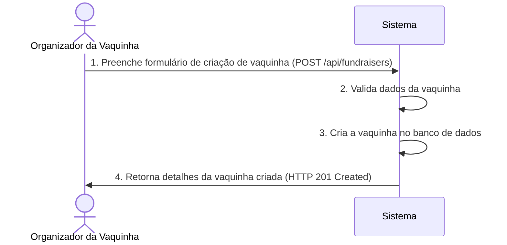
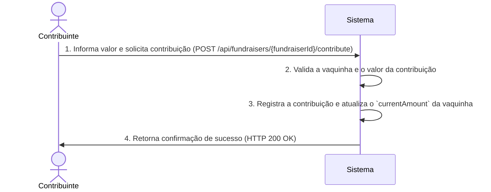

# RF022.1 🎁 Criação e gestão de vaquinhas digitais

## 📝 Descrição

Esta funcionalidade permite a criação e gestão de vaquinhas digitais. Os usuários podem definir um objetivo, valor-alvo,
prazo e convidar participantes para contribuir. Isso facilita a arrecadação de fundos para eventos, presentes ou causas
compartilhadas, com acompanhamento em tempo real das contribuições.

## 👥 Atores

- 👤 **Organizador da Vaquinha**: O usuário que cria e gerencia a vaquinha.
- 👥 **Contribuinte**: O usuário que faz doações para a vaquinha.

## ⚠️ Pré-condições

- O usuário (Organizador ou Contribuinte) deve estar autenticado no sistema.
- Para criar, o Organizador deve ter um perfil ativo.
- Para contribuir, a vaquinha deve existir e estar ativa.

## 🔌 Endpoints

- `POST /api/fundraisers` (Criar Vaquinha)
- `GET /api/fundraisers/{fundraiserId}` (Obter Detalhes da Vaquinha)
- `PUT /api/fundraisers/{fundraiserId}` (Atualizar Vaquinha)
- `POST /api/fundraisers/{fundraiserId}/contribute` (Contribuir para Vaquinha)

## 📋 Dados de Vaquinha Digital

### Criação/Atualização de Vaquinha

| Campo          | Tipo                | Obrigatório | Descrição                        | Restrições                                                   |
|----------------|---------------------|-------------|----------------------------------|--------------------------------------------------------------|
| `name`         | `string`            | ✅ Sim       | Nome da vaquinha.                | Máximo 100 caracteres.                                       |
| `description`  | `string`            | ❌ Não       | Descrição detalhada da vaquinha. | Máximo 500 caracteres.                                       |
| `targetAmount` | `number`            | ✅ Sim       | Valor total a ser arrecadado.    | Deve ser um número positivo.                                 |
| `currency`     | `string`            | ✅ Sim       | Moeda do valor-alvo.             | Ex: `BRL`, `USD`.                                            |
| `dueDate`      | `string` (ISO 8601) | ❌ Não       | Data limite para arrecadação.    | Formato `YYYY-MM-DD`.                                        |
| `visibility`   | `string`            | ✅ Sim       | Visibilidade da vaquinha.        | Valores permitidos: `PUBLIC`, `PRIVATE` (apenas convidados). |
| `ownerId`      | `string`            | ✅ Sim       | ID do usuário organizador.       | Gerado automaticamente pelo sistema.                         |

### Contribuição para Vaquinha

| Campo           | Tipo      | Obrigatório | Descrição                           | Restrições                                     |
|-----------------|-----------|-------------|-------------------------------------|------------------------------------------------|
| `fundraiserId`  | `string`  | ✅ Sim       | ID único da vaquinha.               | Deve ser um ID de vaquinha válido e existente. |
| `amount`        | `number`  | ✅ Sim       | Valor da contribuição.              | Deve ser um número positivo.                   |
| `contributorId` | `string`  | ✅ Sim       | ID do usuário contribuinte.         | Gerado automaticamente pelo sistema.           |
| `anonymous`     | `boolean` | ❌ Não       | Indica se a contribuição é anônima. | Padrão: `false`.                               |

## 🔄 Fluxo Principal - Criação de Vaquinha



1. O Organizador da Vaquinha envia uma requisição POST para `/api/fundraisers` com os detalhes da nova vaquinha.
2. O sistema valida os dados recebidos (e.g., `targetAmount` positivo, `currency` válido).
3. O sistema cria um novo registro de vaquinha no banco de dados, associando-o ao `ownerId` do usuário logado.
4. O sistema retorna uma resposta HTTP 201 Created com os detalhes da vaquinha recém-criada, incluindo seu
   `fundraiserId`.

## 🔄 Fluxo Principal - Contribuição para Vaquinha



1. O Contribuinte envia uma requisição POST para `/api/fundraisers/{fundraiserId}/contribute` com o `amount` da
   contribuição (e opcionalmente `anonymous`).
2. O sistema valida se a `fundraiserId` existe e está ativa, e se o `amount` é válido.
3. O sistema registra a contribuição no banco de dados e atualiza o `currentAmount` arrecadado na vaquinha.
4. O sistema retorna uma resposta HTTP 200 OK com uma mensagem de sucesso.

## 🔀 Fluxos Alternativos

### ⚠️ FA01 - Vaquinha Privada

1. Se `visibility` for `PRIVATE`, apenas usuários convidados (gerenciados por outra funcionalidade) podem contribuir ou
   visualizar detalhes.
2. O sistema verifica a autorização do usuário antes de permitir acesso à vaquinha privada.

### ⚠️ FA02 - Atingir o Objetivo

1. Quando o `currentAmount` atinge ou excede o `targetAmount`.
2. O sistema pode automaticamente marcar a vaquinha como "Concluída" e notificar o Organizador.

## 🚫 Fluxos de Exceção

### ⚠️ FE01 - Vaquinha Não Encontrada

1. O `fundraiserId` especificado não é encontrado.
2. O sistema retorna uma resposta HTTP 404 Not Found.

### ⚠️ FE02 - Valor de Contribuição Inválido

1. O `amount` fornecido é negativo, zero ou excede algum limite predefinido.
2. O sistema retorna uma resposta HTTP 400 Bad Request.

### ⚠️ FE03 - Prazo Expirado

1. A `dueDate` da vaquinha já passou e não permite mais contribuições.
2. O sistema retorna uma resposta HTTP 403 Forbidden.

### ⚠️ FE04 - Usuário Não Autorizado (para atualização/visualização privada)

1. Um usuário tenta atualizar ou visualizar uma vaquinha que não pertence a ele ou que é privada e ele não foi
   convidado.
2. O sistema retorna uma resposta HTTP 403 Forbidden.

## 🧪 Exemplos de Uso

### Requisição HTTP para Criar uma Vaquinha Pública

```http
POST /api/fundraisers HTTP/1.1
Host: api.metakyasshu.com
Content-Type: application/json

{
  "name": "Viagem de Aniversário da Ana",
  "description": "Arrecadação para a viagem surpresa de 30 anos da Ana para as Maldivas!",
  "targetAmount": 5000.00,
  "currency": "BRL",
  "dueDate": "2024-12-31",
  "visibility": "PUBLIC"
}
```

### Requisição HTTP para Contribuir para uma Vaquinha (não anônima)

```http
POST /api/fundraisers/fdr_abc123/contribute HTTP/1.1
Host: api.metakyasshu.com
Content-Type: application/json

{
  "amount": 50.00,
  "anonymous": false
}
```

### Requisição HTTP para Atualizar o Prazo de uma Vaquinha

```http
PUT /api/fundraisers/fdr_abc123 HTTP/1.1
Host: api.metakyasshu.com
Content-Type: application/json

{
  "dueDate": "2025-01-31"
}
```

---

> ---------------------------------------------------------------------------
> #### 💰 METAKYASSHU 💰
> ***Transformando finanças em conquistas compartilhadas***
> --------------------------------------------------------------------------- 