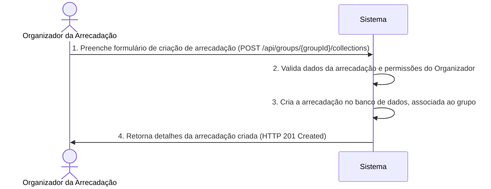
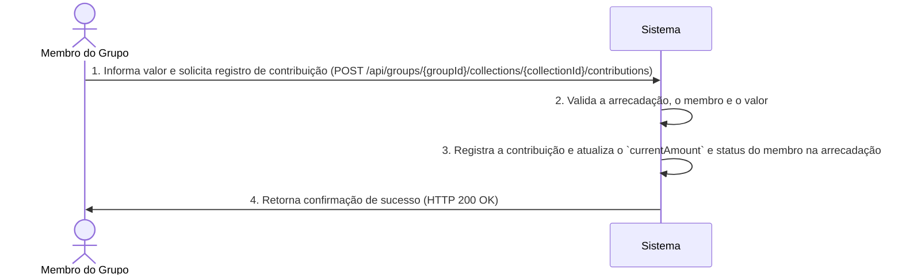

# RF022.2 🎁 Criação e gestão de arrecadações em grupo

## 📝 Descrição

Esta funcionalidade permite a criação e gestão de arrecadações em grupo, que são semelhantes a vaquinhas, mas focadas na
coleta de fundos de forma mais estruturada, como para mensalidades, fundos de caixa, ou projetos específicos do grupo.
Inclui o registro de contribuições, acompanhamento do status de cada membro e relatórios de arrecadação.

## 👥 Atores

- 👤 **Organizador da Arrecadação**: O usuário (geralmente um administrador de grupo) que cria e gerencia a arrecadação.
- 👥 **Membro do Grupo**: O usuário que deve contribuir para a arrecadação.

## ⚠️ Pré-condições

- O usuário (Organizador ou Membro) deve estar autenticado no sistema.
- Para criar, o Organizador deve ter permissão de administrador no grupo.
- Para contribuir, a arrecadação deve existir e estar ativa no grupo.

## 🔌 Endpoints

- `POST /api/groups/{groupId}/collections` (Criar Arrecadação)
- `GET /api/groups/{groupId}/collections/{collectionId}` (Obter Detalhes da Arrecadação)
- `PUT /api/groups/{groupId}/collections/{collectionId}` (Atualizar Arrecadação)
- `POST /api/groups/{groupId}/collections/{collectionId}/contributions` (Registrar Contribuição)

## 📋 Dados de Arrecadação em Grupo

### Criação/Atualização de Arrecadação

| Campo                       | Tipo                | Obrigatório | Descrição                                                                                | Restrições                                             |
|-----------------------------|---------------------|-------------|------------------------------------------------------------------------------------------|--------------------------------------------------------|
| `groupId`                   | `string`            | ✅ Sim       | ID único do grupo financeiro.                                                            | Deve ser um ID de grupo válido e existente.            |
| `name`                      | `string`            | ✅ Sim       | Nome da arrecadação (ex: "Caixinha de Viagem").                                          | Máximo 100 caracteres.                                 |
| `description`               | `string`            | ❌ Não       | Descrição detalhada da arrecadação.                                                      | Máximo 500 caracteres.                                 |
| `targetAmount`              | `number`            | ✅ Sim       | Valor total a ser arrecadado (opcional, se a meta for por contribuição individual fixa). | Deve ser um número positivo.                           |
| `currency`                  | `string`            | ✅ Sim       | Moeda da arrecadação.                                                                    | Ex: `BRL`, `USD`.                                      |
| `dueDate`                   | `string` (ISO 8601) | ❌ Não       | Data limite para arrecadação.                                                            | Formato `YYYY-MM-DD`.                                  |
| `membersContributionAmount` | `number`            | ❌ Não       | Valor de contribuição individual esperada por membro (se aplicável).                     | Deve ser um número positivo.                           |
| `status`                    | `string`            | ✅ Sim       | Status da arrecadação.                                                                   | Valores permitidos: `ACTIVE`, `COMPLETED`, `CANCELED`. |

### Registro de Contribuição

| Campo              | Tipo                | Obrigatório | Descrição                                    | Restrições                                                 |
|--------------------|---------------------|-------------|----------------------------------------------|------------------------------------------------------------|
| `collectionId`     | `string`            | ✅ Sim       | ID único da arrecadação.                     | Deve ser um ID de arrecadação válido e existente no grupo. |
| `contributorId`    | `string`            | ✅ Sim       | ID do membro do grupo que está contribuindo. | Deve ser um ID de usuário válido e membro do grupo.        |
| `amount`           | `number`            | ✅ Sim       | Valor da contribuição.                       | Deve ser um número positivo.                               |
| `contributionDate` | `string` (ISO 8601) | ✅ Sim       | Data da contribuição.                        | Formato `YYYY-MM-DD`.                                      |
| `notes`            | `string`            | ❌ Não       | Observações sobre a contribuição.            | Máximo 255 caracteres.                                     |

## 🔄 Fluxo Principal - Criação de Arrecadação



1. O Organizador da Arrecadação envia uma requisição POST para `/api/groups/{groupId}/collections` com os detalhes da
   nova arrecadação.
2. O sistema valida os dados e verifica se o Organizador tem permissão para criar arrecadações no `groupId`.
3. O sistema cria um novo registro de arrecadação no banco de dados, associando-o ao `groupId` e ao Organizador.
4. O sistema retorna uma resposta HTTP 201 Created com os detalhes da arrecadação recém-criada, incluindo seu
   `collectionId`.

## 🔄 Fluxo Principal - Registro de Contribuição



1. O Membro do Grupo envia uma requisição POST para `/api/groups/{groupId}/collections/{collectionId}/contributions` com
   o `amount` da contribuição.
2. O sistema valida se a `collectionId` existe no `groupId` e está ativa, se o `contributorId` é um membro do grupo, e
   se o `amount` é válido.
3. O sistema registra a contribuição no banco de dados e atualiza o valor total arrecadado (`currentAmount`) e o status
   de contribuição do `contributorId` para aquela arrecadação.
4. O sistema retorna uma resposta HTTP 200 OK com uma mensagem de sucesso.

## 🔀 Fluxos Alternativos

### ⚠️ FA01 - Acompanhamento Individual

1. Cada membro do grupo pode visualizar seu histórico de contribuições para cada arrecadação.
2. O sistema exibe um resumo do quanto cada membro já contribuiu e quanto ainda falta, se houver um
   `membersContributionAmount` definido.

### ⚠️ FA02 - Arrecadação por Valor Alvo

1. Se `targetAmount` for definido, a arrecadação pode ser marcada como `COMPLETED` automaticamente ao atingir o valor.
2. O sistema notifica o Organizador quando o objetivo é alcançado.

## 🚫 Fluxos de Exceção

### ⚠️ FE01 - Arrecadação Não Encontrada ou Não Pertencente ao Grupo

1. A `collectionId` especificada não é encontrada ou não pertence ao `groupId`.
2. O sistema retorna uma resposta HTTP 404 Not Found.

### ⚠️ FE02 - Usuário Não Autorizado (para criação/atualização)

1. O usuário que tenta criar ou atualizar a arrecadação não tem as permissões de administrador para o grupo.
2. O sistema retorna uma resposta HTTP 403 Forbidden.

### ⚠️ FE03 - Contribuição Inválida

1. O `amount` fornecido para a contribuição é negativo, zero ou excede algum limite (se houver).
2. O sistema retorna uma resposta HTTP 400 Bad Request.

### ⚠️ FE04 - Arrecadação Inativa

1. O usuário tenta contribuir para uma arrecadação que está `COMPLETED` ou `CANCELED`.
2. O sistema retorna uma resposta HTTP 403 Forbidden.

## 🧪 Exemplos de Uso

### Requisição HTTP para Criar uma Arrecadação de Caixa de Fundo

```http
POST /api/groups/grp_abc456/collections HTTP/1.1
Host: api.metakyasshu.com
Content-Type: application/json

{
  "name": "Fundo de Caixa - Eventos Sociais",
  "description": "Arrecadação para despesas com eventos sociais do grupo.",
  "currency": "BRL",
  "membersContributionAmount": 20.00,
  "status": "ACTIVE"
}
```

### Requisição HTTP para Registrar uma Contribuição

```http
POST /api/groups/grp_abc456/collections/col_xyz789/contributions HTTP/1.1
Host: api.metakyasshu.com
Content-Type: application/json

{
  "contributorId": "usr_111",
  "amount": 20.00,
  "contributionDate": "2024-07-20",
  "notes": "Mensalidade de Julho"
}
```

### Requisição HTTP para Obter Detalhes da Arrecadação

```http
GET /api/groups/grp_abc456/collections/col_xyz789 HTTP/1.1
Host: api.metakyasshu.com
```

---

> ---------------------------------------------------------------------------
> #### 💰 METAKYASSHU 💰
> ***Transformando finanças em conquistas compartilhadas***
> --------------------------------------------------------------------------- 