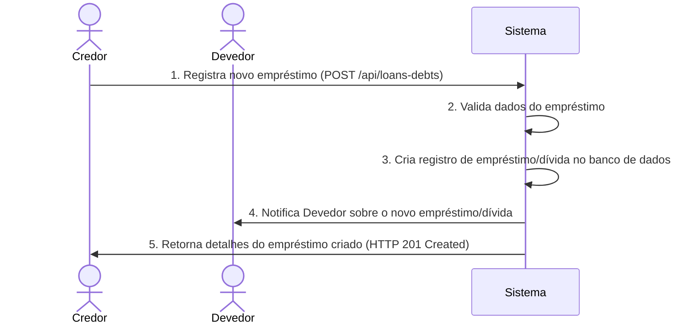
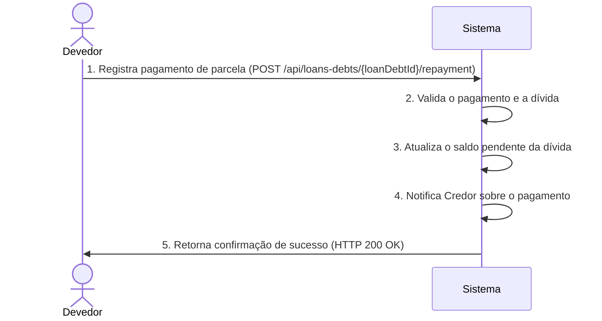

# RF023.1 💰 Registro de empréstimos e dívidas

## 📝 Descrição

Esta funcionalidade permite o registro de empréstimos e dívidas entre membros, facilitando o controle e o acompanhamento
de transações de crédito e débito entre indivíduos ou grupos. Inclui a capacidade de registrar o valor, a data de
vencimento, juros (se aplicável) e o status do empréstimo/dívida.

## 👥 Atores

- 👤 **Credor**: O usuário que emprestou dinheiro.
- 👤 **Devedor**: O usuário que pegou dinheiro emprestado.

## ⚠️ Pré-condições

- Ambos os usuários (credor e devedor) devem estar autenticados no sistema.
- Ambos os usuários devem ter perfis ativos.

## 🔌 Endpoints

- `POST /api/loans-debts` (Registrar Empréstimo/Dívida)
- `GET /api/loans-debts/{loanDebtId}` (Obter Detalhes do Empréstimo/Dívida)
- `PUT /api/loans-debts/{loanDebtId}` (Atualizar Empréstimo/Dívida)
- `POST /api/loans-debts/{loanDebtId}/repayment` (Registrar Pagamento)

## 📋 Dados de Empréstimo/Dívida

### Registro/Atualização de Empréstimo/Dívida

| Campo          | Tipo                | Obrigatório | Descrição                                                | Restrições                                        |
|----------------|---------------------|-------------|----------------------------------------------------------|---------------------------------------------------|
| `lenderId`     | `string`            | ✅ Sim       | ID do usuário que emprestou o dinheiro (Credor).         | Deve ser um ID de usuário válido e existente.     |
| `borrowerId`   | `string`            | ✅ Sim       | ID do usuário que pegou o dinheiro emprestado (Devedor). | Deve ser um ID de usuário válido e existente.     |
| `amount`       | `number`            | ✅ Sim       | Valor do empréstimo/dívida.                              | Deve ser um número positivo.                      |
| `currency`     | `string`            | ✅ Sim       | Moeda do empréstimo/dívida.                              | Ex: `BRL`, `USD`.                                 |
| `dueDate`      | `string` (ISO 8601) | ✅ Sim       | Data de vencimento do empréstimo/dívida.                 | Formato `YYYY-MM-DD`.                             |
| `interestRate` | `number`            | ❌ Não       | Taxa de juros anual (se aplicável).                      | Valor percentual (ex: 0.05 para 5%).              |
| `description`  | `string`            | ❌ Não       | Descrição do empréstimo/dívida.                          | Máximo 255 caracteres.                            |
| `status`       | `string`            | ✅ Sim       | Status atual do empréstimo/dívida.                       | Valores permitidos: `PENDING`, `PAID`, `OVERDUE`. |

### Registro de Pagamento

| Campo         | Tipo                | Obrigatório | Descrição                      | Restrições                                              |
|---------------|---------------------|-------------|--------------------------------|---------------------------------------------------------|
| `loanDebtId`  | `string`            | ✅ Sim       | ID único do empréstimo/dívida. | Deve ser um ID de empréstimo/dívida válido e existente. |
| `paidAmount`  | `number`            | ✅ Sim       | Valor pago na parcela.         | Deve ser um número positivo.                            |
| `paymentDate` | `string` (ISO 8601) | ✅ Sim       | Data do pagamento.             | Formato `YYYY-MM-DD`.                                   |
| `notes`       | `string`            | ❌ Não       | Observações sobre o pagamento. | Máximo 255 caracteres.                                  |

## 🔄 Fluxo Principal - Registro de Empréstimo



1. O Credor envia uma requisição POST para `/api/loans-debts` com os detalhes do empréstimo (Credor, Devedor, valor,
   data de vencimento, etc.).
2. O sistema valida os `lenderId`, `borrowerId`, `amount`, `currency` e `dueDate`.
3. O sistema cria um novo registro de empréstimo/dívida no banco de dados com status `PENDING`.
4. O sistema pode enviar uma notificação ao Devedor sobre o novo empréstimo/dívida registrada em seu nome.
5. O sistema retorna uma resposta HTTP 201 Created com os detalhes do empréstimo/dívida recém-criado, incluindo seu
   `loanDebtId`.

## 🔄 Fluxo Principal - Registro de Pagamento



1. O Devedor envia uma requisição POST para `/api/loans-debts/{loanDebtId}/repayment` com o `paidAmount` e
   `paymentDate`.
2. O sistema valida se o `loanDebtId` existe, se o `paidAmount` é positivo e se a `paymentDate` é válida.
3. O sistema atualiza o saldo pendente do empréstimo/dívida e, se o saldo for zero ou negativo, muda o status para
   `PAID`.
4. O sistema pode enviar uma notificação ao Credor sobre o pagamento recebido.
5. O sistema retorna uma resposta HTTP 200 OK com uma mensagem de sucesso e o status atualizado do empréstimo/dívida.

## 🔀 Fluxos Alternativos

### ⚠️ FA01 - Dívida com Juros

1. Se `interestRate` for especificado, o sistema calcula os juros sobre o saldo devedor ao longo do tempo.
2. Os pagamentos são aplicados primeiro aos juros acumulados e depois ao principal.

### ⚠️ FA02 - Dívida Vencida

1. Se a `dueDate` for ultrapassada e o `status` ainda for `PENDING`.
2. O sistema pode automaticamente mudar o status para `OVERDUE` e notificar ambos os usuários.

## 🚫 Fluxos de Exceção

### ⚠️ FE01 - Empréstimo/Dívida Não Encontrada

1. O `loanDebtId` especificado não é encontrado.
2. O sistema retorna uma resposta HTTP 404 Not Found.

### ⚠️ FE02 - Valor Inválido

1. O `amount` do empréstimo ou o `paidAmount` do pagamento é negativo ou zero.
2. O sistema retorna uma resposta HTTP 400 Bad Request.

### ⚠️ FE03 - Usuário Não Autorizado (para atualização ou registro de pagamento de dívida alheia)

1. Um usuário tenta atualizar uma dívida que não está envolvido ou registrar um pagamento para uma dívida que não é o
   devedor.
2. O sistema retorna uma resposta HTTP 403 Forbidden.

### ⚠️ FE04 - Dívida Já Paga

1. O Devedor tenta registrar um pagamento para uma dívida que já está com o status `PAID`.
2. O sistema retorna uma resposta HTTP 409 Conflict.

## 🧪 Exemplos de Uso

### Requisição HTTP para Registrar um Empréstimo (Credor: usr_A, Devedor: usr_B)

```http
POST /api/loans-debts HTTP/1.1
Host: api.metakyasshu.com
Content-Type: application/json

{
  "lenderId": "usr_A",
  "borrowerId": "usr_B",
  "amount": 150.00,
  "currency": "BRL",
  "dueDate": "2024-09-30",
  "description": "Empréstimo para conserto do carro"
}
```

### Requisição HTTP para Registrar um Pagamento (Devedor: usr_B)

```http
POST /api/loans-debts/lnd_xyz789/repayment HTTP/1.1
Host: api.metakyasshu.com
Content-Type: application/json

{
  "paidAmount": 50.00,
  "paymentDate": "2024-08-01",
  "notes": "Primeira parcela"
}
```

### Requisição HTTP para Atualizar Status para Pago (Credor: usr_A)

```http
PUT /api/loans-debts/lnd_xyz789 HTTP/1.1
Host: api.metakyasshu.com
Content-Type: application/json

{
  "status": "PAID"
}
```

---

> ---------------------------------------------------------------------------
> #### 💰 METAKYASSHU 💰
> ***Transformando finanças em conquistas compartilhadas***
> --------------------------------------------------------------------------- 