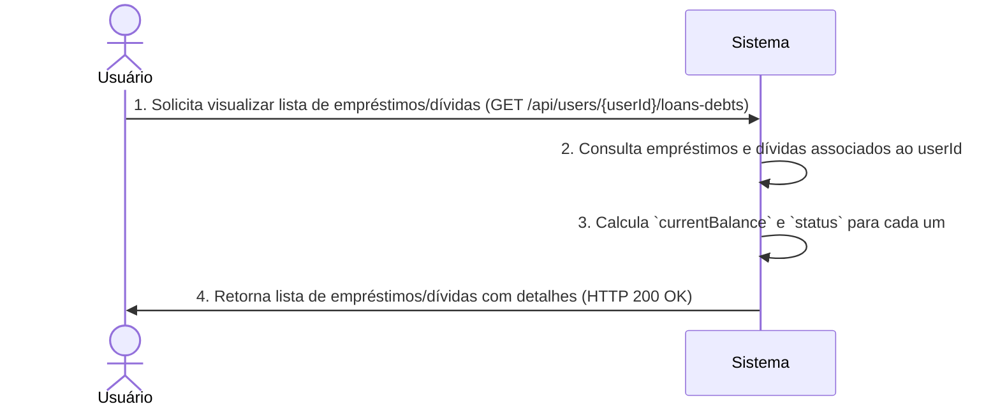

# RF023.2 💰 Acompanhamento de empréstimos e dívidas

## 📝 Descrição

Esta funcionalidade permite o acompanhamento do status de empréstimos e dívidas entre membros. Os usuários podem
visualizar o saldo pendente, histórico de pagamentos, datas de vencimento e receber lembretes, proporcionando uma visão
clara de suas obrigações financeiras e recebíveis.

## 👥 Atores

- 👤 **Credor**: O usuário que emprestou dinheiro e deseja acompanhar o recebimento.
- 👤 **Devedor**: O usuário que pegou dinheiro emprestado e deseja acompanhar sua dívida.

## ⚠️ Pré-condições

- O usuário deve estar autenticado no sistema.
- Deve existir empréstimos ou dívidas registrados envolvendo o usuário.

## 🔌 Endpoints

- `GET /api/users/{userId}/loans-debts` (Listar todos os empréstimos/dívidas do usuário)
- `GET /api/loans-debts/{loanDebtId}` (Obter detalhes de um empréstimo/dívida específico)

## 📋 Dados de Empréstimo/Dívida para Acompanhamento

| Campo             | Tipo                | Descrição                                     | Status Possíveis             |
|-------------------|---------------------|-----------------------------------------------|------------------------------|
| `loanDebtId`      | `string`            | ID único do empréstimo/dívida.                | N/A                          |
| `lenderId`        | `string`            | ID do usuário credor.                         | N/A                          |
| `borrowerId`      | `string`            | ID do usuário devedor.                        | N/A                          |
| `amount`          | `number`            | Valor total do empréstimo/dívida.             | N/A                          |
| `currentBalance`  | `number`            | Saldo atual pendente.                         | N/A                          |
| `currency`        | `string`            | Moeda do empréstimo/dívida.                   | N/A                          |
| `dueDate`         | `string` (ISO 8601) | Data de vencimento.                           | N/A                          |
| `interestRate`    | `number`            | Taxa de juros anual (se aplicável).           | N/A                          |
| `description`     | `string`            | Descrição do empréstimo/dívida.               | N/A                          |
| `status`          | `string`            | Status atual do empréstimo/dívida.            | `PENDING`, `PAID`, `OVERDUE` |
| `paymentsHistory` | `array`             | Histórico de pagamentos (data, valor, notas). | N/A                          |

## 🔄 Fluxo Principal - Visualização de Empréstimos e Dívidas



1. O Usuário (seja credor ou devedor) envia uma requisição GET para `/api/users/{userId}/loans-debts` para obter uma
   lista de todas as transações de empréstimo/dívida em que está envolvido.
2. O sistema consulta o banco de dados para encontrar todos os registros onde o `userId` é `lenderId` ou `borrowerId`.
3. Para cada empréstimo/dívida, o sistema calcula o `currentBalance` (saldo pendente) com base no `amount` original e no
   `paymentsHistory`, e determina o `status` (`PENDING`, `PAID`, `OVERDUE`).
4. O sistema retorna uma resposta HTTP 200 OK contendo uma lista de objetos de empréstimo/dívida, cada um com seus
   detalhes completos, incluindo saldo atual e status.

## 🔀 Fluxos Alternativos

### ⚠️ FA01 - Filtragem por Status

1. O usuário pode adicionar parâmetros de query à requisição (e.g., `?status=OVERDUE`) para filtrar a lista.
2. O sistema retorna apenas os empréstimos/dívidas que correspondem ao status filtrado.

### ⚠️ FA02 - Detalhes de um Empréstimo Específico

1. O usuário solicita detalhes de um `loanDebtId` específico (GET /api/loans-debts/{loanDebtId}).
2. O sistema retorna todos os dados detalhados daquele empréstimo/dívida, incluindo histórico completo de pagamentos.

## 🚫 Fluxos de Exceção

### ⚠️ FE01 - Usuário Não Autorizado

1. Um usuário tenta acessar empréstimos/dívidas de outro `userId` sem permissão.
2. O sistema retorna uma resposta HTTP 403 Forbidden.

### ⚠️ FE02 - Empréstimo/Dívida Não Encontrada

1. Ao tentar obter detalhes de um `loanDebtId` específico, ele não é encontrado.
2. O sistema retorna uma resposta HTTP 404 Not Found.

### ⚠️ FE03 - Ausência de Empréstimos/Dívidas

1. O `userId` não possui empréstimos ou dívidas registrados.
2. O sistema retorna uma lista vazia e um HTTP 200 OK.

## 🧪 Exemplos de Uso

### Requisição HTTP para Listar Todos os Empréstimos/Dívidas do Usuário

```http
GET /api/users/usr_abc123/loans-debts HTTP/1.1
Host: api.metakyasshu.com
```

### Requisição HTTP para Listar Dívidas Vencidas de um Usuário

```http
GET /api/users/usr_abc123/loans-debts?status=OVERDUE HTTP/1.1
Host: api.metakyasshu.com
```

### Requisição HTTP para Obter Detalhes de um Empréstimo Específico

```http
GET /api/loans-debts/lnd_xyz789 HTTP/1.1
Host: api.metakyasshu.com
```

---

> ---------------------------------------------------------------------------
> #### 💰 METAKYASSHU 💰
> ***Transformando finanças em conquistas compartilhadas***
> --------------------------------------------------------------------------- 