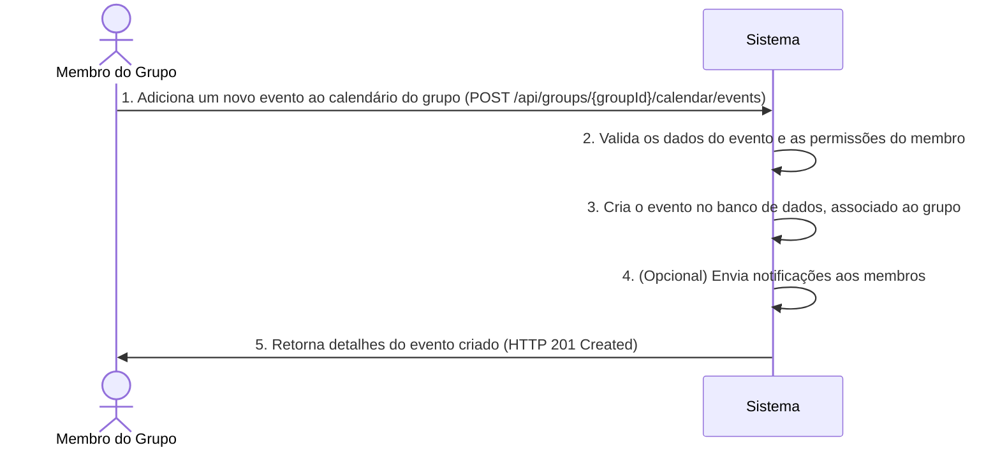
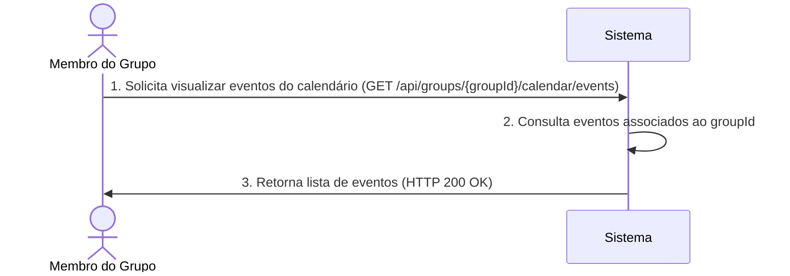

# RF024 📅 Calendário financeiro compartilhado

## 📝 Descrição

Esta funcionalidade permite um calendário financeiro compartilhado com eventos e vencimentos importantes. Os usuários
podem adicionar e visualizar datas de pagamentos, recebimentos, faturas, metas e outros eventos financeiros relevantes
para o grupo, garantindo que todos os membros estejam cientes dos compromissos financeiros.

## 👥 Atores

- 👤 **Membro do Grupo**: Qualquer usuário que faz parte de um grupo financeiro.

## ⚠️ Pré-condições

- O usuário deve estar autenticado no sistema.
- O usuário deve ser membro de um grupo financeiro existente.

## 🔌 Endpoints

- `POST /api/groups/{groupId}/calendar/events` (Criar Evento de Calendário)
- `GET /api/groups/{groupId}/calendar/events` (Listar Eventos de Calendário do Grupo)
- `PUT /api/groups/{groupId}/calendar/events/{eventId}` (Atualizar Evento de Calendário)
- `DELETE /api/groups/{groupId}/calendar/events/{eventId}` (Excluir Evento de Calendário)

## 📋 Dados de Evento de Calendário

| Campo               | Tipo                | Obrigatório | Descrição                                            | Restrições                                                             |
|---------------------|---------------------|-------------|------------------------------------------------------|------------------------------------------------------------------------|
| `groupId`           | `string`            | ✅ Sim       | ID único do grupo financeiro.                        | Deve ser um ID de grupo válido e existente.                            |
| `title`             | `string`            | ✅ Sim       | Título do evento (ex: "Pagamento Aluguel").          | Máximo 100 caracteres.                                                 |
| `description`       | `string`            | ❌ Não       | Descrição detalhada do evento.                       | Máximo 500 caracteres.                                                 |
| `type`              | `string`            | ✅ Sim       | Tipo do evento financeiro.                           | Valores permitidos: `BILL`, `RECEIVABLE`, `GOAL`, `REMINDER`, `OTHER`. |
| `amount`            | `number`            | ❌ Não       | Valor associado ao evento (se aplicável).            | Deve ser um número positivo.                                           |
| `currency`          | `string`            | Condicional | Moeda do valor (se `amount` for fornecido).          | Ex: `BRL`, `USD`.                                                      |
| `dueDate`           | `string` (ISO 8601) | ✅ Sim       | Data do evento/vencimento.                           | Formato `YYYY-MM-DD`.                                                  |
| `isRecurrent`       | `boolean`           | ✅ Sim       | Indica se o evento se repete.                        | Padrão: `false`.                                                       |
| `recurrencePattern` | `string`            | Condicional | Padrão de recorrência (se `isRecurrent` for `true`). | Ex: `DAILY`, `WEEKLY`, `MONTHLY`, `YEARLY`.                            |
| `notifiedMembers`   | `array`             | ❌ Não       | Lista de IDs de membros a serem notificados.         | Se vazio, todos os membros do grupo são notificados.                   |

## 🔄 Fluxo Principal - Criação de Evento



1. O Membro do Grupo envia uma requisição POST para `/api/groups/{groupId}/calendar/events` com os detalhes do novo
   evento.
2. O sistema valida os campos obrigatórios (`title`, `type`, `dueDate`, `isRecurrent`) e verifica se o `groupId` é
   válido e se o membro tem permissão para adicionar eventos.
3. O sistema cria um novo registro de evento no banco de dados, associando-o ao `groupId`.
4. Se `notifiedMembers` for especificado, o sistema envia notificações aos membros listados. Caso contrário, ou se a
   funcionalidade de notificação estiver habilitada por padrão, notifica todos os membros do grupo sobre o novo evento.
5. O sistema retorna uma resposta HTTP 201 Created com os detalhes do evento recém-criado, incluindo seu `eventId`.

## 🔄 Fluxo Principal - Visualização de Eventos



1. O Membro do Grupo envia uma requisição GET para `/api/groups/{groupId}/calendar/events`.
2. O sistema consulta o banco de dados por todos os eventos de calendário associados ao `groupId`.
3. O sistema retorna uma resposta HTTP 200 OK contendo uma lista de objetos de evento, cada um com seus detalhes
   completos.

## 🔀 Fluxos Alternativos

### ⚠️ FA01 - Filtragem por Data ou Tipo

1. O usuário pode adicionar parâmetros de query à requisição GET (e.g.,
   `?startDate=2024-07-01&endDate=2024-07-31&type=BILL`) para filtrar eventos.
2. O sistema retorna apenas os eventos que correspondem aos critérios de filtragem.

### ⚠️ FA02 - Eventos Recorrentes

1. Se `isRecurrent` for `true`, o sistema gera múltiplas instâncias do evento no calendário com base no
   `recurrencePattern`.
2. A edição ou exclusão de um evento recorrente pode perguntar se a alteração se aplica a uma única instância ou a todas
   as futuras instâncias.

## 🚫 Fluxos de Exceção

### ⚠️ FE01 - Grupo Não Encontrado

1. O `groupId` especificado não é encontrado.
2. O sistema retorna uma resposta HTTP 404 Not Found.

### ⚠️ FE02 - Usuário Não Autorizado

1. O usuário que tenta criar, atualizar ou excluir um evento não é membro do `groupId`.
2. O sistema retorna uma resposta HTTP 403 Forbidden.

### ⚠️ FE03 - Dados Inválidos

1. Campos obrigatórios estão faltando ou contêm valores inválidos (e.g., `dueDate` mal formatado, `type` não
   reconhecido).
2. O sistema retorna uma resposta HTTP 400 Bad Request.

### ⚠️ FE04 - Evento Não Encontrado (para atualização/exclusão)

1. O `eventId` especificado para atualização ou exclusão não é encontrado dentro do `groupId`.
2. O sistema retorna uma resposta HTTP 404 Not Found.

## 🧪 Exemplos de Uso

### Requisição HTTP para Criar um Evento de Pagamento Recorrente Mensal

```http
POST /api/groups/grp_abc456/calendar/events HTTP/1.1
Host: api.metakyasshu.com
Content-Type: application/json

{
  "title": "Pagamento Mensal da Internet",
  "description": "Fatura mensal da internet para o apartamento do grupo.",
  "type": "BILL",
  "amount": 120.00,
  "currency": "BRL",
  "dueDate": "2024-08-10",
  "isRecurrent": true,
  "recurrencePattern": "MONTHLY"
}
```

### Requisição HTTP para Listar Eventos de Agosto de 2024

```http
GET /api/groups/grp_abc456/calendar/events?startDate=2024-08-01&endDate=2024-08-31 HTTP/1.1
Host: api.metakyasshu.com
```

### Requisição HTTP para Excluir um Evento

```http
DELETE /api/groups/grp_abc456/calendar/events/evt_xyz789 HTTP/1.1
Host: api.metakyasshu.com
```

---

> ---------------------------------------------------------------------------
> #### 💰 METAKYASSHU 💰
> ***Transformando finanças em conquistas compartilhadas***
> --------------------------------------------------------------------------- 