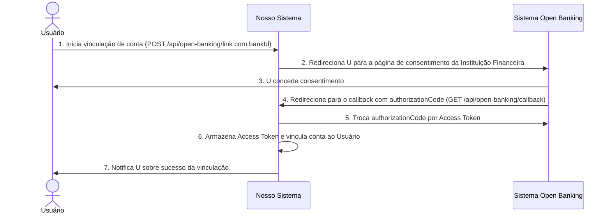
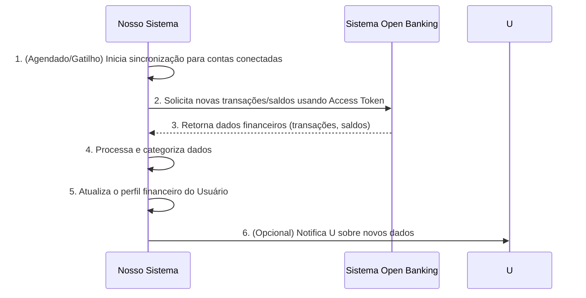

# RF025 🏦 Integração com Open Banking

## 📝 Descrição

Esta funcionalidade permite a integração com Open Banking para sincronização automática de dados bancários. Os usuários
podem conectar suas contas bancárias à plataforma para importar transações, saldos e outras informações financeiras de
forma segura e automatizada, eliminando a necessidade de entrada manual de dados e fornecendo uma visão financeira
completa e atualizada.

## 👥 Atores

- 👤 **Usuário**: O proprietário da conta bancária que deseja integrar com o Open Banking.
- 🏛️ **Instituição Financeira**: O banco ou outra instituição que expõe os dados via Open Banking.

## ⚠️ Pré-condições

- O usuário deve estar autenticado no sistema.
- A Instituição Financeira do usuário deve participar do ecossistema Open Banking e estar habilitada para integração com
  a nossa plataforma.
- O usuário deve conceder consentimento para o compartilhamento de dados via Open Banking.

## 🔌 Endpoints

- `POST /api/open-banking/link` (Iniciar processo de vinculação)
- `GET /api/open-banking/callback` (Endpoint de callback do Open Banking)
- `GET /api/accounts/{accountId}/transactions/sync` (Sincronizar transações de uma conta)
- `GET /api/users/{userId}/open-banking/connected-accounts` (Listar contas conectadas)

## 📋 Dados de Integração Open Banking

### Início de Vinculação

| Campo         | Tipo     | Obrigatório | Descrição                                                        | Restrições                                   |
|---------------|----------|-------------|------------------------------------------------------------------|----------------------------------------------|
| `bankId`      | `string` | ✅ Sim       | ID da instituição financeira.                                    | Deve ser um ID de banco válido e suportado.  |
| `redirectUrl` | `string` | ✅ Sim       | URL para onde o Open Banking redirecionará após o consentimento. | Deve ser uma URL válida da nossa plataforma. |

### Dados Retornados pelo Callback (Exemplo)

| Campo               | Tipo     | Descrição                                                                         | Restrições                               |
|---------------------|----------|-----------------------------------------------------------------------------------|------------------------------------------|
| `authorizationCode` | `string` | Código de autorização concedido pelo Open Banking.                                | Gerado pela instituição financeira.      |
| `state`             | `string` | Estado para prevenção de CSRF, deve corresponder ao gerado na requisição inicial. | Gerado e validado pela nossa plataforma. |

### Sincronização de Transações (Exemplo de dados importados)

| Campo           | Tipo                | Descrição                           | Restrições                                         |
|-----------------|---------------------|-------------------------------------|----------------------------------------------------|
| `transactionId` | `string`            | ID único da transação no banco.     | N/A                                                |
| `accountId`     | `string`            | ID da conta bancária associada.     | N/A                                                |
| `description`   | `string`            | Descrição da transação.             | N/A                                                |
| `amount`        | `number`            | Valor da transação.                 | Pode ser positivo (receita) ou negativo (despesa). |
| `currency`      | `string`            | Moeda da transação.                 | N/A                                                |
| `date`          | `string` (ISO 8601) | Data da transação.                  | Formato `YYYY-MM-DD`.                              |
| `type`          | `string`            | Tipo de transação (débito/crédito). | Ex: `DEBIT`, `CREDIT`.                             |
| `category`      | `string`            | Categoria sugerida (se disponível). | N/A                                                |

## 🔄 Fluxo Principal - Vinculação de Conta Bancária



1. O Usuário seleciona sua Instituição Financeira em nossa plataforma e inicia o processo de vinculação (POST para
   `/api/open-banking/link`).
2. Nossa plataforma gera um `state` e redireciona o Usuário para a página de consentimento da Instituição Financeira (
   via Open Banking).
3. O Usuário faz login na Instituição Financeira e concede consentimento para o compartilhamento de dados com nossa
   plataforma.
4. A Instituição Financeira redireciona o Usuário de volta para o `redirectUrl` de nossa plataforma (endpoint
   `/api/open-banking/callback`), incluindo um `authorizationCode` e o `state`.
5. Nosso sistema recebe o `authorizationCode`, valida o `state`, e o troca por um Access Token (e possivelmente um
   Refresh Token) com a Instituição Financeira.
6. O Access Token é armazenado de forma segura e a conta bancária é vinculada ao perfil do Usuário em nossa plataforma.
7. O sistema notifica o Usuário que a vinculação foi bem-sucedida e que os dados podem ser sincronizados.

## 🔄 Fluxo Principal - Sincronização Automática de Dados



1. Periodicamente (ou acionado por eventos), nosso sistema inicia a sincronização de dados para as contas vinculadas via
   Open Banking (GET para `/api/accounts/{accountId}/transactions/sync`).
2. Utilizando o Access Token armazenado, nosso sistema solicita as últimas transações e/ou saldos da Instituição
   Financeira via API do Open Banking.
3. A Instituição Financeira retorna os dados financeiros para nosso sistema.
4. Nosso sistema processa os dados, categoriza as transações (se possível automaticamente) e os integra ao perfil
   financeiro do Usuário.
5. Os saldos das contas são atualizados e novas transações são registradas, evitando duplicidade.
6. O sistema pode enviar uma notificação ao Usuário sobre a conclusão da sincronização e a disponibilidade de novos
   dados.

## 🔀 Fluxos Alternativos

### ⚠️ FA01 - Reautenticação Necessária

1. Se o Access Token expirar ou for revogado, nosso sistema detecta um erro de autenticação durante a sincronização.
2. O sistema notifica o Usuário que ele precisa reautenticar sua conta bancária via Open Banking, redirecionando-o para
   o processo de consentimento novamente.

### ⚠️ FA02 - Falha Parcial na Sincronização

1. Algumas transações podem falhar ao ser importadas devido a dados inconsistentes ou erros temporários da API externa.
2. O sistema registra os erros, tenta reprocessar em uma próxima sincronização e notifica o Usuário sobre quaisquer
   lacunas ou dados ausentes.

## 🚫 Fluxos de Exceção

### ⚠️ FE01 - Consentimento Negado

1. O Usuário nega o consentimento na página da Instituição Financeira.
2. A Instituição Financeira redireciona para o callback com um erro ou sem o `authorizationCode`.
3. Nosso sistema detecta a falha e notifica o Usuário que a vinculação não pôde ser concluída.

### ⚠️ FE02 - Instituição Financeira Indisponível

1. A API do Open Banking da Instituição Financeira está fora do ar ou com problemas de conectividade.
2. Nosso sistema tenta novamente após um tempo e, se a falha persistir, notifica o Usuário sobre a indisponibilidade.

### ⚠️ FE03 - Dados Inconsistentes da Instituição Financeira

1. A Instituição Financeira envia dados que não correspondem ao esperado pelo nosso sistema (e.g., formato de data
   incorreto, campos obrigatórios ausentes).
2. O sistema tenta sanitizar os dados ou os ignora, registra o erro e pode notificar a equipe de suporte para
   investigação.

## 🧪 Exemplos de Uso

### Requisição HTTP para Iniciar Vinculação de Conta (Frontend -> Backend)

```http
POST /api/open-banking/link HTTP/1.1
Host: api.metakyasshu.com
Content-Type: application/json

{
  "bankId": "bank_bradesco",
  "redirectUrl": "https://app.metakyasshu.com/open-banking/callback"
}
```

### Exemplo de Retorno do Callback do Open Banking (para o nosso Backend)

```http
GET /api/open-banking/callback?code=AUTH_CODE_XYZ&state=STATE_VALUE_ABC HTTP/1.1
Host: api.metakyasshu.com
```

### Requisição HTTP para Forçar Sincronização de Transações para uma Conta Conectada

```http
GET /api/accounts/acc_123def/transactions/sync HTTP/1.1
Host: api.metakyasshu.com
```

### Exemplo de Dados de Transação Sincronizada

```json
{
  "transactionId": "trn_bank456",
  "accountId": "acc_123def",
  "description": "COMPRA SUPERMERCADO ABC",
  "amount": -75.50,
  "currency": "BRL",
  "date": "2024-07-18",
  "type": "DEBIT",
  "category": "Alimentação"
}
```

---

> ---------------------------------------------------------------------------
> #### 💰 METAKYASSHU 💰
> ***Transformando finanças em conquistas compartilhadas***
> --------------------------------------------------------------------------- 