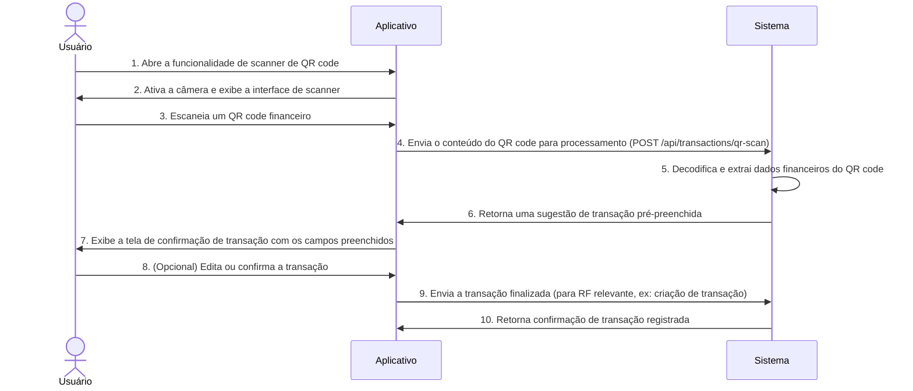

# RF026.1 📱 Scanner de QR codes para transações

## 📝 Descrição

Esta funcionalidade permite o uso de scanner de QR codes para registro rápido de transações, tanto para pagamentos
quanto para recebimentos. Ao escanear um QR code (por exemplo, de um Pix, boleto ou outro formato suportado), o
aplicativo preenche automaticamente os detalhes da transação, agilizando o processo e reduzindo erros de digitação.

## 👥 Atores

- 👤 **Usuário**: O indivíduo que utiliza a câmera do dispositivo para escanear um QR code financeiro.

## ⚠️ Pré-condições

- O usuário deve estar autenticado no sistema.
- O dispositivo do usuário deve ter uma câmera funcional e permissão concedida ao aplicativo para acessá-la.
- O QR code deve ser de um formato financeiro reconhecido e válido (e.g., Pix copia e cola, boleto bancário).

## 🔌 Endpoints

- `POST /api/transactions/qr-scan` (Processar QR Code e Sugerir Transação)

## 📋 Dados de Processamento de QR Code

| Campo           | Tipo     | Obrigatório | Descrição                      | Restrições                                   |
|-----------------|----------|-------------|--------------------------------|----------------------------------------------|
| `qrCodeContent` | `string` | ✅ Sim       | Conteúdo do QR code escaneado. | Deve ser um string decodificável do QR code. |

## 📋 Dados de Saída (Sugestão de Transação)

| Campo                  | Tipo     | Descrição                                                | Restrições                                                                               |
|------------------------|----------|----------------------------------------------------------|------------------------------------------------------------------------------------------|
| `suggestedTransaction` | `object` | Objeto JSON com os detalhes da transação pré-preenchida. | Pode incluir campos como `amount`, `description`, `recipientName`, `paymentMethod`, etc. |
| `status`               | `string` | Status do processamento.                                 | Valores: `SUCCESS`, `INVALID_QR`, `PROCESSING_ERROR`.                                    |
| `message`              | `string` | Mensagem descritiva do resultado.                        | N/A                                                                                      |

## 🔄 Fluxo Principal



1. O Usuário abre a funcionalidade de scanner de QR code no aplicativo.
2. O aplicativo ativa a câmera do dispositivo e exibe uma interface para o escaneamento.
3. O Usuário posiciona o dispositivo para escanear um QR code financeiro (ex: de um boleto ou um código Pix).
4. Após o escaneamento bem-sucedido, o aplicativo envia o conteúdo textual do QR code para o endpoint
   `POST /api/transactions/qr-scan`.
5. O sistema backend decodifica o conteúdo do QR code e extrai os dados financeiros relevantes (e.g., valor,
   destinatário, descrição, banco).
6. O sistema retorna uma sugestão de objeto de transação pré-preenchida para o aplicativo.
7. O aplicativo exibe uma tela de confirmação da transação, com os campos preenchidos automaticamente com os dados
   extraídos do QR code.
8. O Usuário pode revisar, editar os campos (se necessário) e confirmar a transação.
9. O aplicativo envia a transação finalizada para o endpoint apropriado (e.g., `POST /api/transactions` ou
   `POST /api/payments`).
10. O sistema registra a transação e retorna uma confirmação de sucesso.

## 🔀 Fluxos Alternativos

### ⚠️ FA01 - QR Code de Texto Puro (Copia e Cola)

1. Se o QR code contiver apenas texto puro (e.g., um código Pix copia e cola), o aplicativo pode oferecer a opção de
   colar o texto diretamente.
2. O fluxo segue o mesmo caminho de processamento do conteúdo do QR code.

### ⚠️ FA02 - Múltiplos Tipos de QR Code

1. O sistema backend pode identificar diferentes formatos de QR code (Pix, boleto, voucher) e adaptar a extração e
   preenchimento dos dados.
2. Para cada tipo, o `suggestedTransaction` terá campos específicos preenchidos.

## 🚫 Fluxos de Exceção

### ⚠️ FE01 - QR Code Inválido ou Não Reconhecido

1. O QR code escaneado é ilegível, não contém dados financeiros válidos ou o formato não é suportado.
2. O sistema retorna um `status: INVALID_QR` e uma mensagem de erro.
3. O aplicativo exibe uma mensagem de erro ao usuário e solicita que tente novamente com um QR code válido.

### ⚠️ FE02 - Falha na Leitura da Câmera

1. O aplicativo não consegue acessar a câmera ou o QR code não é bem focado/iluminado.
2. O aplicativo exibe uma mensagem de erro ao usuário sobre a falha na leitura e o orienta a tentar novamente.

### ⚠️ FE03 - Erro no Processamento Backend

1. O backend enfrenta um erro ao decodificar ou extrair informações do QR code.
2. O sistema retorna um `status: PROCESSING_ERROR`.
3. O aplicativo informa ao usuário sobre um erro interno e sugere que tente novamente ou insira os dados manualmente.

## 🧪 Exemplos de Uso

### Requisição HTTP para Processar um QR Code (Conteúdo do Pix Copia e Cola)

```http
POST /api/transactions/qr-scan HTTP/1.1
Host: api.metakyasshu.com
Content-Type: application/json

{
  "qrCodeContent": "00020126580014BR.GOV.BCB.PIX0136a3e1b2c3-d4e5-f6a7-b8c9-0d1e2f3a4b5c5204000053039865802BR5915NOME DO PAGADOR6008BRASILIA62070503***6304CA1A"
}
```

### Exemplo de Resposta (Sugestão de Transação Pix)

```json
{
  "suggestedTransaction": {
    "type": "RECEIVABLE",
    "amount": 150.00,
    "currency": "BRL",
    "description": "Pagamento de almoço",
    "recipientName": "Maria Silva",
    "paymentMethod": "PIX",
    "qrCodeRawData": "00020126580014BR.GOV.BCB.PIX0136a3e1b2c3-d4e5-f6a7-b8c9-0d1e2f3a4b5c5204000053039865802BR5915NOME DO PAGADOR6008BRASILIA62070503***6304CA1A"
  },
  "status": "SUCCESS",
  "message": "QR Code processado com sucesso. Transação sugerida."
}
```

---

> ---------------------------------------------------------------------------
> #### 💰 METAKYASSHU 💰
> ***Transformando finanças em conquistas compartilhadas***
> --------------------------------------------------------------------------- 