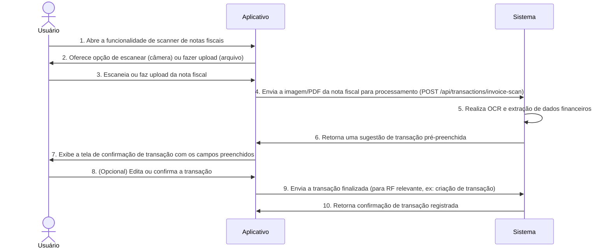

# RF026.2 📱 Scanner de notas fiscais para transações

## 📝 Descrição

Esta funcionalidade permite o uso de scanner de notas fiscais (físicas ou digitais, como PDFs) para registro rápido de
transações. Ao escanear uma nota fiscal, o sistema utiliza OCR (Optical Character Recognition) e inteligência artificial
para extrair automaticamente informações como valor total, itens comprados, data, estabelecimento e CNPJ, preenchendo os
campos da transação e facilitando o controle de gastos e a prestação de contas.

## 👥 Atores

- 👤 **Usuário**: O indivíduo que escaneia ou faz upload de uma nota fiscal.

## ⚠️ Pré-condições

- O usuário deve estar autenticado no sistema.
- O dispositivo do usuário deve ter uma câmera funcional (para notas físicas) ou o usuário deve ter um arquivo de nota
  fiscal digital para upload.
- A nota fiscal deve ser legível e conter informações estruturadas para extração.

## 🔌 Endpoints

- `POST /api/transactions/invoice-scan` (Upload/Processar Nota Fiscal e Sugerir Transação)

## 📋 Dados de Processamento de Nota Fiscal

| Campo       | Tipo              | Obrigatório | Descrição                                 | Restrições                          |
|-------------|-------------------|-------------|-------------------------------------------|-------------------------------------|
| `imageData` | `string` (Base64) | Condicional | Imagem da nota fiscal em Base64.          | Obrigatório se não for `pdfData`.   |
| `pdfData`   | `string` (Base64) | Condicional | Conteúdo do PDF da nota fiscal em Base64. | Obrigatório se não for `imageData`. |

## 📋 Dados de Saída (Sugestão de Transação)

| Campo                  | Tipo     | Descrição                                                | Restrições                                                                                 |
|------------------------|----------|----------------------------------------------------------|--------------------------------------------------------------------------------------------|
| `suggestedTransaction` | `object` | Objeto JSON com os detalhes da transação pré-preenchida. | Pode incluir `amount`, `description`, `establishmentName`, `cnpj`, `date`, `items`, etc.   |
| `status`               | `string` | Status do processamento.                                 | Valores: `SUCCESS`, `INVALID_IMAGE_OR_PDF`, `PROCESSING_ERROR`, `NO_FINANCIAL_DATA_FOUND`. |
| `message`              | `string` | Mensagem descritiva do resultado.                        | N/A                                                                                        |

## 🔄 Fluxo Principal



1. O Usuário abre a funcionalidade de scanner de notas fiscais no aplicativo.
2. O aplicativo oferece ao usuário as opções de escanear uma nota fiscal com a câmera do dispositivo ou fazer o upload
   de um arquivo de imagem/PDF.
3. O Usuário escaneia a nota fiscal ou seleciona um arquivo para upload.
4. O aplicativo envia a imagem (em Base64) ou o conteúdo do PDF (em Base64) da nota fiscal para o endpoint
   `POST /api/transactions/invoice-scan`.
5. O sistema backend realiza OCR na imagem/PDF para extrair o texto e, em seguida, utiliza algoritmos de processamento
   de linguagem natural e inteligência artificial para identificar e extrair dados financeiros relevantes (ex: valor
   total, data, CNPJ, nome do estabelecimento, itens).
6. O sistema retorna uma sugestão de objeto de transação pré-preenchida com os dados extraídos para o aplicativo.
7. O aplicativo exibe uma tela de confirmação da transação, com os campos preenchidos automaticamente com os dados da
   nota fiscal.
8. O Usuário pode revisar, editar os campos (se necessário, corrigir erros de OCR) e confirmar a transação.
9. O aplicativo envia a transação finalizada para o endpoint apropriado (e.g., `POST /api/transactions`).
10. O sistema registra a transação e retorna uma confirmação de sucesso.

## 🔀 Fluxos Alternativos

### ⚠️ FA01 - Extração Parcial de Dados

1. Se o OCR ou a IA não conseguirem extrair todos os dados da nota fiscal (e.g., descrição ilegível, valor faltando).
2. O sistema preenche os campos que conseguiu extrair e deixa os restantes em branco ou com sugestões genéricas.
3. O aplicativo destaca os campos vazios ou com sugestões para que o usuário possa preenchê-los manualmente.

### ⚠️ FA02 - Classificação Automática de Categoria

1. Após a extração dos itens ou da descrição da nota, o sistema tenta categorizar automaticamente a transação (e.g., "
   Supermercado" para compras de mercado).
2. O `suggestedTransaction` inclui uma categoria sugerida, que o usuário pode aceitar ou modificar.

## 🚫 Fluxos de Exceção

### ⚠️ FE01 - Imagem/PDF Inválido ou Ilegível

1. O arquivo enviado não é uma imagem/PDF válido, está corrompido, ou a qualidade da imagem é muito baixa para OCR.
2. O sistema retorna um `status: INVALID_IMAGE_OR_PDF` e uma mensagem de erro.
3. O aplicativo exibe uma mensagem de erro ao usuário e solicita uma imagem/PDF de melhor qualidade ou que tente
   novamente.

### ⚠️ FE02 - Nenhuma Informação Financeira Encontrada

1. O sistema consegue processar a imagem/PDF, mas não detecta nenhuma informação financeira estruturada (e.g., não é uma
   nota fiscal, mas um documento comum).
2. O sistema retorna um `status: NO_FINANCIAL_DATA_FOUND`.
3. O aplicativo informa ao usuário que nenhum dado relevante foi encontrado e sugere a entrada manual.

### ⚠️ FE03 - Erro no Serviço de OCR/IA

1. O backend enfrenta um erro ao se comunicar com o serviço de OCR/IA ou durante o processamento interno.
2. O sistema retorna um `status: PROCESSING_ERROR`.
3. O aplicativo informa ao usuário sobre um erro interno e sugere que tente novamente ou insira os dados manualmente.

## 🧪 Exemplos de Uso

### Requisição HTTP para Processar uma Imagem de Nota Fiscal (Base64 abreviado para exemplo)

```http
POST /api/transactions/invoice-scan HTTP/1.1
Host: api.metakyasshu.com
Content-Type: application/json

{
  "imageData": "data:image/jpeg;base64,/9j/4AAQSkZJRgABAQAAAQABAAD/2wBDAAYEBQYFB..." 
  // Conteúdo real da imagem em base64 seria muito mais longo
}
```

### Exemplo de Resposta (Sugestão de Transação de Nota Fiscal)

```json
{
  "suggestedTransaction": {
    "type": "EXPENSE",
    "amount": 125.75,
    "currency": "BRL",
    "description": "Compras no Supermercado",
    "establishmentName": "SUPERMERCADO NOVO LTDA",
    "cnpj": "12.345.678/0001-90",
    "date": "2024-07-20",
    "items": [
      { "name": "Arroz 5kg", "quantity": 1, "price": 25.00 },
      { "name": "Feijão 1kg", "quantity": 2, "price": 8.50 },
      { "name": "Leite 1L", "quantity": 4, "price": 5.25 }
    ],
    "rawInvoiceData": "[Conteúdo textual extraído da nota fiscal]"
  },
  "status": "SUCCESS",
  "message": "Nota fiscal processada com sucesso. Transação sugerida."
}
```

---

> ---------------------------------------------------------------------------
> #### 💰 METAKYASSHU 💰
> ***Transformando finanças em conquistas compartilhadas***
> --------------------------------------------------------------------------- 