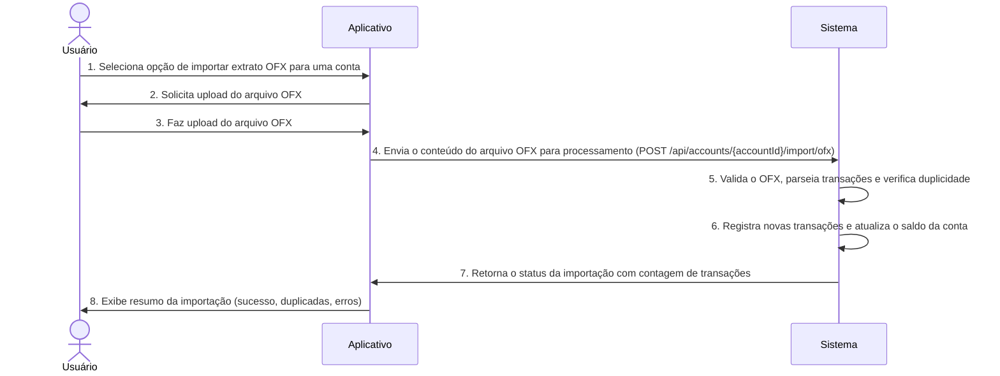

# RF027.1 📥 Importação de extratos OFX

## 📝 Descrição

Esta funcionalidade permite a importação de extratos bancários no formato OFX (Open Financial Exchange). Os usuários
podem carregar seus arquivos OFX para sincronizar transações e saldos de suas contas bancárias manualmente, o que é útil
para bancos que não suportam Open Banking ou para usuários que preferem um controle manual sobre a importação de dados.

## 👥 Atores

- 👤 **Usuário**: O indivíduo que possui o extrato OFX e deseja importá-lo para a plataforma.

## ⚠️ Pré-condições

- O usuário deve estar autenticado no sistema.
- O usuário deve ter um arquivo OFX válido de um extrato bancário.
- O usuário deve ter uma conta bancária correspondente registrada na plataforma para associar o extrato.

## 🔌 Endpoints

- `POST /api/accounts/{accountId}/import/ofx` (Importar extrato OFX para uma conta)

## 📋 Dados de Importação de Extrato OFX

| Campo        | Tipo     | Obrigatório | Descrição                                    | Restrições                                             |
|--------------|----------|-------------|----------------------------------------------|--------------------------------------------------------|
| `accountId`  | `string` | ✅ Sim       | ID único da conta bancária na plataforma.    | Deve ser um ID de conta válido e existente do usuário. |
| `ofxContent` | `string` | ✅ Sim       | Conteúdo do arquivo OFX em formato de texto. | Deve ser um string XML/SGML OFX válido.                |

## 📋 Dados de Saída (Status da Importação)

| Campo                        | Tipo     | Descrição                                                | Restrições                                                                                            |
|------------------------------|----------|----------------------------------------------------------|-------------------------------------------------------------------------------------------------------|
| `status`                     | `string` | Status da importação.                                    | Valores: `SUCCESS`, `INVALID_OFX`, `ACCOUNT_NOT_FOUND`, `DUPLICATE_TRANSACTIONS`, `PROCESSING_ERROR`. |
| `importedTransactionsCount`  | `number` | Número de transações importadas com sucesso.             | N/A                                                                                                   |
| `duplicateTransactionsCount` | `number` | Número de transações duplicadas encontradas e ignoradas. | N/A                                                                                                   |
| `message`                    | `string` | Mensagem descritiva do resultado da importação.          | N/A                                                                                                   |
| `errors`                     | `array`  | Lista de erros encontrados durante a importação.         | N/A                                                                                                   |

## 🔄 Fluxo Principal



1. O Usuário acessa a seção de contas bancárias e seleciona a opção de importar extrato OFX para uma conta específica (
   `accountId`).
2. O aplicativo solicita que o usuário selecione e faça o upload de um arquivo OFX de seu dispositivo.
3. O Usuário seleciona e faz o upload do arquivo OFX.
4. O aplicativo lê o conteúdo do arquivo OFX e o envia como uma string (ou um buffer) para o endpoint
   `POST /api/accounts/{accountId}/import/ofx`.
5. O sistema backend recebe o conteúdo do OFX, o valida (estrutura do arquivo), parseia as transações e as compara com
   as transações existentes na `accountId` para evitar duplicidade. Transações já existentes são ignoradas.
6. O sistema registra as novas transações no banco de dados, associando-as à `accountId` do usuário, e atualiza o saldo
   da conta com base nas transações importadas.
7. O sistema retorna uma resposta HTTP 200 OK contendo um resumo da importação, incluindo o `status`,
   `importedTransactionsCount`, `duplicateTransactionsCount` e `message`.
8. O aplicativo exibe ao usuário um relatório da importação, informando quantas transações foram importadas, quantas
   foram duplicadas e quaisquer erros que ocorreram.

## 🔀 Fluxos Alternativos

### ⚠️ FA01 - Categorização Automática Pós-Importação

1. Após a importação, o sistema pode tentar categorizar automaticamente as novas transações com base em regras
   predefinidas ou aprendizado de máquina.
2. As transações são importadas com uma categoria sugerida, que o usuário pode revisar e ajustar.

### ⚠️ FA02 - Processamento em Lotes para Grandes Arquivos

1. Para arquivos OFX muito grandes, o processamento pode ser feito em segundo plano para evitar timeouts.
2. O usuário é notificado quando a importação estiver concluída e os dados estiverem disponíveis.

## 🚫 Fluxos de Exceção

### ⚠️ FE01 - Conta Bancária Não Encontrada ou Não Pertencente ao Usuário

1. O `accountId` especificado na requisição não é encontrado ou não pertence ao usuário autenticado.
2. O sistema retorna uma resposta HTTP 404 Not Found.

### ⚠️ FE02 - Arquivo OFX Inválido/Corrompido

1. O conteúdo do `ofxContent` não é um OFX válido (formato incorreto, XML corrompido, dados faltando).
2. O sistema retorna um `status: INVALID_OFX` e uma mensagem de erro.

### ⚠️ FE03 - Erro no Processamento das Transações

1. Durante o parsing ou salvamento das transações, ocorre um erro interno (e.g., erro de banco de dados, inconsistência
   de dados).
2. O sistema retorna um `status: PROCESSING_ERROR` e uma lista de `errors` detalhando as falhas específicas.

## 🧪 Exemplos de Uso

### Requisição HTTP para Importar um Extrato OFX (conteúdo abreviado para exemplo)

```http
POST /api/accounts/acc_xyz123/import/ofx HTTP/1.1
Host: api.metakyasshu.com
Content-Type: application/json

{
  "ofxContent": "<OFX><SIGNONMSGSRSV1><SONRS><STATUS><CODE>0</CODE></STATUS>...</OFX>"
  // Conteúdo real do OFX seria muito mais longo
}
```

### Exemplo de Resposta de Sucesso

```json
{
  "status": "SUCCESS",
  "importedTransactionsCount": 50,
  "duplicateTransactionsCount": 10,
  "message": "Extrato OFX importado com sucesso. 50 novas transações adicionadas, 10 duplicadas ignoradas."
}
```

### Exemplo de Resposta com Erro (OFX Inválido)

```json
{
  "status": "INVALID_OFX",
  "importedTransactionsCount": 0,
  "duplicateTransactionsCount": 0,
  "message": "O arquivo OFX fornecido é inválido ou está corrompido.",
  "errors": ["Erro de parsing na linha X: tag inesperada."]
}
```

---

> ---------------------------------------------------------------------------
> #### 💰 METAKYASSHU 💰
> ***Transformando finanças em conquistas compartilhadas***
> --------------------------------------------------------------------------- 