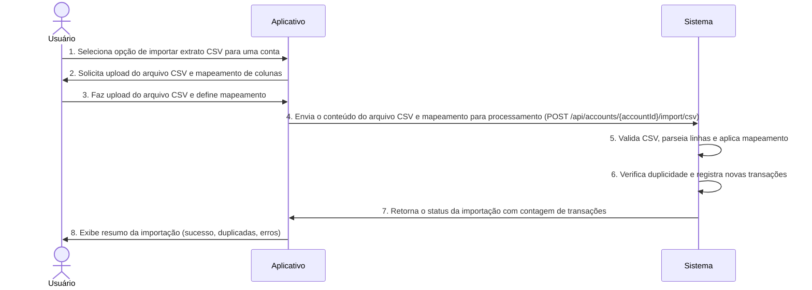

# RF027.2 📥 Importação de extratos CSV

## 📝 Descrição

Esta funcionalidade permite a importação de extratos bancários no formato CSV (Comma Separated Values). Os usuários
podem carregar seus arquivos CSV e mapear as colunas para os campos de transação da plataforma, oferecendo uma forma
flexível de importar dados financeiros de diversas fontes, mesmo sem suporte a OFX ou Open Banking.

## 👥 Atores

- 👤 **Usuário**: O indivíduo que possui o extrato CSV e deseja importá-lo para a plataforma.

## ⚠️ Pré-condições

- O usuário deve estar autenticado no sistema.
- O usuário deve ter um arquivo CSV contendo dados de transações.
- O usuário deve ter uma conta bancária correspondente registrada na plataforma para associar o extrato.

## 🔌 Endpoints

- `POST /api/accounts/{accountId}/import/csv` (Importar extrato CSV para uma conta)
- `GET /api/import-templates/csv` (Obter templates de mapeamento de colunas CSV)

## 📋 Dados de Importação de Extrato CSV

| Campo           | Tipo      | Obrigatório | Descrição                                                  | Restrições                                                            |
|-----------------|-----------|-------------|------------------------------------------------------------|-----------------------------------------------------------------------|
| `accountId`     | `string`  | ✅ Sim       | ID único da conta bancária na plataforma.                  | Deve ser um ID de conta válido e existente do usuário.                |
| `csvContent`    | `string`  | ✅ Sim       | Conteúdo do arquivo CSV em formato de texto.               | Deve ser um string CSV válido.                                        |
| `columnMapping` | `object`  | ✅ Sim       | Mapeamento das colunas do CSV para os campos da transação. | Ex: `{"date": "Data", "description": "Histórico", "amount": "Valor"}` |
| `hasHeader`     | `boolean` | ✅ Sim       | Indica se o CSV tem linha de cabeçalho.                    | Padrão: `true`.                                                       |

## 📋 Dados de Saída (Status da Importação)

| Campo                        | Tipo     | Descrição                                                | Restrições                                                                                   |
|------------------------------|----------|----------------------------------------------------------|----------------------------------------------------------------------------------------------|
| `status`                     | `string` | Status da importação.                                    | Valores: `SUCCESS`, `INVALID_CSV`, `ACCOUNT_NOT_FOUND`, `MAPPING_ERROR`, `PROCESSING_ERROR`. |
| `importedTransactionsCount`  | `number` | Número de transações importadas com sucesso.             | N/A                                                                                          |
| `duplicateTransactionsCount` | `number` | Número de transações duplicadas encontradas e ignoradas. | N/A                                                                                          |
| `message`                    | `string` | Mensagem descritiva do resultado da importação.          | N/A                                                                                          |
| `errors`                     | `array`  | Lista de erros encontrados durante a importação.         | N/A                                                                                          |

## 🔄 Fluxo Principal



1. O Usuário acessa a seção de contas bancárias e seleciona a opção de importar extrato CSV para uma conta específica (
   `accountId`).
2. O aplicativo solicita que o usuário selecione e faça o upload de um arquivo CSV de seu dispositivo e, opcionalmente,
   oferece um assistente para mapear as colunas do CSV para os campos da transação (ex: "Data", "Descrição", "Valor").
3. O Usuário seleciona o arquivo CSV, insere ou confirma o `columnMapping` e indica se o arquivo tem `hasHeader`.
4. O aplicativo lê o conteúdo do arquivo CSV e o envia como uma string (ou um buffer), juntamente com o `columnMapping`
   e `hasHeader`, para o endpoint `POST /api/accounts/{accountId}/import/csv`.
5. O sistema backend recebe o conteúdo do CSV, o valida (estrutura do arquivo, delimitador), parseia cada linha de
   acordo com o `columnMapping` e cria objetos de transação. Em seguida, compara com as transações existentes na
   `accountId` para evitar duplicidade. Transações já existentes são ignoradas.
6. O sistema registra as novas transações no banco de dados, associando-as à `accountId` do usuário, e atualiza o saldo
   da conta com base nas transações importadas.
7. O sistema retorna uma resposta HTTP 200 OK contendo um resumo da importação, incluindo o `status`,
   `importedTransactionsCount`, `duplicateTransactionsCount` e `message`.
8. O aplicativo exibe ao usuário um relatório da importação, informando quantas transações foram importadas, quantas
   foram duplicadas e quaisquer erros que ocorreram.

## 🔀 Fluxos Alternativos

### ⚠️ FA01 - Sugestão de Mapeamento de Colunas

1. Antes do upload, o aplicativo pode ler as primeiras linhas do CSV e sugerir um `columnMapping` com base em nomes de
   colunas comuns (e.g., "Data", "Descrição", "Valor").
2. O usuário pode aceitar a sugestão ou ajustá-la manualmente.

### ⚠️ FA02 - Tratamento de Formatos de Data/Número

1. O sistema backend pode ter regras para inferir e converter diferentes formatos de data (DD/MM/YYYY, MM-DD-YYYY) e
   números (com vírgula como separador decimal).
2. O usuário pode ser capaz de selecionar o formato esperado durante o mapeamento.

## 🚫 Fluxos de Exceção

### ⚠️ FE01 - Conta Bancária Não Encontrada ou Não Pertencente ao Usuário

1. O `accountId` especificado na requisição não é encontrado ou não pertence ao usuário autenticado.
2. O sistema retorna uma resposta HTTP 404 Not Found.

### ⚠️ FE02 - Arquivo CSV Inválido/Mal Formado

1. O conteúdo do `csvContent` não é um CSV válido (erros de sintaxe, linhas incompletas).
2. O sistema retorna um `status: INVALID_CSV` e uma mensagem de erro.

### ⚠️ FE03 - Erro de Mapeamento de Colunas

1. O `columnMapping` fornecido é inválido (e.g., nome de coluna no CSV não existe no mapeamento, campos obrigatórios não
   mapeados).
2. O sistema retorna um `status: MAPPING_ERROR` e uma mensagem de erro detalhando o problema.

### ⚠️ FE04 - Erro no Processamento das Transações

1. Durante o parsing das linhas ou salvamento das transações, ocorre um erro interno (e.g., erro de banco de dados,
   inconsistência de dados).
2. O sistema retorna um `status: PROCESSING_ERROR` e uma lista de `errors` detalhando as falhas específicas.

## 🧪 Exemplos de Uso

### Requisição HTTP para Importar um Extrato CSV

```http
POST /api/accounts/acc_xyz123/import/csv HTTP/1.1
Host: api.metakyasshu.com
Content-Type: application/json

{
  "accountId": "acc_xyz123",
  "csvContent": "Data,Descrição,Valor,Tipo\n2024-07-15,Compra Supermercado,-150.25,Débito\n2024-07-16,Salário,+3000.00,Crédito\n2024-07-17,Cinema,-45.00,Débito",
  "columnMapping": {
    "date": "Data",
    "description": "Descrição",
    "amount": "Valor",
    "type": "Tipo"
  },
  "hasHeader": true
}
```

### Exemplo de Resposta de Sucesso

```json
{
  "status": "SUCCESS",
  "importedTransactionsCount": 3,
  "duplicateTransactionsCount": 0,
  "message": "Extrato CSV importado com sucesso. 3 novas transações adicionadas."
}
```

### Exemplo de Resposta com Erro (Mapeamento Inválido)

```json
{
  "status": "MAPPING_ERROR",
  "importedTransactionsCount": 0,
  "duplicateTransactionsCount": 0,
  "message": "Erro no mapeamento: coluna 'Valor' não encontrada no CSV.",
  "errors": ["Coluna 'Valor' não existe no arquivo CSV."]
}
```

---

> ---------------------------------------------------------------------------
> #### 💰 METAKYASSHU 💰
> ***Transformando finanças em conquistas compartilhadas***
> --------------------------------------------------------------------------- 