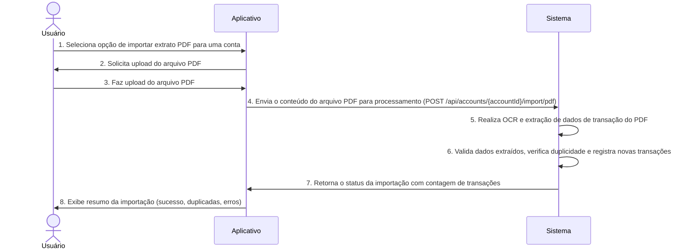

# RF027.3 📥 Importação de extratos PDF

## 📝 Descrição

Esta funcionalidade permite a importação de extratos bancários no formato PDF. Utilizando tecnologias de OCR (Optical
Character Recognition) e inteligência artificial, o sistema extrai as transações e saldos do documento PDF,
convertendo-os em dados estruturados que podem ser importados para as contas do usuário na plataforma. Isso oferece uma
maneira de automatizar a entrada de dados para usuários que só possuem extratos em PDF.

## 👥 Atores

- 👤 **Usuário**: O indivíduo que possui o extrato bancário em PDF e deseja importá-lo para a plataforma.

## ⚠️ Pré-condições

- O usuário deve estar autenticado no sistema.
- O usuário deve ter um arquivo PDF de extrato bancário válido e legível.
- O usuário deve ter uma conta bancária correspondente registrada na plataforma para associar o extrato.

## 🔌 Endpoints

- `POST /api/accounts/{accountId}/import/pdf` (Importar extrato PDF para uma conta)

## 📋 Dados de Importação de Extrato PDF

| Campo        | Tipo              | Obrigatório | Descrição                                 | Restrições                                             |
|--------------|-------------------|-------------|-------------------------------------------|--------------------------------------------------------|
| `accountId`  | `string`          | ✅ Sim       | ID único da conta bancária na plataforma. | Deve ser um ID de conta válido e existente do usuário. |
| `pdfContent` | `string` (Base64) | ✅ Sim       | Conteúdo do arquivo PDF em Base64.        | Deve ser um PDF válido e legível.                      |

## 📋 Dados de Saída (Status da Importação)

| Campo                        | Tipo     | Descrição                                                | Restrições                                                                                       |
|------------------------------|----------|----------------------------------------------------------|--------------------------------------------------------------------------------------------------|
| `status`                     | `string` | Status da importação.                                    | Valores: `SUCCESS`, `INVALID_PDF`, `ACCOUNT_NOT_FOUND`, `NO_DATA_EXTRACTED`, `PROCESSING_ERROR`. |
| `importedTransactionsCount`  | `number` | Número de transações importadas com sucesso.             | N/A                                                                                              |
| `duplicateTransactionsCount` | `number` | Número de transações duplicadas encontradas e ignoradas. | N/A                                                                                              |
| `message`                    | `string` | Mensagem descritiva do resultado da importação.          | N/A                                                                                              |
| `errors`                     | `array`  | Lista de erros encontrados durante a importação.         | N/A                                                                                              |

## 🔄 Fluxo Principal



1. O Usuário acessa a seção de contas bancárias e seleciona a opção de importar extrato PDF para uma conta específica (
   `accountId`).
2. O aplicativo solicita que o usuário selecione e faça o upload de um arquivo PDF de extrato bancário de seu
   dispositivo.
3. O Usuário seleciona e faz o upload do arquivo PDF.
4. O aplicativo lê o conteúdo do arquivo PDF e o envia em Base64 para o endpoint
   `POST /api/accounts/{accountId}/import/pdf`.
5. O sistema backend recebe o conteúdo do PDF, realiza OCR para extrair o texto e utiliza inteligência artificial para
   identificar e extrair as transações, valores, datas, descrições e saldos da conta. O sistema tenta identificar o
   formato do extrato para otimizar a extração.
6. Os dados extraídos são validados e comparados com as transações existentes na `accountId` para evitar duplicidade.
   Transações já existentes são ignoradas.
7. O sistema registra as novas transações no banco de dados, associando-as à `accountId` do usuário, e atualiza o saldo
   da conta com base nas transações importadas.
8. O sistema retorna uma resposta HTTP 200 OK contendo um resumo da importação, incluindo o `status`,
   `importedTransactionsCount`, `duplicateTransactionsCount` e `message`.
9. O aplicativo exibe ao usuário um relatório da importação, informando quantas transações foram importadas, quantas
   foram duplicadas e quaisquer erros que ocorreram.

## 🔀 Fluxos Alternativos

### ⚠️ FA01 - Ajuste Manual Pós-Importação

1. Se a extração de dados for imprecisa (devido a PDFs complexos ou digitalizações de baixa qualidade), o sistema pode
   marcar algumas transações para revisão manual.
2. O usuário é notificado e pode acessar uma interface para corrigir ou categorizar manualmente as transações que
   apresentaram problemas.

### ⚠️ FA02 - Processamento Assíncrono

1. Para PDFs grandes ou complexos que exigem mais tempo de processamento, a importação pode ser realizada em segundo
   plano.
2. O sistema retorna um status inicial de `PROCESSING` e notifica o usuário quando a importação estiver concluída,
   através de notificação no aplicativo ou e-mail.

## 🚫 Fluxos de Exceção

### ⚠️ FE01 - Conta Bancária Não Encontrada ou Não Pertencente ao Usuário

1. O `accountId` especificado na requisição não é encontrado ou não pertence ao usuário autenticado.
2. O sistema retorna uma resposta HTTP 404 Not Found.

### ⚠️ FE02 - Arquivo PDF Inválido/Ilegível

1. O `pdfContent` não é um PDF válido, está corrompido, é uma imagem de baixa qualidade dentro do PDF, ou o texto não é
   selecionável.
2. O sistema retorna um `status: INVALID_PDF` e uma mensagem de erro.

### ⚠️ FE03 - Nenhuma Informação Financeira Extraída

1. O sistema consegue processar o PDF, mas não identifica dados de extrato bancário (e.g., é um PDF de um documento
   comum, não um extrato).
2. O sistema retorna um `status: NO_DATA_EXTRACTED`.

### ⚠️ FE04 - Erro no Serviço de OCR/IA

1. O backend enfrenta um erro ao se comunicar com o serviço de OCR/IA ou durante o processamento interno da extração de
   dados.
2. O sistema retorna um `status: PROCESSING_ERROR` e uma lista de `errors` detalhando as falhas específicas.

## 🧪 Exemplos de Uso

### Requisição HTTP para Importar um Extrato PDF (conteúdo Base64 abreviado)

```http
POST /api/accounts/acc_xyz123/import/pdf HTTP/1.1
Host: api.metakyasshu.com
Content-Type: application/json

{
  "accountId": "acc_xyz123",
  "pdfContent": "JVBERi0xLjQKJcOkw..."
  // Conteúdo real do PDF em base64 seria muito mais longo
}
```

### Exemplo de Resposta de Sucesso

```json
{
  "status": "SUCCESS",
  "importedTransactionsCount": 75,
  "duplicateTransactionsCount": 15,
  "message": "Extrato PDF importado com sucesso. 75 novas transações adicionadas, 15 duplicadas ignoradas."
}
```

### Exemplo de Resposta com Erro (PDF Inválido)

```json
{
  "status": "INVALID_PDF",
  "importedTransactionsCount": 0,
  "duplicateTransactionsCount": 0,
  "message": "O arquivo PDF fornecido é inválido ou está corrompido.",
  "errors": ["Erro ao abrir o arquivo PDF."]
}
```

---

> ---------------------------------------------------------------------------
> #### 💰 METAKYASSHU 💰
> ***Transformando finanças em conquistas compartilhadas***
> --------------------------------------------------------------------------- 