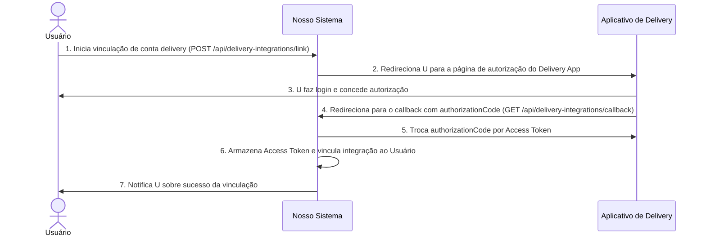
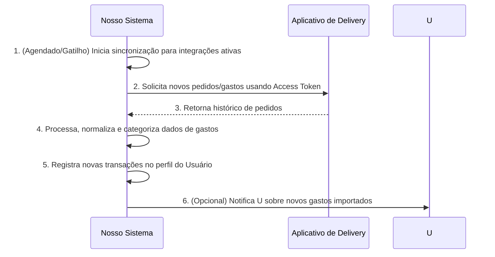

# RF028.1 🍽️ Integração com aplicativos de delivery para importação de gastos

## 📝 Descrição

Esta funcionalidade permite a integração com aplicativos de delivery (como iFood, Rappi, Uber Eats) para importação
direta de gastos. Ao conectar a conta do aplicativo de delivery, o sistema pode automaticamente importar o histórico de
pedidos como transações financeiras, preenchendo detalhes como valor, estabelecimento, data e categoria, simplificando o
registro e a categorização de despesas com alimentação e delivery.

## 👥 Atores

- 👤 **Usuário**: O proprietário da conta no aplicativo de delivery que deseja integrar.
- 📦 **Aplicativo de Delivery**: A plataforma que fornece o histórico de pedidos para importação.

## ⚠️ Pré-condições

- O usuário deve estar autenticado no sistema.
- O usuário deve ter uma conta ativa no aplicativo de delivery a ser integrado.
- A integração com o aplicativo de delivery deve ser suportada pela nossa plataforma.
- O usuário deve conceder consentimento para o compartilhamento de dados do aplicativo de delivery.

## 🔌 Endpoints

- `POST /api/delivery-integrations/link` (Iniciar processo de vinculação com delivery app)
- `GET /api/delivery-integrations/callback` (Endpoint de callback do delivery app)
- `GET /api/delivery-integrations/{integrationId}/sync` (Sincronizar gastos de uma integração)
- `GET /api/users/{userId}/delivery-integrations` (Listar integrações de delivery)

## 📋 Dados de Integração de Delivery

### Início de Vinculação

| Campo           | Tipo     | Obrigatório | Descrição                                                        | Restrições                                   |
|-----------------|----------|-------------|------------------------------------------------------------------|----------------------------------------------|
| `deliveryAppId` | `string` | ✅ Sim       | ID do aplicativo de delivery (ex: "IFOOD", "RAPPI").             | Deve ser um ID de aplicativo suportado.      |
| `redirectUrl`   | `string` | ✅ Sim       | URL para onde o delivery app redirecionará após o consentimento. | Deve ser uma URL válida da nossa plataforma. |

### Dados Retornados pelo Callback (Exemplo)

| Campo               | Tipo     | Descrição                                                                         | Restrições                               |
|---------------------|----------|-----------------------------------------------------------------------------------|------------------------------------------|
| `authorizationCode` | `string` | Código de autorização concedido pelo delivery app.                                | Gerado pelo delivery app.                |
| `state`             | `string` | Estado para prevenção de CSRF, deve corresponder ao gerado na requisição inicial. | Gerado e validado pela nossa plataforma. |

### Sincronização de Gastos (Exemplo de dados importados)

| Campo               | Tipo                | Descrição                                        | Restrições             |
|---------------------|---------------------|--------------------------------------------------|------------------------|
| `transactionId`     | `string`            | ID único da transação gerado pelo nosso sistema. | N/A                    |
| `originalId`        | `string`            | ID original do pedido no delivery app.           | N/A                    |
| `appSource`         | `string`            | Nome do aplicativo de delivery.                  | N/A                    |
| `description`       | `string`            | Descrição do pedido/gasto.                       | N/A                    |
| `amount`            | `number`            | Valor total do gasto.                            | Negativo para despesa. |
| `currency`          | `string`            | Moeda do gasto.                                  | N/A                    |
| `date`              | `string` (ISO 8601) | Data do pedido.                                  | Formato `YYYY-MM-DD`.  |
| `establishmentName` | `string`            | Nome do restaurante/loja.                        | N/A                    |
| `category`          | `string`            | Categoria sugerida (ex: "Alimentação").          | N/A                    |

## 🔄 Fluxo Principal - Vinculação com Aplicativo de Delivery



1. O Usuário acessa a seção de integrações em nossa plataforma e seleciona o aplicativo de delivery que deseja
   vincular (POST para `/api/delivery-integrations/link`).
2. Nossa plataforma gera um `state` e redireciona o Usuário para a página de autorização do Aplicativo de Delivery.
3. O Usuário faz login no Aplicativo de Delivery e concede autorização para nossa plataforma acessar seus dados de
   pedidos.
4. O Aplicativo de Delivery redireciona o Usuário de volta para o `redirectUrl` de nossa plataforma (endpoint
   `/api/delivery-integrations/callback`), incluindo um `authorizationCode` e o `state`.
5. Nosso sistema recebe o `authorizationCode`, valida o `state`, e o troca por um Access Token (e possivelmente um
   Refresh Token) com o Aplicativo de Delivery.
6. O Access Token é armazenado de forma segura e a integração é vinculada ao perfil do Usuário em nossa plataforma.
7. O sistema notifica o Usuário que a vinculação foi bem-sucedida e que os gastos podem ser importados.

## 🔄 Fluxo Principal - Sincronização Automática de Gastos



1. Periodicamente (ou acionado por eventos, como a vinculação de uma nova conta), nosso sistema inicia a sincronização
   de dados para as integrações de delivery ativas (GET para `/api/delivery-integrations/{integrationId}/sync`).
2. Utilizando o Access Token armazenado, nosso sistema solicita o histórico de pedidos do Usuário ao Aplicativo de
   Delivery via sua API.
3. O Aplicativo de Delivery retorna os dados dos pedidos (valor, restaurante, data, itens, etc.) para nosso sistema.
4. Nosso sistema processa os dados, os normaliza para o formato de transação interna, e tenta categorizar
   automaticamente o gasto (e.g., "Alimentação"). Verifica duplicidade para evitar importar o mesmo pedido várias vezes.
5. As novas transações são registradas no banco de dados, associando-as ao perfil do Usuário.
6. O sistema pode enviar uma notificação ao Usuário sobre a conclusão da sincronização e a disponibilidade de novos
   gastos importados.

## 🔀 Fluxos Alternativos

### ⚠️ FA01 - Reautenticação Necessária

1. Se o Access Token expirar ou for revogado, nosso sistema detecta um erro de autenticação durante a sincronização.
2. O sistema notifica o Usuário que ele precisa reautenticar sua conta de delivery, redirecionando-o para o processo de
   consentimento novamente.

### ⚠️ FA02 - Falha Parcial na Importação

1. Alguns pedidos podem falhar ao ser importados devido a dados inconsistentes ou erros temporários da API externa.
2. O sistema registra os erros, tenta reprocessar em uma próxima sincronização e notifica o Usuário sobre quaisquer
   lacunas ou dados ausentes.

## 🚫 Fluxos de Exceção

### ⚠️ FE01 - Integração Não Encontrada ou Não Pertencente ao Usuário

1. O `integrationId` especificado não é encontrado ou não pertence ao usuário autenticado.
2. O sistema retorna uma resposta HTTP 404 Not Found.

### ⚠️ FE02 - Aplicativo de Delivery Indisponível

1. A API do Aplicativo de Delivery está fora do ar ou com problemas de conectividade.
2. Nosso sistema tenta novamente após um tempo e, se a falha persistir, notifica o Usuário sobre a indisponibilidade.

### ⚠️ FE03 - Dados Inconsistentes do Aplicativo de Delivery

1. O Aplicativo de Delivery envia dados de pedido que não correspondem ao esperado pelo nosso sistema.
2. O sistema tenta sanitizar os dados ou os ignora, registra o erro e pode notificar a equipe de suporte.

## 🧪 Exemplos de Uso

### Requisição HTTP para Iniciar Vinculação com iFood (Frontend -> Backend)

```http
POST /api/delivery-integrations/link HTTP/1.1
Host: api.metakyasshu.com
Content-Type: application/json

{
  "deliveryAppId": "IFOOD",
  "redirectUrl": "https://app.metakyasshu.com/delivery-callback"
}
```

### Exemplo de Retorno do Callback do Aplicativo de Delivery (para o nosso Backend)

```http
GET /api/delivery-integrations/callback?code=AUTH_CODE_DELIVERY_123&state=STATE_VALUE_XYZ HTTP/1.1
Host: api.metakyasshu.com
```

### Exemplo de Dados de Gasto Sincronizado do iFood

```json
{
  "originalId": "order_ifood_456789",
  "appSource": "IFOOD",
  "description": "Pedido #456789 - Restaurante Sabor Oriental",
  "amount": -85.90,
  "currency": "BRL",
  "date": "2024-07-21",
  "establishmentName": "Restaurante Sabor Oriental",
  "category": "Alimentação"
}
```

---

> ---------------------------------------------------------------------------
> #### 💰 METAKYASSHU 💰
> ***Transformando finanças em conquistas compartilhadas***
> --------------------------------------------------------------------------- 