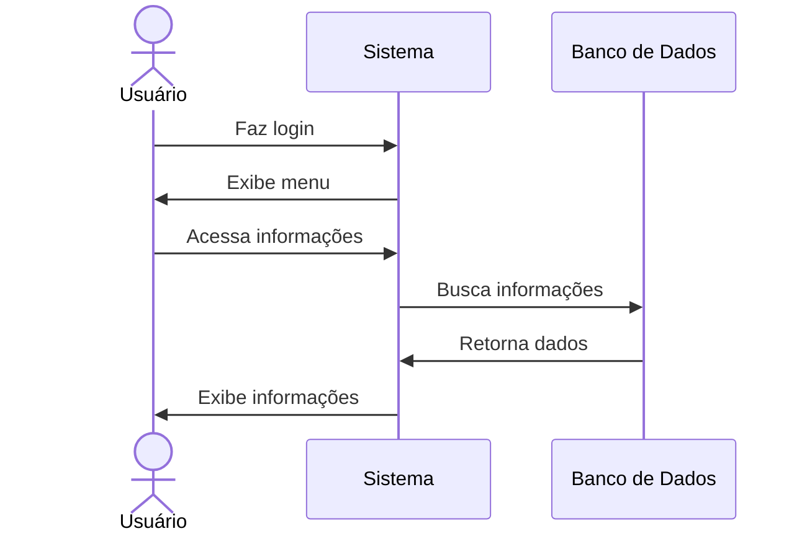

# 👁️ RF03 - Visualizar Usuário 

{ width=150 }

## 📝 Descrição

Esta funcionalidade permite que usuários visualizem suas informações cadastradas no sistema.

## 👥 Atores

- 👤 Usuário

## ⚠️ Pré-condições

- O usuário deve estar logado no sistema.

## 🔌 Endpoints

- `GET /api/user`

## 📋 Dados do Usuário

| Campo   | Tipo     | Obrigatório | Descrição            | Restrições |
|---------|----------|-------------|----------------------|------------|
| `token` | `string` | ✅ Sim      | Token jwt do usuário |            |

## 🔄 Fluxo Principal



1. O usuário faz login no sistema.
2. O usuário acessa a opção no menu de visualizar informações do usuário.
3. O sistema exibe as informações do usuário.

## 🔀 Fluxos Alternativos

- Não se aplica.

## 🚫 Fluxos de Exceção

### ⚠️ FE01 - Token inválido
1. No passo 3 do fluxo principal, se o token informado for inválido, o sistema exibe uma mensagem de erro.
2. O sistema redireciona o usuário para a página de login.

### ⚠️ FE02 - Usuário não logado
1. No passo 2 do fluxo principal, se o usuário não estiver logado, o sistema exibe uma mensagem de erro.
2. O sistema redireciona o usuário para a página de login.

### ⚠️ FE03 - Usuário não encontrado
1. No passo 3 do fluxo principal, se o usuário não for encontrado, o sistema exibe uma mensagem de erro.
2. O sistema redireciona o usuário para a página de login.

## 🧪 Exemplos de Uso

### Requisição HTTP
```http
GET /api/user HTTP/1.1
Host: api.metakyasshu.com
Authorization: Bearer {token}
```

### Resposta
```http
HTTP/1.1 200 OK
Content-Type: application/json

{
  "id": 123,
  "name": "João Silva",
  "email": "joao@email.com",
  "cpf": "123.456.789-00"
}
```


> ---------------------------------------------------------------------------
> #### 💰 Sistema de Gestão Financeira 💰
> ***Controlando suas finanças de forma simples e eficiente***
> ---------------------------------------------------------------------------