# RF030 🔔 Configuração personalizável de canais de notificação

## 📝 Descrição

Esta funcionalidade permite a configuração personalizável de canais de notificação (Push, E-mail, SMS, WhatsApp,
Telegram, etc.) para alertas e lembretes.

## 👥 Atores

- 👤 [Ator Principal]

## ⚠️ Pré-condições

- [Nenhuma pré-condição específica / Pré-condições específicas]

## 🔌 Endpoints

- `[METODO] /api/[recurso]`

## 📋 Dados [do Recurso]

| Campo     | Tipo     | Obrigatório | Descrição        | Restrições           |
|-----------|----------|-------------|------------------|----------------------|
| `exemplo` | `string` | ✅ Sim       | Exemplo de campo | Exemplo de restrição |

## 🔄 Fluxo Principal

```mermaid
sequenceDiagram
    actor A as Usuário
    participant S as Sistema
    A ->> S: [Ação do Usuário]
    S ->> A: [Resposta do Sistema]
```



1. [Passo 1 do fluxo principal]
2. [Passo 2 do fluxo principal]

## 🔀 Fluxos Alternativos

### ⚠️ FA01 - [Nome do Fluxo Alternativo]

1. [Passo 1 do fluxo alternativo]

## 🚫 Fluxos de Exceção

### ⚠️ FE01 - [Nome do Fluxo de Exceção]

1. [Passo 1 do fluxo de exceção]

## 🧪 Exemplos de Uso

### Requisição HTTP

```http
[METODO] /api/[recurso] HTTP/1.1
Host: api.metakyasshu.com
Content-Type: application/json

{{
  "[campo]": "[valor]"
}}
```

---

> ---------------------------------------------------------------------------
> #### 💰 METAKYASSHU 💰
> ***Transformando finanças em conquistas compartilhadas***
> --------------------------------------------------------------------------- 