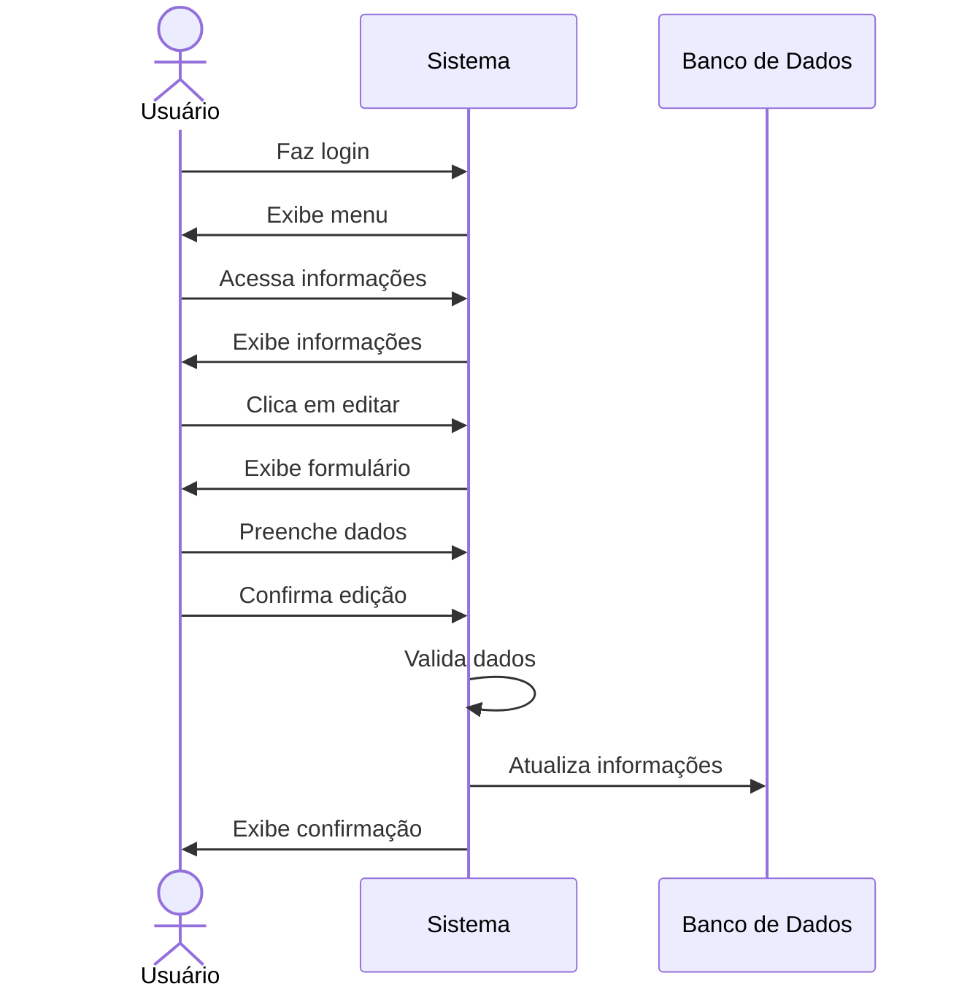

# ✏️ RF04 - Editar Usuário 

{ width=150 }

## 📝 Descrição

Esta funcionalidade permite que usuários editem suas informações cadastradas no sistema.

## 👥 Atores

- 👤 Usuário

## ⚠️ Pré-condições

- O usuário deve estar logado no sistema.

## 🔌 Endpoints

- `PUT /api/user`

## 📋 Dados do Usuário

| Campo      | Tipo     | Obrigatório | Descrição            | Restrições             |
|------------|----------|-------------|----------------------|------------------------|
| `token`    | `string` | ✅ Sim      | Token jwt do usuário |                        |
| `name`     | `string` | ❌ Não      | Nome do usuário      |                        |
| `email`    | `string` | ❌ Não      | E-mail do usuário    | Formato válido         | 
| `cpf`      | `string` | ❌ Não      | CPF do usuário       | Formato válido         | 
| `password` | `string` | ❌ Não      | Senha do usuário     | Mínimo de 8 caracteres | 
| `foto`     | `file`   | ❌ Não      | Foto do usuário      | jpg, jpeg, png         |

## 🔄 Fluxo Principal



1. O usuário faz login no sistema.
2. O usuário acessa a opção no menu de visualizar informações do usuário.
3. O sistema exibe as informações do usuário.
4. O usuário clica no botão de editar informações.
5. O sistema exibe um formulário com os campos a serem editados.
6. O usuário preenche os campos que deseja editar.
7. O usuário envia o formulário de edição.
8. O sistema valida os dados informados.
9. O sistema atualiza as informações do usuário.
10. O sistema exibe uma mensagem de confirmação de edição.
11. O usuário é redirecionado para a página de visualização de informações do usuário.

## 🔀 Fluxos Alternativos

- Não se aplica.

## 🚫 Fluxos de Exceção

### ⚠️ FE01 - Token inválido
1. No passo 3 do fluxo principal, se o token informado for inválido, o sistema exibe uma mensagem de erro.
2. O sistema redireciona o usuário para a página de login.

### ⚠️ FE02 - Usuário não logado
1. No passo 2 do fluxo principal, se o usuário não estiver logado, o sistema exibe uma mensagem de erro.
2. O sistema redireciona o usuário para a página de login.

### ⚠️ FE03 - Usuário não encontrado
1. No passo 3 do fluxo principal, se o usuário não for encontrado, o sistema exibe uma mensagem de erro.
2. O sistema redireciona o usuário para a página de login.

### ⚠️ FE04 - Dados inválidos
1. No passo 8 do fluxo principal, se os dados informados forem inválidos, o sistema exibe uma mensagem de erro.
2. O sistema retorna ao passo 5 do fluxo principal para que o usuário corrija os dados informados.

### ⚠️ FE05 - E-mail já cadastrado
1. No passo 9 do fluxo principal, se o e-mail informado já estiver cadastrado a outro usuário, o sistema exibe uma mensagem de erro.
2. O sistema retorna ao passo 5 do fluxo principal para que o usuário informe um novo e-mail.

### ⚠️ FE06 - CPF já cadastrado
1. No passo 9 do fluxo principal, se o CPF informado já estiver cadastrado a outro usuário, o sistema exibe uma mensagem de erro.
2. O sistema retorna ao passo 5 do fluxo principal para que o usuário informe um novo CPF.

### ⚠️ FE07 - Senha inválida
1. No passo 9 do fluxo principal, se a senha informada for inválida, o sistema exibe uma mensagem de erro.
2. O sistema retorna ao passo 5 do fluxo principal para que o usuário informe uma nova senha.

### ⚠️ FE08 - Foto inválida
1. No passo 9 do fluxo principal, se a foto informada for inválida, o sistema exibe uma mensagem de erro.
2. O sistema retorna ao passo 5 do fluxo principal para que o usuário informe uma nova foto.

## 🧪 Exemplos de Uso

### Requisição HTTP
```http
PUT /api/user HTTP/1.1
Host: api.metakyasshu.com
Content-Type: application/json
Authorization: Bearer {token}

{
  "name": "João Silva",
  "email": "joao@email.com",
  "password": "Senha@123"
}
```

> ---------------------------------------------------------------------------
> #### 💰 Sistema de Gestão Financeira 💰
> ***Controlando suas finanças de forma simples e eficiente***
> ---------------------------------------------------------------------------