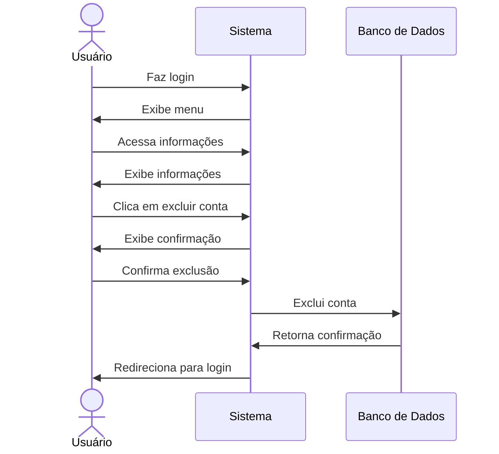

#  🗑️ RF05 - Excluir Usuário 

{ width=150 }

## 📝 Descrição

Esta funcionalidade permite que usuários que não possuam transações compartilhadas excluam suas contas do sistema.

## 👥 Atores

- 👤 Usuário

## ⚠️ Pré-condições

- O usuário deve estar logado no sistema.
- O usuário não deve possuir transações compartilhadas.
- O usuário deve confirmar a exclusão da conta.

## 🔌 Endpoints

- `DELETE /api/user`

## 📋 Dados do Usuário

| Campo   | Tipo     | Obrigatório | Descrição            | Restrições |
|---------|----------|-------------|----------------------|------------|
| `token` | `string` | ✅ Sim      | Token jwt do usuário |            |

## 🔄 Fluxo Principal



1. O usuário faz login no sistema.
2. O usuário acessa a opção no menu de visualizar informações do usuário.
3. O sistema exibe as informações do usuário.
4. O usuário clica no botão de excluir conta.
5. O sistema exibe uma mensagem de confirmação de exclusão.
6. O usuário confirma a exclusão da conta.
7. O sistema exclui a conta do usuário.
8. O sistema exibe uma mensagem de confirmação de exclusão.
9. O usuário é redirecionado para a página de login.

## 🔀 Fluxos Alternativos

### ⚠️ FA01 - Cancelar exclusão
1. O usuário faz login no sistema.
2. O usuário acessa a opção no menu de visualizar informações do usuário.
3. O sistema exibe as informações do usuário.
4. O usuário clica no botão de excluir conta.
5. O sistema exibe uma mensagem de confirmação de exclusão.
6. O usuário cancela a exclusão da conta.
7. O sistema exibe uma mensagem de cancelamento de exclusão.
8. O usuário é redirecionado para a página de visualização de informações do usuário.

### ⚠️ FA02 - Usuário com transações compartilhadas
1. O usuário faz login no sistema.
2. O usuário acessa a opção no menu de visualizar informações do usuário.
3. O sistema exibe as informações do usuário.
4. O usuário clica no botão de excluir conta.
5. O sistema exibe uma mensagem que o usuário possui transações compartilhadas e que sua conta sera suspensa até que as transações sejam finalizadas e então excluída.
6. O usuário é redirecionado para a página de login.

## 🚫 Fluxos de Exceção

### ⚠️ FE01 - Token inválido
1. No passo 3 do fluxo principal, se o token informado for inválido, o sistema exibe uma mensagem de erro.
2. O sistema redireciona o usuário para a página de login.

### ⚠️ FE02 - Usuário não logado
1. No passo 2 do fluxo principal, se o usuário não estiver logado, o sistema exibe uma mensagem de erro.
2. O sistema redireciona o usuário para a página de login.

### ⚠️ FE03 - Usuário não encontrado
1. No passo 3 do fluxo principal, se o usuário não for encontrado, o sistema exibe uma mensagem de erro.
2. O sistema redireciona o usuário para a página de login.

## 🧪 Exemplos de Uso

### Requisição HTTP
```http
DELETE /api/user HTTP/1.1
Host: api.metakyasshu.com
Authorization: Bearer {token}
```


> ---------------------------------------------------------------------------
> #### 💰 Sistema de Gestão Financeira 💰
> ***Controlando suas finanças de forma simples e eficiente***
> ---------------------------------------------------------------------------