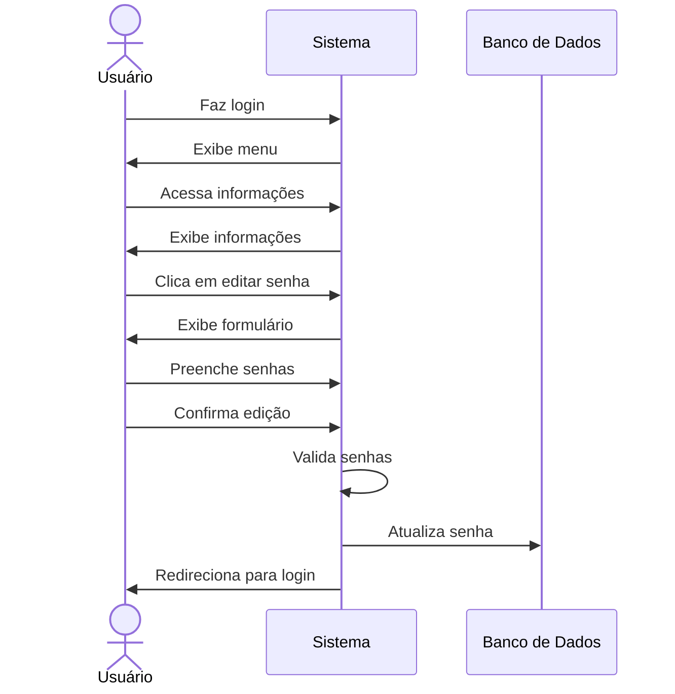

# 🔑 RF06 - Editar Senha 

{ width=150 }

## 📝 Descrição

Este requisito é responsável por permitir que o usuário edite exclusivamente a sua senha de acesso ao sistema.

## 👥 Atores

- 👤 Usuário

## ⚠️ Pré-condições

- O usuário deve estar logado no sistema.

## 🔌 Endpoints

- `PATCH /api/user/password`

## 📋 Dados do Usuário

| Campo          | Tipo     | Obrigatório | Descrição               | Restrições             |
|----------------|----------|-------------|-------------------------|------------------------|
| `token`        | `string` | ✅ Sim      | Token jwt do usuário    |                        |
| `old password` | `string` | ✅ Sim      | Senha antiga do usuário | Ser a senha atual      |
| `new password` | `string` | ✅ Sim      | Nova senha do usuário   | Mínimo de 8 caracteres |

## 🔄 Fluxo Principal



1. O usuário faz login no sistema.
2. O usuário acessa a opção no menu de visualizar informações do usuário.
3. O sistema exibe as informações do usuário.
4. O usuário clica no botão de editar senha.
5. O sistema exibe um formulário para edição de senha.
6. O usuário preenche o formulário com a senha antiga e a nova senha.
7. O usuário clica no botão de confirmar edição.
8. O sistema valida a senha antiga e a nova senha.
9. O sistema atualiza a senha do usuário.
10. O usuário é redirecionado para a página de login.

## 🔀 Fluxos Alternativos

### ⚠️ FA01 - Cancelar edição
1. O usuário faz login no sistema.
2. O usuário acessa a opção no menu de visualizar informações do usuário.
3. O sistema exibe as informações do usuário.
4. O usuário clica no botão de editar senha.
5. O sistema exibe um formulário para edição de senha.
6. O usuário clica no botão de cancelar edição.
7. O usuário é redirecionado para a página de visualização de informações do usuário.

## 🚫 Fluxos de Exceção

### ⚠️ FE01 - Senha antiga incorreta
1. No passo 8 do Fluxo Principal, o sistema exibe uma mensagem de senha antiga incorreta.
2. O sistema redireciona o usuário para a página de edição de senha.

### ⚠️ FE02 - Senha nova inválida
1. No passo 8 do Fluxo Principal, se a senha nova não atender aos requisitos mínimos de segurança, o sistema exibe uma mensagem de erro.
2. O sistema redireciona o usuário para a página de edição de senha.

### ⚠️ FE03 - Token inválido
1. No passo 3 do fluxo principal, se o token informado for inválido, o sistema exibe uma mensagem de erro.
2. O sistema redireciona o usuário para a página de login.

### ⚠️ FE04 - Usuário não logado
1. No passo 1 do fluxo principal, se o usuário não estiver logado, o sistema redireciona o usuário para a página de login.

## 🧪 Exemplos de Uso

### Requisição HTTP
```http
PATCH /api/user/password HTTP/1.1
Host: api.metakyasshu.com
Content-Type: application/json
Authorization: Bearer {token}

{
  "oldPassword": "Senha@123",
  "newPassword": "NovaSenha@123"
}
```

> ---------------------------------------------------------------------------
> #### 💰 Sistema de Gestão Financeira 💰
> ***Controlando suas finanças de forma simples e eficiente***
> ---------------------------------------------------------------------------