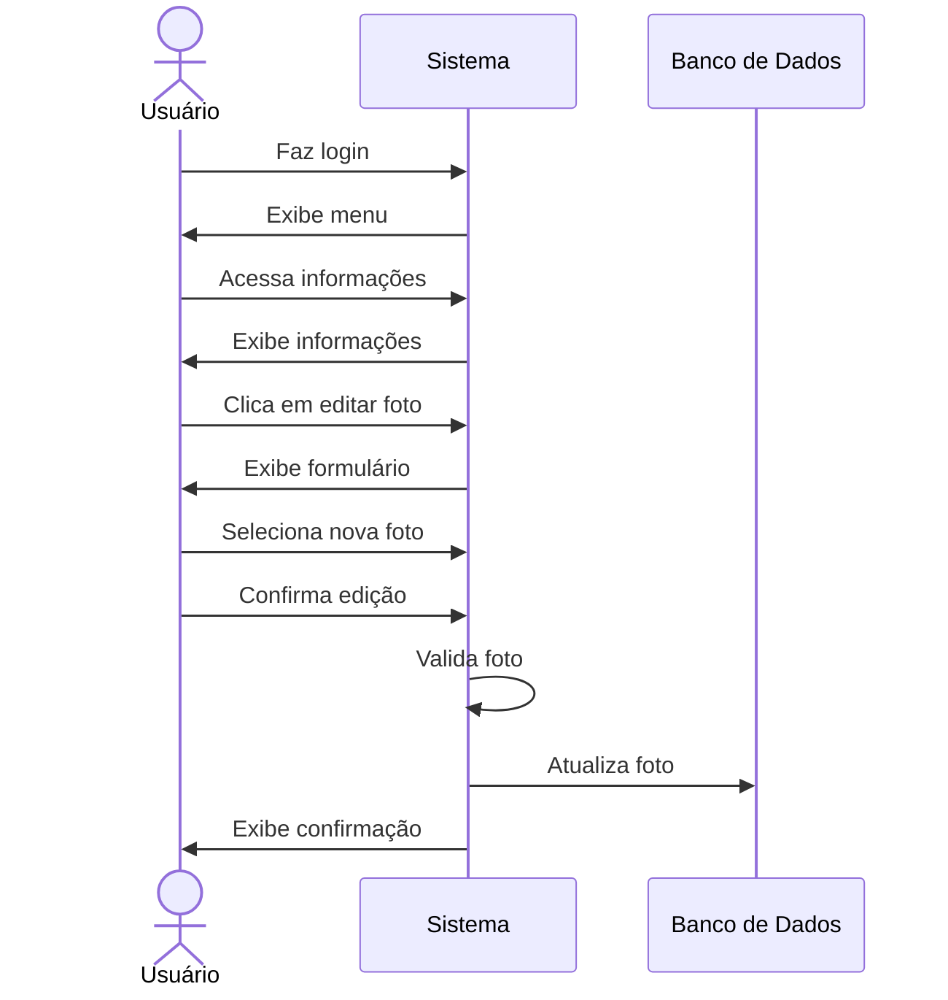

# 📷 RF07 - Editar Foto 

{ width=150 }

## 📝 Descrição

Este requisito é responsável por permitir que o usuário edite exclusivamente a sua foto de perfil no sistema.

## 👥 Atores

- 👤 Usuário

## ⚠️ Pré-condições

- O usuário deve estar logado no sistema.

## 🔌 Endpoints

- `PATCH /api/user/photo`

## 📋 Dados do Usuário

| Campo   | Tipo     | Obrigatório | Descrição            | Restrições   |
|---------|----------|-------------|----------------------|--------------|
| `token` | `string` | ✅ Sim      | Token jwt do usuário |              |
| `photo` | `file`   | ✅ Sim      | Nova foto do usuário | JPEG,JPG,PNG |

## 🔄 Fluxo Principal



1. O usuário faz login no sistema.
2. O usuário acessa a opção no menu de visualizar informações do usuário.
3. O sistema exibe as informações do usuário.
4. O usuário clica no botão de editar foto.
5. O sistema exibe um formulário para edição de foto.
6. O usuário seleciona a nova foto.
7. O usuário clica no botão de confirmar edição.
8. O sistema valida a foto.
9. O sistema atualiza a foto do usuário.
10. O usuário é redirecionado para a página de visualização de informações do usuário.

## 🔀 Fluxos Alternativos

### ⚠️ FA01 - Cancelar edição
1. O usuário faz login no sistema.
2. O usuário acessa a opção no menu de visualizar informações do usuário.
3. O sistema exibe as informações do usuário.
4. O usuário clica no botão de editar foto.
5. O sistema exibe um formulário para edição de foto.
6. O usuário clica no botão de cancelar edição.
7. O usuário é redirecionado para a página de visualização de informações do usuário.

## 🚫 Fluxos de Exceção

### ⚠️ FE01 - Foto inválida
1. No passo 8 do Fluxo Principal, se a foto não atender aos requisitos mínimos de segurança, o sistema exibe uma mensagem de erro.
2. O sistema redireciona o usuário para a página de edição de foto.

## 🧪 Exemplos de Uso

### Requisição HTTP
```http
PATCH /api/user/photo HTTP/1.1
Host: api.metakyasshu.com
Content-Type: multipart/form-data
Authorization: Bearer {token}

--boundary
Content-Disposition: form-data; name="photo"; filename="profile.jpg"
Content-Type: image/jpeg

[Dados binários da imagem]
--boundary--
```

> ---------------------------------------------------------------------------
> #### 💰 Sistema de Gestão Financeira 💰
> ***Controlando suas finanças de forma simples e eficiente***
> ---------------------------------------------------------------------------