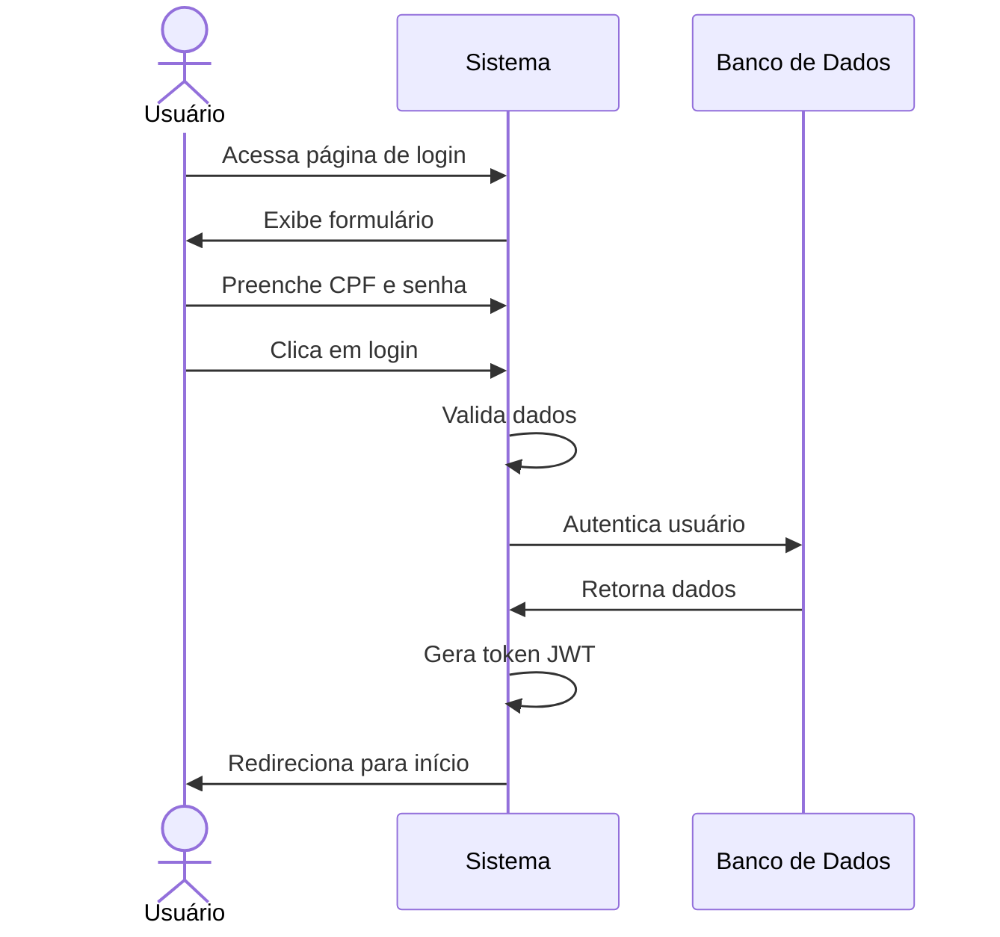

# 🔓 RF08 - Logar Usuário 

{ width=150 }

## 📝 Descrição

Este requisito é responsável por permitir que o usuário acesse o sistema.

## 👥 Atores

- 👤 Usuário

## ⚠️ Pré-condições

- O usuário deve estar cadastrado no sistema.

## 🔌 Endpoints

- `POST /api/start-session`

## 📋 Dados do Login

| Campo      | Tipo     | Obrigatório | Descrição        | Restrições |
|------------|----------|-------------|------------------|------------|
| `cpf`      | `string` | ✅ Sim      | CPF do usuário   | CPF válido |
| `password` | `string` | ✅ Sim      | Senha do usuário |            |

## 🔄 Fluxo Principal



1. O usuário acessa a página de login.
2. O sistema exibe um formulário para login.
3. O usuário preenche o formulário com o CPF e a senha.
4. O usuário clica no botão de login.
5. O sistema valida os dados.
6. O sistema autentica o usuário.
7. O sistema redireciona o usuário para a página inicial.
8. O sistema gera um token jwt para o usuário.

## 🔀 Fluxos Alternativos

### ⚠️ FA01 - Esqueci minha senha
1. O usuário acessa a página de login.
2. O sistema exibe um formulário para login.
3. O usuário clica no link "Esqueci minha senha".
4. O sistema redireciona o usuário para a página de recuperação de senha.

## 🚫 Fluxos de Exceção

### ⚠️ FE01 - Dados inválidos
1. No passo 5 do Fluxo Principal, se os dados não atenderem aos requisitos mínimos de segurança, o sistema exibe uma mensagem de erro.
2. O sistema redireciona o usuário para a página de login.

### ⚠️ FE02 - Usuário não cadastrado
1. No passo 5 do Fluxo Principal, se o usuário não estiver cadastrado no sistema, o sistema exibe uma mensagem de erro.
2. O sistema redireciona o usuário para a página de login.

### ⚠️ FE03 - CPF inválido
1. No passo 5 do Fluxo Principal, se o CPF não for válido, o sistema exibe uma mensagem de erro.
2. O sistema redireciona o usuário para a página de login.

### ⚠️ FE04 - Senha inválida
1. No passo 5 do Fluxo Principal, se a senha não for válida, o sistema exibe uma mensagem de erro.
2. O sistema redireciona o usuário para a página de login.

### ⚠️ FE05 - Usuário inativo
1. No passo 5 do Fluxo Principal, se o usuário estiver inativo, o sistema exibe uma mensagem de erro.
2. O sistema redireciona o usuário para a página de login.

## 🧪 Exemplos de Uso

### Requisição HTTP
```http
POST /api/start-session HTTP/1.1
Host: api.metakyasshu.com
Content-Type: application/json

{
  "cpf": "123.456.789-00",
  "password": "Senha@123"
}
```

### Resposta
```http
HTTP/1.1 200 OK
Content-Type: application/json

{
  "token": "eyJhbGciOiJIUzI1NiIsInR5cCI6IkpXVCJ9...",
  "user": {
    "id": 123,
    "name": "João Silva"
  }
}
```

> ---------------------------------------------------------------------------
> #### 💰 Sistema de Gestão Financeira 💰
> ***Controlando suas finanças de forma simples e eficiente***
> ---------------------------------------------------------------------------